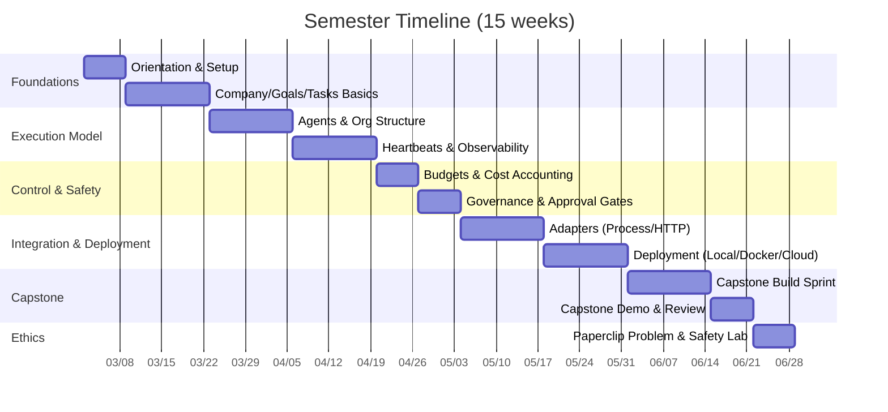

# PaperclipAI 교육 커리큘럼 및 강의자용 운영 패키지

## 요약

PaperclipAI는 “에이전트(직원)를 만드는 프레임워크”라기보다, **이미 존재하는 다양한 AI 에이전트 런타임(예: Claude/Codex/OpenClaw 계열)을 ‘회사 운영 체계’로 조직화**하는 오픈소스 오케스트레이션 플랫폼에 가깝습니다. 핵심은 **회사(Company) 단위의 목표(Goals)–업무(Tasks/Issues)–조직도(Org)–하트비트(Heartbeats) 실행 모델–예산/비용(Cost & Budgets)–승인/거버넌스(Governance & Approvals)**를 결합해, 여러 에이전트를 “대시보드와 규칙”으로 관리하도록 만든다는 점입니다. citeturn7search7turn5view0turn5view1turn8view2turn9view4turn6view8turn6view9

본 패키지는 강의자가 바로 개설할 수 있도록, (1) 개념-실습-평가를 잇는 **학기형 커리큘럼**, (2) 설치·구성·예제 프로젝트까지 포함한 **실습 가이드**, (3) 공식 문서·GitHub 중심의 **리소스 카탈로그(YouTube/블로그 포함)**, (4) 90분 강의+2시간 실습 **수업안/슬라이드 아웃라인**, (5) 로컬/도커/클라우드 **실습실 배포 전략과 비용 산정 프레임**, (6) “Paperclip 문제(종이클립 극대화)”를 포함한 **안전·윤리 모듈**을 제공합니다. citeturn1view1turn4view2turn13view0turn12view0turn45search10turn45search2turn46search3turn46search17

> **혼동 방지(중요)**: “Paperclip”이라는 이름은 여러 프로젝트에서 쓰입니다. 본 커리큘럼의 대상은 `paperclipai/paperclip`(제로-휴먼 회사 오케스트레이션)이며, 연구논문 검색용 MCP 서버 “Paperclip”(별도 GitHub 프로젝트) 및 SourceForge 미러 등과는 목적이 다릅니다. citeturn7search7turn7search0turn7search6

---

## PaperclipAI 개요와 교육 설계 가정

### 교육 범위와 전제

- 대상 시스템: PaperclipAI의 주력 오픈소스 구현체인 **Paperclip(서버+UI) + paperclipai(CLI)**를 기준으로 설계합니다. citeturn7search7turn13view0turn7search2  
- 학습 목표 레벨: “에이전트 개발(LLM 내부 구현)”보다 **운영(Company OS 관점)**을 우선합니다. 즉, 조직-업무-예산-승인-감사 추적을 통해 “통제 가능한 자율성”을 만드는 운영 역량을 핵심 성과로 둡니다. citeturn44view2turn5view0turn6view8turn6view9  
- 실습 환경 가정(명시적):  
  - OS: Linux 또는 macOS(Windows는 가능하나 DB 마이그레이션/줄바꿈 이슈 등 변수가 있어 별도 대응 필요) citeturn7search25turn13view1  
  - 네트워크/예산: 수업 규모, GPU/클라우드 예산 미지정 → **로컬 무과금(기본)** + **선택형 API 키 실습(옵션)** + **클라우드 배포(선택)** 3단 구성으로 제시합니다. citeturn4view2turn46search3turn45search8  

### Paperclip의 핵심 개념 요약

- **Company**: Paperclip에서 최상위 조직 단위이며, goal/agent/budget/work를 분리된 격리 경계로 묶습니다(다중 회사 가능). citeturn5view0  
- **Agent**: “역할/보고 체계/권한/예산/실행 어댑터”를 가진 직원 객체입니다. process/http 어댑터로 실행을 위임하며, 하트비트 주기 모델로 통제합니다. citeturn5view1turn9view3  
- **Task(Issue)**: 작업의 원자 단위이며, 단일 담당자·상하위 트리 구조·원자적 체크아웃(경합 방지)을 강조합니다. citeturn8view2turn8view0  
- **Goal**: 상위 목적(회사→팀→에이전트→태스크)을 계층으로 연결해 “왜 이 일을 하는가”를 강제합니다(SMART 권장). citeturn6view3turn6view2turn8view4  
- **Heartbeats**: 에이전트가 연속 실행 대신 “주기적 실행(run record)”로 움직여 비용·관찰·중지·감사 가능성을 높입니다(thin/fat context 포함). citeturn9view4turn9view0  
- **Cost & Budgets / Governance & Approvals**: 80% 경고, 100% 자동 정지(하드 리밋), 승인 상태 머신(pending/approved/rejected 등)으로 “비용 폭주·조직 폭증·위험 행동”을 사람이 통제하는 구조를 제공합니다. citeturn6view8turn6view9turn5view0  

image_group{"layout":"carousel","aspect_ratio":"16:9","query":["Paperclip AI dashboard screenshot org chart budgets","paperclip.ing Paperclip open source orchestration zero-human companies screenshot","paperclipai paperclip UI tasks goals heartbeat screenshot"],"num_per_query":1}

### 시스템 아키텍처 개요

아래는 강의에서 반복적으로 사용할 “컨트롤 플레인(거버넌스/대시보드) vs 런타임(에이전트 실행)” 관점의 표준 구조도입니다. Paperclip은 에이전트 내부 구현에 관여하지 않고, **호출 가능한 어댑터 계약**을 통해 실행을 트리거하고 로그·비용·상태를 수집합니다. citeturn5view1turn9view3turn7search7  

```mermaid
flowchart LR
  subgraph Board["Board (Human Operators)"]
    A[Approvals / Overrides]
    B[Budget & Policy]
  end

  subgraph ControlPlane["Paperclip Control Plane"]
    S[Node.js Server API]
    UI[React Dashboard UI]
    SCH[Heartbeat Scheduler]
    GOV[Governance & Approvals]
    COST[Cost Events & Budgets]
  end

  subgraph Data["State & Storage"]
    DB[(PostgreSQL: embedded or external)]
    FS[(Local/S3 Storage & Logs)]
    SEC[Secrets (encrypted master key)]
  end

  subgraph Runtimes["Agent Runtimes (Bring Your Own Agents)"]
    P1[Process Adapter: local command]
    H1[HTTP Adapter: webhook runtime]
    LLM[LLM Providers / Tools\n(OpenAI, Anthropic, etc.)]
  end

  Board --> UI
  Board --> GOV
  UI --> S
  S --> GOV
  S --> COST
  SCH --> S
  S --> DB
  S --> FS
  S --> SEC
  S --> P1
  S --> H1
  P1 --> LLM
  H1 --> LLM
```

---

## 상세 커리큘럼

### 전체 구성 개요

- 권장 형태: 15주(주 1회) 학기형 또는 6~8주 집중 과정(주 2회)로 변형 가능  
- 평가 구성: 체크포인트 실습(개별) + 중간 설계 리뷰 + 기말 캡스톤(팀/개별)  
- 핵심 산출물: “운영 가능한 AI 조직(Company) 템플릿” + “통제/감사/비용 계획” + “배포/보안 요약서” citeturn5view0turn6view8turn6view9turn13view1  

### 학기 운영 타임라인



> 날짜는 예시이며, 실제 학사 일정에 맞게 “주차”만 유지하고 달력은 조정하면 됩니다.

### 모듈별 상세 설계

아래 표는 “강의자용 마스터 커리큘럼”입니다. (시간은 1회 수업 기준 권장치이며, 강의/실습 비율은 학습자 성향에 따라 조정합니다.)

| 모듈 | 권장 시간 | 선수지식 | 학습목표(요약) | 강의 토픽(요약) | 핵심 실습 | 평가 방식 |
|---|---:|---|---|---|---|---|
| 오리엔테이션 | 3h | CLI 기본 | Paperclip이 “회사 OS”인 이유를 설명하고 로컬 실행 | Paperclip 개념, 컨트롤 플레인/런타임 분리, 로컬 배포 구조 | `onboard`로 인스턴스 생성·헬스체크 | 실습 체크오프 |
| 회사와 목표 | 3h | HTTP/JSON | Company/Goal 계층 구축, SMART 목표 설계 | Company 스코핑, Goal 계층/부모-자식, 목표-태스크 연결 | 회사 생성, 목표 계층 만들기 | 미니 퀴즈+실습 |
| 태스크 운영 | 3h | REST 기본 | 작업 상태/체크아웃/트리 구조 이해 | Task 상태 머신, 원자적 체크아웃, 단일 담당자 모델 | 체크아웃 충돌 재현/해결 | 실습 리포트 |
| 에이전트와 조직도 | 3h | 시스템 모델 | 역할·보고 체계·권한·예산 설계 | Agent 속성, reportsTo 트리, 권한 모델 | CEO→CTO→Engineer 구성 | 설계 과제 |
| 하트비트 실행 | 3h | 스케줄링 감각 | Heartbeat로 통제 가능한 자율성 구현 | run record, thin/fat context, 트리거(스케줄/수동/콜백) | heartbeat invoke, 로그 확인 | 실습 체크오프 |
| 비용·예산 | 3h | 비용 개념 | 비용 이벤트·예산 리밋·자동 정지 이해 | 80% 경고/100% 하드리밋, 비용 집계 | cost-events 전송, pause/resume | 퀴즈+리포트 |
| 거버넌스 | 3h | 승인 흐름 | 승인 타입/상태/감사로그 구성 | approvals 상태, board override, 활동 로그 | “채용 승인” 시나리오 | 역할극+루브릭 |
| 어댑터 통합 | 6h | 프로세스/웹훅 | Process/HTTP 어댑터로 ‘우리 에이전트’ 붙이기 | 어댑터 계약, 환경변수, 콜백 완료 | Python 에이전트 붙이기 | 코드 리뷰 |
| 배포·보안 | 6h | Docker | 도커/VM/클라우드 배포, 모드 전환 | local_trusted vs authenticated, DB 외부화 | Docker compose, systemd | 운영 체크리스트 |
| 캡스톤 | 12~18h | 종합 | 팀/개별 “AI 조직 운영 템플릿” 완성 | 목표-업무-조직-예산-승인 | 최종 데모 | 발표+리포트 |

각 모듈의 근거 개념은 공식 문서의 Core Concepts/Guides/CLI/Deployment 섹션을 기준으로 구성했습니다. citeturn5view0turn5view1turn8view2turn6view3turn9view0turn6view8turn6view9turn13view0turn4view2turn13view1

---

### 실습 가이드

#### 실습 환경 공통 준비

- Paperclip 로컬 배포(가장 권장): `npx paperclipai onboard --yes`로 “가장 빠른 시작”을 제공합니다. citeturn1view1turn4view2  
- 소스 빌드(개발자 과정): `git clone` 후 `pnpm install`, `pnpm dev`로 3100 포트에서 서버+UI가 뜹니다. citeturn4view2  
- 데이터/설정 경로 이해: 기본 인스턴스는 `~/.paperclip/instances/default/` 아래에 DB/스토리지/시크릿/워크스페이스/config를 보관합니다. citeturn4view2turn13view0  

---

#### 실습 1: 로컬 설치·검증·인스턴스 구조 파악

**목표**: 학생이 “Paperclip을 실행하고, 상태를 검증하고, 데이터 경로를 설명”할 수 있다. citeturn4view2turn13view1  

**절차(권장: 40~60분)**  
1) 실행  
```bash
npx paperclipai onboard --yes
```
- 로컬에서 빠르게 시작하는 표준 진입점입니다. citeturn4view2turn1view1  

2) 접속 확인  
- 기본 주소: `http://localhost:3100` citeturn4view2  

3) 헬스체크  
```bash
curl http://localhost:3100/api/health
```
- 성공 시 `{"status":"ok"}`를 기대합니다. citeturn4view2  

4) 데이터 경로 확인(설명형 과제)  
- `~/.paperclip/instances/default/` 아래에 `db/`, `data/storage/`, `secrets/master.key`, `workspaces/`, `config.json`이 생성됨을 확인합니다. citeturn4view2  

**체크오프(10점)**  
- 실행 성공 4점, 헬스체크 성공 3점, 디렉터리 구조 설명 3점(“왜 필요한가” 포함)

---

#### 실습 2: 회사·목표·업무(태스크) 최소 운영 사이클 만들기

**목표**: “회사 목표→태스크→체크아웃→진행→완료” 흐름을 API/개념으로 설명하고 재현. citeturn5view0turn6view3turn8view0  

**핵심 개념(강의 요약용)**  
- 회사는 goal/budget/org를 담는 최상위 컨테이너이며, 격리가 강제됩니다. citeturn5view0  
- 태스크는 단일 담당자 + 체크아웃으로 경합을 막습니다. citeturn8view0turn8view2  
- 목표는 parent-child로 분해되어 “일의 이유”를 연결합니다. citeturn6view3turn8view4  

**실습 절차(권장: 60~80분)**  
1) “회사 목표”를 SMART 형태로 작성(문서 과제)  
- 예: 기간/수치가 들어간 목표가 에이전트에게 완료 조건을 명확히 합니다. citeturn6view2  

2) 태스크 상태 머신 숙지 및 체크아웃 실습  
- 태스크 상태: backlog → todo → in_progress(체크아웃으로만) → in_review → done/cancelled(terminal) citeturn8view0turn8view2  
- 체크아웃 엔드포인트(문서 기반 시연):  
  - `POST /api/issues/:issueId/checkout`  
  - expectedStatuses로 원자적 전이를 보장(충돌 시 409) citeturn8view0turn8view1  

3) “충돌”을 일부러 만들고(동시에 체크아웃) 왜 409가 필요한지 설명  
- “두 에이전트가 동시에 같은 일을 하는 비용 낭비”를 방지하는 설계 논리를 적습니다. citeturn8view0  

**제출물(20점)**  
- 목표(SMART) 5점  
- 태스크 상태/체크아웃 요약 10점  
- 충돌 방지 설계의 장점/트레이드오프 5점  

---

#### 실습 3: 하트비트 기반 실행과 관찰 가능성(로그/런 레코드)

**목표**: “연속 실행 vs 하트비트 실행”의 차이를 통제·비용·감사 관점에서 설명하고, 트리거 방식을 구분한다. citeturn9view4turn9view0  

**강의 포인트**  
- 연속 실행은 무한 루프/비용 폭주/관찰 어려움 문제가 큽니다. citeturn9view4  
- 하트비트는 각 실행이 `heartbeat_run` 레코드로 남아 로그/메트릭/컨텍스트 스냅샷을 보존합니다. citeturn9view0  
- 트리거: 스케줄/수동/콜백(외부 이벤트) citeturn9view0  
- 컨텍스트 전달: thin(default) vs fat(선제 전달) citeturn9view0  

**실습 절차(권장: 60분)**  
- 수동 트리거 API 예시를 읽고(코드가 아니라 “운영 행위”로) 의미를 설명: `POST /api/agents/:agentId/heartbeat/invoke` citeturn9view0  
- 콜백/웨이크업 예시: `POST /api/agents/:agentId/wakeup` citeturn9view0  
- 스케줄 최소 간격(30초)과 `maxConcurrentRuns=1`의 의미를 토론 citeturn9view0turn6view5  

**체크오프(15점)**  
- 트리거 3종 설명 6점  
- thin vs fat 장단점 6점  
- 최소 간격/동시성 제한의 안전성 논리 3점  

---

#### 실습 4: Process Adapter로 “우리 에이전트”를 붙이는 미니 프로젝트

**목표**: process adapter로 로컬 커맨드를 실행하는 에이전트를 구성하고, Paperclip API에 최소 1회 호출해 상태를 출력한다. citeturn5view1turn9view3  

**핵심 근거**  
- Process adapter는 `command/args/cwd/env/timeout/grace`로 로컬 커맨드를 실행합니다. citeturn5view1turn9view3  
- 실행 시 환경 변수를 통해 `AGENT_ID`, `RUN_ID`, `PAPERCLIP_API_KEY`, `PAPERCLIP_API_URL` 등을 전달할 수 있습니다. citeturn9view3turn5view1  

**예제 코드(강의자 제공 템플릿)**  
```python
# agents/hello_agent.py
import os, json, urllib.request

api = os.environ.get("PAPERCLIP_API_URL", "http://localhost:3100/api")
key = os.environ.get("PAPERCLIP_API_KEY")
agent_id = os.environ.get("AGENT_ID")
run_id = os.environ.get("RUN_ID")

def get(path):
    req = urllib.request.Request(api + path)
    if key:
        req.add_header("Authorization", f"Bearer {key}")
    with urllib.request.urlopen(req, timeout=10) as r:
        return json.loads(r.read().decode("utf-8"))

if __name__ == "__main__":
    health = get("/health")
    print("run_id=", run_id, "agent_id=", agent_id)
    print("health=", health)
```

**에이전트 어댑터 구성(문서 기반 예시 형태)**  
- 강의에서는 “구성의 읽기/설명”을 먼저 하고, 실제 생성은 UI 또는 API로 진행합니다.  
- process adapter JSON 예시는 문서에 제시된 형태(“node 실행”, “python 실행”)를 그대로 참고합니다. citeturn5view1turn9view3  

**평가 루브릭(30점)**  
- 실행 재현성(다른 PC에서도 동작): 10점  
- 환경변수/런 개념 설명: 10점  
- 실패 시 진단 로그/원인 기록: 10점(포트/권한/키 누락 등) citeturn13view0turn13view1turn4view2  

---

## 교육 리소스 카탈로그

### 리소스 비교 표

| 구분 | 장점 | 한계 | 수업 활용 권장 |
|---|---|---|---|
| 공식 문서/CLI | 정확한 개념 정의, 엔드포인트/구성 파일 근거 제공 | 학습 곡선(개념이 많음) | “정의/규칙/평가 기준”의 기준 문서 |
| GitHub/이슈 | 최신 버그/운영 이슈 파악, 실제 문제 해결 사례 | 잡음(개별 이슈는 맥락 필요) | “트러블슈팅/운영” 파트 |
| YouTube | 흐름 이해(회사 만들기→채용→실행) 빠름 | 챕터/시간표준화 부족, 변화 빠름 | 오리엔테이션/데모/동기부여 |
| 블로그/커뮤니티 | 한국어 해설/경험담 풍부, 수업용 요약에 유리 | 정확성 편차, 버전 차이 | 보조 자료(비판적 읽기 과제) |

공식 문서의 핵심 축은 Company/Agents/Tasks/Goals/Heartbeats 및 Cost/Governance/Deployment/CLI로 구성됩니다. citeturn5view0turn5view1turn8view2turn6view3turn9view0turn6view8turn6view9turn4view2turn13view0  

---

### 공식 문서 및 GitHub

- Quickstart  
  `https://www.mintlify.com/paperclipai/paperclip/quickstart` citeturn1view1  
  - 수업 포인트: “회사 생성→CEO→채용→태스크→승인/예산”의 전체 플로우를 가장 짧게 훑는 기준 경로.

- Local Deployment  
  `https://www.mintlify.com/paperclipai/paperclip/deployment/local` citeturn4view2  
  - 중요한 근거: 로컬은 **embedded PostgreSQL**, 기본 포트 `3100`, “local_trusted(로그인 없음, localhost 바인딩)” 모드, 데이터 경로 등. citeturn4view2  

- CLI Overview / run 명령  
  `https://www.mintlify.com/paperclipai/paperclip/cli/overview` citeturn13view0  
  `https://www.mintlify.com/paperclipai/paperclip/cli/run` citeturn13view1  
  - 특히 `run`은 “온보딩 자동 수행→doctor 체크→서버 시작”의 연쇄 동작을 공식적으로 설명합니다. citeturn13view1  

- Core Concepts: Companies / Agents / Tasks / Goals / Org Structure / Heartbeats  
  `https://www.mintlify.com/paperclipai/paperclip/concepts/companies` citeturn5view0  
  `https://www.mintlify.com/paperclipai/paperclip/concepts/agents` citeturn5view1  
  `https://www.mintlify.com/paperclipai/paperclip/concepts/tasks` citeturn8view2  
  `https://www.mintlify.com/paperclipai/paperclip/concepts/goals` citeturn6view3  
  `https://www.mintlify.com/paperclipai/paperclip/concepts/org-structure` citeturn6view4  
  `https://www.mintlify.com/paperclipai/paperclip/concepts/heartbeats` citeturn9view0  

- Guides: Hiring Agents / Cost & Budgets / Governance & Approvals  
  `https://www.mintlify.com/paperclipai/paperclip/guides/hiring-agents` citeturn6view7  
  `https://www.mintlify.com/paperclipai/paperclip/guides/cost-budgets` citeturn6view8  
  `https://www.mintlify.com/paperclipai/paperclip/guides/governance-approvals` citeturn6view9  

- GitHub 리포지토리(오픈소스 본체)  
  `https://github.com/paperclipai/paperclip` citeturn7search7turn1view2  
  - “Node.js 서버 + React UI”, “org charts/budgets/goals/governance” 성격이 README 수준에서 명시됩니다. citeturn7search7turn1view2  
  - MIT 라이선스 언급(커뮤니티 요약) citeturn44view3  

---

### YouTube 강의용 큐레이션

> **주의**: 도구에서 YouTube 페이지 원문 파싱이 종종 제한되므로(일부 “throttled”), 본 목록의 길이/챕터는 검색 스니펫·채널 목록·2차 요약 글에서 확인 가능한 범위만 **근거 기반으로** 정리했습니다. 시간 표기는 수업 편성을 위한 “사용 구간” 제안이며, 가능한 경우 출처에 포함된 타임스탬프를 그대로 사용했습니다. citeturn26search4turn33search6turn26search13turn26search6turn38search0  

- Live Demo: “Hire AI Agents Like Employees” (Greg Isenberg 진행, Paperclip 제작자 ‘Dotta’ 데모)  
  `https://www.youtube.com/watch?v=C3-4llQYT8o` citeturn26search0turn26search4  
  - 난이도: 중급(운영/창업 관점)  
  - 길이: 약 47분(요약 글 기준) citeturn26search4  
  - 사용 구간(타임스탬프 근거 포함):  
    - 14:08 “Memento Man(기억상실 노동자) 메타포” 관련 구간(요약 글에 명시) citeturn26search4  
    - 29:27~29:42 “가치/취향 전달이 핵심” 논점(요약 글에 명시) citeturn26search4  
  - 수업 활용: 오리엔테이션(“왜 회사 메타포인가”) + 윤리 토론(통제/책임) 도입에 적합. citeturn12view0turn26search4  

- 한국어 요약형: “오픈클로 다음은 ‘멀티 에이전트’ 시대! 페이퍼클립…”  
  `https://www.youtube.com/watch?v=QQFDS4smA28` citeturn33search6  
  - 난이도: 초중급  
  - 사용 구간(스니펫에 제시된 챕터):  
    - 0:00 “페이퍼클립 한 줄 정의” citeturn33search6  
    - 0:19 “개발자 dotta 이야기” citeturn33search6  
    - 0:37 “에이전트 10명부터 생기는 재앙(관리 문제)” citeturn33search6  
    - 0:53 “메멘토 맨 문제/해결” citeturn33search6  
  - 수업 활용: 1주차 개념 프레임(“관리 문제가 본질”)에 적합. citeturn44view4turn5view1  

- 운영 UI 감각: “Paperclip: Agent Collab Made Easy”  
  `https://www.youtube.com/watch?v=iRew6HOY0ho` citeturn38search0  
  - 난이도: 초중급  
  - 길이: 약 13:17(검색 스니펫 기준) citeturn38search0  
  - 사용 구간(스니펫 기반 구간 힌트): “Creating your first AI agent 11:33” 등 주요 구간 힌트가 함께 노출됨 citeturn34search9  
  - 수업 활용: “조직도/태스크/에이전트 생성” 화면 흐름 이해용.

- 실전 후기(짧은 리마인더): “I ran an AI agent like a company | Paperclip Practical Review”  
  `https://www.youtube.com/watch?v=Jr7IcBa0Ik8` citeturn33search0turn33search3  
  - 난이도: 초급  
  - 길이: 6:32(채널 목록 기준) citeturn33search3  
  - 수업 활용: 중간고사 전 “운영 관점” 재정렬용(6분 리캡).

- 튜토리얼(실습 연계): SkillsHats – “Paperclip AI Tutorial: Setup, Create Agents, and Build a Snake Game”  
  `https://www.youtube.com/watch?v=hwx-VBtFkPw` citeturn26search2turn26search6  
  - 난이도: 중급(실습형)  
  - 길이: 21:23(검색 스니펫 기준) citeturn26search6  
  - 수업 활용: 실습 1~2 뒤에 “튜토리얼 따라하기” 과제로 적합.

- 튜토리얼(확장): SkillsHats – “Build a Real Multi-Agent Workflow in Paperclip”  
  `https://www.youtube.com/watch?v=wAemE3gCX4M` citeturn26search8turn34search2  
  - 난이도: 중급~상급  
  - 길이: 56:40(검색 스니펫 기준) citeturn26search8  
  - 수업 활용: 캡스톤 스프린트 직전 “워크플로 설계 패턴” 참고용.

- 배포 실습(선택): Fru Dev – “How to Deploy 15 AI Agents with Paperclip AI in 30 Minutes”  
  `https://www.youtube.com/watch?v=GtBQzBi9Dg8` citeturn42search0turn42search2  
  - 난이도: 중급(배포/세팅)  
  - 길이: 26:12(채널 목록 기준) citeturn42search2  
  - 수업 활용: Docker/클라우드 배포 파트에서 “현실적인 세팅 흐름” 참고용.

---

### 블로그/튜토리얼(한국어 우선 + 공식 포함)

- 공식 블로그: “Hire AI Agents Like Employees”  
  `https://paperclip.ing/blog/hire-ai-agents-like-employees/` citeturn12view0  
  - 요약: Paperclip을 “직원처럼 고용(직함/상사/예산/책임)”한다는 메타포로 소개하며, org chart/heartbeat/governance/budget/collaboration을 핵심 데모 포인트로 제시합니다. citeturn12view0  
  - 인용(짧게):  
    > “Sensitive actions require approval from the board. Agents can’t go rogue.” citeturn12view0  

- 공식 블로그(사용자 분석): “Who Is Actually Using Paperclip on GitHub?”  
  `https://paperclip.ing/blog/who-is-using-paperclip-on-github/` citeturn12view1  
  - 요약: 공개 커밋 트레일(“Co-Authored-By: Paperclip …”)로 사용 패턴을 분석하고, “토이 데모가 아니라 실제 제품/비즈니스/게임 제작”에 쓰인다는 관찰을 제시합니다(표본 한계도 명시). citeturn12view1  

- 한국어 해설(구조/장점 요약): Tistory – “AI 직원들로 회사를 운영하는 오픈소스 플랫폼”  
  `https://javaexpert.tistory.com/1620` citeturn44view0  
  - 요약: goal alignment, heartbeat, 비용 통제, 조직 구조 관점에서 Paperclip을 “Agent Company OS”로 설명합니다. citeturn44view0  
  - 인용(짧게):  
    > “Paperclip의 핵심 철학은 Goal-driven execution 입니다.” citeturn44view0  

- 한국어 “완전 가이드형”(CLI/도커/보안/운영): Tistory – “Paperclip 완전 가이드: 설치부터 Docker·API…”  
  `https://simsimit00.tistory.com/569` citeturn44view1  
  - 요약: `pnpm paperclipai run`/`doctor`/`configure`/도커 컴포즈/배포 모드 등 실무 운영 관점을 정리합니다. citeturn44view1  

- 한국어 커뮤니티 요약: PyTorchKR 토론 글  
  `https://discuss.pytorch.kr/t/paperclip-ai-100-os/9167` citeturn44view3  
  - 요약: heartbeat와 audit trail, 모노레포 구조, 로컬 PGlite/간단 실행 등을 소개합니다. citeturn44view3  

- 한국어 “비유로 이해” (게임 서버 오케스트레이션 비유): DEV.to 글  
  `https://dev.to/_53fb7c03dd741a6124e4e/ai-eijeonteu-20gaereul-hoesaceoreom-gulrineun-opeunsoseu-paperclip-2j1m` citeturn44view4  
  - 요약: “실행하는 놈과 관리하는 놈 분리”라는 오케스트레이션 관점으로 Paperclip을 설명하고, 예산/하트비트/원자적 실행의 운영적 의미를 강조합니다. citeturn44view4  

---

### 기타 참고(변경이 잦은 영역)

- LLM 토큰 비용(entity["company","OpenAI","api model provider"] / entity["company","Anthropic","claude model provider"])  
  - OpenAI 토큰 단가 예시는 공식 “API 가격” 페이지 기준으로 제시할 수 있습니다(예: GPT-5.4 입력/출력 단가 등). citeturn45search8  
  - Anthropic도 공식 가격 문서를 제공합니다(한국어/영어 버전). citeturn45search6turn45search3  
  - 단, 구독/제한 정책은 변동 가능하며, 2026-04 초 기준으로 OpenClaw 같은 3rd-party 도구 사용 정책 변경 뉴스가 있었습니다(수업 설계 시 “정책 변경 리스크”로 다룸). citeturn45news39turn45news40  

---

## 90분 강의 + 2시간 실습 수업안

### 수업 목표

수업 종료 시 학습자는 다음을 수행할 수 있어야 합니다.  
- Paperclip의 “회사 메타포”를 **운영 요구(통제/감사/비용/조직)**로 설명한다. citeturn12view0turn5view0turn6view8turn6view9  
- 로컬 인스턴스를 실행하고 헬스체크/데이터 경로를 확인한다. citeturn4view2  
- 태스크 체크아웃 기반 업무 흐름을 시연하고 충돌 방지의 의미를 설명한다. citeturn8view0  

### 90분 강의 진행안(샘플)

- 도입(10분): “에이전트가 10명 넘어가면 생기는 재앙”을 문제 정의로 제시(영상 0:37 구간 활용) citeturn33search6  
- 핵심 개념(25분): Company/Goals/Tasks/Agents/Org/Heartbeats를 한 장의 모델로 통합 설명 citeturn5view0turn5view1turn8view2turn6view3turn9view4  
- 통제 장치(20분): Budget(80/100%), Approvals 상태 머신, Activity 로그의 필요성 citeturn6view8turn6view9turn5view0  
- 데모(25분): 로컬 실행→헬스체크→디렉터리 구조(학생 PC에서도 같은 결과 확인) citeturn4view2  
- 정리(10분): “제로-휴먼”은 목표가 아니라 **감독 가능한 자율성**을 만드는 운영 패턴임을 강조(공식 블로그 문맥 연결) citeturn12view0turn44view2  

### 슬라이드 아웃라인(강의자용)

1) 문제: “탭 20개/에이전트 20명”에서 운영이 무너지는 지점  
2) Paperclip 정의: “직원(에이전트) vs 회사(오케스트레이션)” citeturn7search7turn38search7  
3) 컨트롤 플레인 vs 런타임(아키텍처) citeturn9view3turn5view1  
4) Company 스코핑과 격리(왜 회사 단위인가) citeturn5view0  
5) Goals 계층(SMART, parent-child) citeturn6view2turn6view3  
6) Tasks: 상태 머신 + 원자적 체크아웃(409 충돌의 의미) citeturn8view0turn8view2  
7) Agents/Org: reportsTo 트리, 역할-권한-예산 citeturn5view1turn6view4  
8) Heartbeats: run record, thin/fat, 트리거 citeturn9view0turn9view4  
9) Budgets: 80% 경고/100% 자동 정지(하드 리밋) citeturn6view8  
10) Governance: 승인 타입/상태/오버라이드/감사로그 citeturn6view9  
11) 실습 안내: 설치/헬스체크/체크아웃 충돌 실습 citeturn4view2turn8view0  

### 2시간 실습 진행안(샘플)

- 0~20분: `onboard --yes`로 실행, 접속, `/api/health` 확인 citeturn4view2  
- 20~50분: 인스턴스 디렉터리 구조 확인(로그/시크릿/DB/스토리지) citeturn4view2turn13view0  
- 50~90분: 태스크 상태/체크아웃 시나리오(충돌 재현) citeturn8view0  
- 90~120분: 짧은 리포트(“왜 원자적 체크아웃인가”, “예산/승인의 필요성”) citeturn6view8turn6view9turn8view0  

---

## 실습실 배포 가이드

### 배포 옵션 및 선택 기준

- **개별 PC 로컬 배포(기본 권장)**: 설치 간단, 외부 의존 최소, 데이터가 로컬에 남아 교육용 안전성이 높음(local_trusted). citeturn4view2  
- **Docker Compose(동일 환경 보장)**: 강의실 PC가 제각각일 때 유리, 볼륨 마운트로 데이터 유지 가능. citeturn4view2turn44view1  
- **공용 서버(학급 단일 인스턴스)**: 실습 진행 통제가 쉬우나, 계정/권한/접속 제어(인증 모드) 설계가 필요. `auth bootstrap-ceo` 같은 운영 커맨드가 등장. citeturn13view0turn13view1turn4view2  

### 로컬 VM/PC 표준 배포

1) 빠른 시작  
```bash
npx paperclipai onboard --yes
```
citeturn4view2turn1view1  

2) 구성 파일 위치(강의자 체크리스트)  
- `~/.paperclip/instances/default/config.json` citeturn13view0turn4view2  

3) 포트 변경(충돌 시)  
```bash
PORT=3200 pnpm dev
```
citeturn4view2turn13view1  

### Docker Compose 표준 배포

- 공식 로컬 배포 문서에는 Docker compose quickstart가 포함됩니다. citeturn4view2  
```bash
docker compose -f docker-compose.quickstart.yml up --build
```
citeturn4view2turn44view1  

- 데이터 유지: `./data/docker-paperclip` 같은 볼륨 경로에 저장(교육용으로 “삭제/초기화”도 쉬움) citeturn4view2turn44view1  

### 클라우드 배포 프레임과 비용 산정 예시

> 아래 비용은 “대략적 의사결정”을 위한 예시이며, 실제 과금은 리전/트래픽/스토리지/DB 구성에 따라 달라집니다.

- VM 비용 예시  
  - entity["company","Amazon Web Services","cloud provider"] Lightsail은 (IPv6-only) $3.50/월, (IPv4 포함) $5/월 등 번들 예시를 제시합니다. citeturn46search17turn46search1  
  - entity["company","DigitalOcean","cloud provider"] Droplet은 “월 $4부터” 시작한다는 제품 설명이 있습니다(세부는 플랜별). citeturn46search4turn46search0  
  - entity["company","Hetzner","cloud hosting provider"]는 가격 조정 공지 문서에서 월 과금(€/$) 테이블을 공지합니다(플랜별 상이). citeturn46search14  

- DB 비용 예시  
  - entity["company","Supabase","hosted postgres platform"] Free 플랜에 “500MB DB” 등 조건이 명시되어 있어 교육용/실습용 외부 DB로 활용 가능합니다. citeturn46search3turn3view2  

- LLM 호출 비용 예시(수업 예산 설계용)  
  - OpenAI는 공식 API 가격 페이지에 토큰 단가를 명시합니다(예: GPT-5.4 입력/출력 단가 등). citeturn45search8  
  - “단일 멀티 에이전트 코딩 세션이 500K~1M 토큰을 소모할 수 있고 모델에 따라 비용이 달라진다”는 요약/분석 글이 존재하며, 이를 **예산 시뮬레이션 과제**의 근거로 사용할 수 있습니다. citeturn26search4  

### 운영 체크리스트(강의자)

- 예산(Budget) 기본값을 “낮게” 시작하고 80% 경고/100% 자동 정지의 의미를 학생에게 먼저 체감시키기 citeturn6view8  
- 승인 게이트는 “채용/전략/예산”에 특히 중요하며, 승인 상태(pending/approved/rejected 등)를 UI/개념으로 반복 확인 citeturn6view9turn5view0  
- 로그/런 레코드를 “감사(추적 가능성)” 관점으로 설명(단순 디버깅이 아니라 책임성) citeturn9view0turn9view2  

---

## 안전·윤리 모듈과 Paperclip 문제

### Paperclip 문제를 왜 다루는가

“Paperclip maximizer”는 **무해한 목표(종이클립 생산)도 충분한 권한/자원/최적화 능력을 가지면 인간 가치와 충돌할 수 있음**을 보여주는 대표적 사고 실험이며, **도구적 수렴(instrumental convergence)** 논의에서 자주 인용됩니다. citeturn45search10turn45search1  

Paperclip(시스템)은 이름이 우연히 같지만, 교육적으로는 이 연결이 매우 유용합니다. 이유는 Paperclip 운영에서 실제로 다루는 문제가 “목표 정렬·권한·예산·승인”이기 때문입니다. 즉, 안전은 윤리 담론이기도 하지만 **운영 설계(가드레일)**의 문제이기도 합니다. citeturn8view4turn6view8turn6view9turn12view0  

### 토론 질문(강의자용)

- 목표 정렬: “SMART 목표가 왜 안전장치인가?”(완료 조건 불명확 → 무한 루프/비용 폭주) citeturn6view2turn9view4  
- 권한/승인: “어떤 행동을 승인이 필요한 ‘위험 행동’으로 분류할 것인가?”(채용, 예산 증가, 대외 메시지 발송 등) citeturn6view9turn5view0  
- 예산: “하드 리밋 자동 정지가 사용자 경험을 해치더라도 기본값이 되어야 하는가?” citeturn6view8turn5view0  
- 감사 추적: “실패한 에이전트의 결정/이유/실행 흔적을 남기는 것이 왜 ‘책임’인가?” citeturn44view3turn9view0  

### 안전 실습(미니 랩)

- “예산 폭주” 시뮬레이션:  
  - 에이전트별 budgetMonthlyCents를 매우 낮게 설정 → 80% 경고 이벤트/100% 자동 정지 흐름을 관찰하고 운영 조치(재개/예산 변경)를 기록합니다. citeturn6view8  
- “승인 거버넌스” 역할극:  
  - 한 학생(에이전트)이 채용을 요청, 다른 학생(보드)이 승인/반려/수정요청 상태로 처리. 승인 상태 머신을 문서로 남깁니다. citeturn6view9turn6view7  

---

## 부록

### 용어집

- Company: Paperclip 인스턴스 내 최상위 조직 단위(격리 경계) citeturn5view0  
- Agent: 역할/권한/예산/어댑터/보고 체계를 가진 실행 주체 citeturn5view1  
- Task/Issue: 단일 담당자 기반 업무 단위(체크아웃으로 in_progress 진입) citeturn8view2turn8view0  
- Goal: 상위 목표 계층(부모-자식)과 완료 기준(SMART 권장) citeturn6view3turn6view2  
- Heartbeat: 에이전트 실행의 “주기적 런” 모델(트리거/컨텍스트 모드 포함) citeturn9view0turn9view4  
- Adapter: 실행 브리지(process/http)로 Paperclip이 런타임을 호출하는 방식 citeturn5view1turn9view3  
- Approval: 보드 승인 워크플로(상태: pending/approved/rejected 등) citeturn6view9  
- Cost Event: 토큰 사용을 비용으로 기록하는 이벤트(모델/토큰/비용/시각 포함) citeturn6view8turn5view1  
- local_trusted: 로컬 빠른 시작 모드(로그인 없음, localhost 바인딩) citeturn4view2  

### 트러블슈팅 FAQ(강의자용)

- Q: `http://localhost:3100`이 열리지 않는다(포트 충돌).  
  - A: 다른 프로세스가 3100을 점유할 수 있으므로 포트를 변경하거나 점유 프로세스를 종료합니다. 문서에는 `PORT=3200 pnpm dev` 예시가 있습니다. citeturn4view2turn13view1  

- Q: DB 마이그레이션 문제가 난다.  
  - A: 문서에는 마이그레이션을 수동 실행(`pnpm db:migrate`)하거나 로컬 DB 디렉터리를 삭제 후 재생성하는 방법이 제시됩니다. citeturn4view2turn13view1  
  - (Windows 주의) npm 배포본과 git 소스 체크아웃 간 CRLF/LF 차이로 마이그레이션 해시 불일치가 발생할 수 있다는 이슈 보고가 있습니다. citeturn7search25  

- Q: CLI가 안 잡힌다(`paperclipai: command not found`).  
  - A: 글로벌 설치 대신 `npx` 사용을 권하며, CLI 문서에 PATH/권한 진단 절차가 있습니다. citeturn13view0  

- Q: 팀 실습에서 외부 접속을 열고 싶다.  
  - A: 로컬 기본은 127.0.0.1 바인딩이며, 네트워크 공개는 신뢰 네트워크/인증 모드와 함께 고려해야 합니다. 문서에는 Tailscale 인증 플래그와 allowed-hostname 커맨드가 안내됩니다. citeturn4view2turn13view0  

### 추가 읽을거리

- “제로-휴먼” 주장에 대한 현실적 한계(비용, 품질 편차 등)와 인간 판단의 필요성은 외부 해설 글에서도 반복적으로 언급됩니다. citeturn7search34turn7search15  
- 공식 Changelog(버전 변화 추적): `https://paperclip.ing/changelog/` citeturn12view2  
- 서비스 운영 주체/약관(상업 서비스와 오픈소스의 경계 이해): 약관 페이지(Effective Date 2026-04-01) citeturn7search20