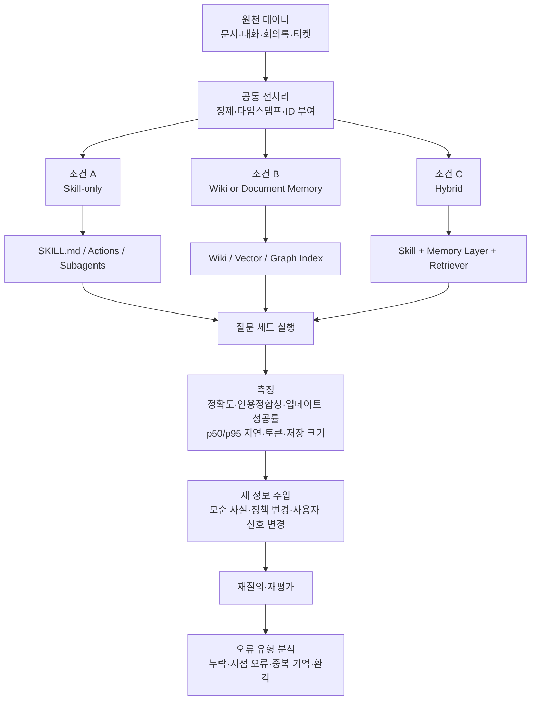

# LLM 지식 아키텍처와 장기 기억 도구 비교 보고서

## Executive Summary

2023~2026년의 흐름을 한 문장으로 요약하면, **“큰 컨텍스트 창에 다 때려 넣는 방식”에서 “필요한 지식과 절차를 분리해 지속적으로 기억·갱신하는 방식”으로 이동**했다고 볼 수 있습니다. 2023년 MemGPT는 제한된 컨텍스트 윈도우를 계층형 메모리로 우회하는 문제를 제기했고, 2024년 Microsoft GraphRAG는 사설 문서 코퍼스에 대해 **그래프 인덱스 + 커뮤니티 요약**으로 전역 질문을 다루는 방법을 제시했습니다. 2025년 Zep/Graphiti와 Mem0는 장기 기억을 별도 메모리 레이어로 제품화했고, 2026년 Andrej Karpathy의 **LLM Wiki**는 “문서를 매번 다시 검색”하지 않고 **LLM이 누적형 위키를 직접 작성·유지**하는 패턴을 대중화했습니다. citeturn12search0turn13search1turn22search2turn25search9turn14search2turn3view2

이번 조사에서 가장 중요한 결론은, **“스킬 기반 지시”와 “wiki-LLM”은 대체재가 아니라 서로 다른 종류의 기억**이라는 점입니다. OpenAI Skills와 Claude Code Skills가 잘하는 것은 **절차적 기억**입니다. 즉 “어떻게 할 것인가”를 모듈화하고 필요할 때만 불러오는 능력입니다. 반면 Karpathy의 LLM Wiki, GraphRAG, Graphiti, Mem0, Letta, LangMem 계열이 잘하는 것은 **사실·관계·경험 기억**입니다. 즉 “무엇이 사실인가, 무엇이 바뀌었는가, 과거에 무슨 일이 있었는가”를 저장하고 재호출하는 능력입니다. 공식 문서들도 각각 skills를 “workflow/instructions bundle”로, long-term memory를 “cross-session persistent store”로 설명합니다. citeturn17view0turn18view0turn20view0turn20view1turn3view2turn25search13

실무적으로는 **하이브리드 구조가 가장 안정적**입니다. 즉, **스킬/액션/서브에이전트는 제어 평면**, **위키/벡터/그래프/메모리 레이어는 데이터 평면**으로 두는 구조입니다. 이 패턴은 OpenAI의 Skills·Apps·Actions, Claude Code의 CLAUDE.md·Skills·Subagents, Graphiti의 MCP 서버, Letta의 background memory subagents, LangMem의 background memory manager에서 공통적으로 드러납니다. citeturn17view0turn17view2turn17view3turn9view0turn9view1turn19search7turn24search0turn20view1

한 가지 명시적 가정도 필요합니다. 질문에 언급된 “그래파이트”는 장기 기억 문맥상 **Zep의 Graphiti**를 뜻하는 것으로 해석했습니다. 실제 웹 검색에서는 “Graphite”라는 다른 AI 프로젝트·모델 이름도 함께 나오므로, 이 부분은 명시적 해석입니다. citeturn15search0turn15search5

## 선정한 도구와 프레임워크

이번 목록은 **GitHub 스타 수가 아니라, 2023~2026 사이의 신선도·실무 유용성·공식 문서와 공개 실험의 존재 여부**를 기준으로 골랐습니다. 일부는 “도구”, 일부는 “프레임워크”, 일부는 “운영 패턴”이지만, 실제 현업에서는 이 셋이 함께 조합되어 하나의 지식 아키텍처를 이룹니다. citeturn14search2turn17view0turn18view0turn20view0

| 선정 대상 | 대표 계층 | 왜 지금 뽑았는가 | 가장 잘 맞는 용도 |
|---|---|---|---|
| **Karpathy LLM Wiki** | 문서 컴파일형 위키 | 2026년 공식 gist가 **raw sources → wiki → schema** 구조와 **ingest/query** 운영을 명확히 설명했다. 핵심은 RAG처럼 원문을 매번 다시 찾지 않고, LLM이 지식을 누적·정리하는 “persistent, compounding artifact”를 만든다는 점이다. citeturn2view1turn3view0turn3view2turn3view5 | 개인 지식관리, 연구 노트, 코드베이스 위키 |
| **Obsidian Smart Connections** | 로컬 퍼스널 위키 / 시맨틱 인덱싱 | 내장 로컬 모델로 vault를 자동 인덱싱하고, 설치 난도가 낮으며, 로컬·오프라인·API key 없는 흐름을 강조한다. Obsidian 생태계에서 가장 실용적인 **wiki-LLM 프런트엔드** 중 하나다. citeturn0search2turn7search10turn19search0turn19search4 | 개인 second brain, 로컬 우선 PKM |
| **Microsoft GraphRAG** | 그래프 기반 문서 RAG | 공식 문서와 논문이 모두 있고, **entity graph + community summary**로 “이 데이터셋의 주요 주제는?” 같은 전역 질문에서 Naive RAG보다 유리하다는 문제정의를 분명히 제시했다. citeturn20view5turn13search1turn13search12 | 기업 문서 검색, 리서치, 전역 요약 |
| **Zep Graphiti** | 시간 인식 그래프 메모리 | Graphiti는 **temporally-aware knowledge graph**를 실시간으로 증분 업데이트하며, 배치 재계산 없이 관계 변화와 시간축을 다루도록 설계되었다. LongMemEval과 DMR 기준의 공개 성능 주장도 있다. citeturn20view6turn15search5turn22search2turn19search7 | 실시간 변화 데이터, CRM/티켓/에이전트 기억 |
| **Mem0** | 프로덕션 메모리 레이어 | “universal, self-improving memory layer”를 내세우며 OSS와 managed 양쪽을 제공하고, graph memory·cross-session memory·live token metrics를 강조한다. LoCoMo 기준 공개 연구도 있었다. citeturn20view7turn21search0turn21search2turn25search9 | 장기대화 챗봇, 개인화, 멀티에이전트 공유 기억 |
| **Letta** | stateful agent runtime | MemGPT 계보를 잇는 stateful agent 프레임워크로, memory blocks, archival memory, dream/sleep-time subagents, context repositories 등 **“기억이 주역인 에이전트 런타임”**을 제공한다. citeturn24search5turn24search8turn24search0turn24search3turn24search14turn24search16 | 장기 사용자 에이전트, 코딩 에이전트, stateful assistants |
| **LangGraph + LangMem** | 애플리케이션 프레임워크 메모리 | LangGraph store 위에 long-term memory를 두고, LangMem은 **hot path memory tools + background manager + prompt refinement**까지 다룬다. 커스텀 메모리 설계를 원하는 개발자에게 강하다. citeturn20view0turn20view1turn25search4 | 맞춤형 제품 개발, 실험 설계, 프레임워크 통합 |
| **LlamaIndex Memory** | 토큰 인지형 단·장기 메모리 | 최신 문서에서 `ChatMemoryBuffer`보다 **더 유연한 `Memory` class**를 권장하고, short-term FIFO + long-term extraction + token-limit 기반 flush/truncate를 제공한다. citeturn20view2 | 문서 기반 agent 개발, 토큰 제약 관리 |
| **Claude Code 확장 계층** | 스킬/서브에이전트/지속 컨텍스트 | 공식 문서가 CLAUDE.md, Skills, MCP, Hooks, Subagents를 **각각 다른 역할의 컨텍스트 엔지니어링 수단**으로 설명한다. 특히 skills는 필요할 때만 로드되고, subagents는 컨텍스트를 격리한다. citeturn9view0turn9view1turn9view2turn18view0turn18view1 | 코딩 에이전트, 운영 절차 자동화, 팀 컨벤션 |
| **OpenAI Skills + File Search + Apps/Actions** | 스킬/액션/검색 통합 | OpenAI는 공식적으로 `SKILL.md` 기반 versioned skills, file search의 자동 parsing/chunking/embedding, 그리고 Apps/Actions의 search·sync·deep research·external API 호출을 제공한다. 스킬 기반 지시의 대표 사례다. citeturn17view0turn17view1turn17view2turn17view3 | 업무 자동화, 검색형 비서, 툴 오케스트레이션 |

위 10개는 모두 같은 종류의 제품이 아닙니다. **Karpathy LLM Wiki·GraphRAG·Graphiti·Mem0·Letta는 “무엇을 기억할지”**, **Claude/OpenAI Skills는 “어떻게 행동할지”**, **Obsidian Smart Connections는 “사람이 읽고 탐색할 인터페이스”**, **LangMem·LlamaIndex는 “개발자가 메모리 로직을 직접 조립하는 프레임워크”**에 더 가깝습니다. 그래서 실제 도입은 보통 “하나를 고른다”가 아니라 “한 계층씩 조합한다”에 가깝습니다. citeturn3view2turn20view0turn20view6turn17view0turn18view0

참고로 Obsidian 사용자라면 **Copilot for Obsidian**도 강한 대안입니다. 공식 문서는 이를 “open-source and privacy-focused AI assistant for your personal wiki”로 설명하며, vault chat과 다중 모델 지원을 전면에 둡니다. 다만 이번 10개에서는 Smart Connections가 더 직접적으로 **지식 구조화·검색 전면**에 서 있다고 보고 우선 선정했습니다. citeturn7search3turn19search2

## 스킬 기반 지시와 wiki-LLM의 차이

가장 단순하게 정리하면, **스킬 기반 지시**는 “절차를 저장하는 방식”이고, **wiki-LLM**은 “지식을 저장하는 방식”입니다. OpenAI와 Claude의 공식 문서에서 skills는 모두 `SKILL.md`와 설명·전면 규칙을 가진 **modular instructions / reusable workflows**로 정의됩니다. 반대로 Karpathy의 LLM Wiki나 LangGraph long-term memory, Letta, Mem0는 세션을 넘어 축적되는 사실·관계·경험을 저장하는 구조입니다. citeturn17view0turn18view0turn20view0turn24search16turn25search0

이 차이를 사람 기억의 비유로 바꾸면 더 명확합니다. **스킬은 procedural memory**, 즉 “배포 체크리스트를 어떻게 실행하나”, “이 회사의 글쓰기 스타일을 어떻게 지키나”에 가깝습니다. 반대로 **wiki-LLM/메모리 레이어는 semantic/episodic memory**, 즉 “고객 A는 어떤 제약이 있나”, “지난 분기 어떤 설계 결정을 했나”, “이 관계가 지난달 어떻게 바뀌었나”에 가깝습니다. LangMem은 문서에서 procedural memory까지 명시적으로 다루고, Mem0와 Letta는 사용자 기억과 세션/장기 기억을 분리합니다. citeturn25search13turn25search4turn25search0turn25search2

아래 표의 **지연·비용 표현은 공식 문서의 구조를 바탕으로 한 상대적 추정**입니다. 즉, 특정 벤더의 실제 청구 금액이 아니라, 아키텍처가 자연스럽게 만드는 비용 구조를 비교한 것입니다. citeturn17view0turn17view1turn18view0turn3view0turn20view5turn20view6

| 비교 차원 | 스킬 기반 지시 | wiki-LLM / 문서 기반 맥락 |
|---|---|---|
| **핵심 자산** | 지침, 체크리스트, 도구 호출 규칙, API schema, 역할 분담. OpenAI Skills와 Claude Skills 모두 `SKILL.md`를 중심으로 한다. citeturn17view0turn18view0 | 문서·대화·구조화 데이터에서 추출·요약된 지식 아티팩트. Karpathy는 raw sources와 wiki 사이에 중간 층을 두고, GraphRAG/Graphiti는 그래프를, Mem0/Letta/LangMem은 메모리 스토어를 둔다. citeturn3view0turn3view2turn20view5turn20view6turn20view0 |
| **아키텍처** | 주로 **제어 평면**이다. Skills, Actions, Apps, Subagents가 모델의 행동을 제한·유도·분기시킨다. Subagent는 별도 컨텍스트에서 실행되고, Actions는 OpenAPI schema와 인증 구성을 요구한다. citeturn9view0turn9view1turn17view2 | 주로 **데이터 평면**이다. 문서를 ingest하고, 위키 또는 벡터/그래프 인덱스를 만들고, 질의 시 이를 읽어 답한다. Karpathy는 ingest/query 흐름을, GraphRAG는 graph + community summaries를, Graphiti는 temporal graph를 사용한다. citeturn3view0turn3view2turn20view5turn20view6 |
| **데이터 흐름** | 질의 시점에 필요한 skill만 로드하거나 action을 호출한다. Claude는 skill body가 사용될 때만 로드된다고 명시한다. OpenAI Apps는 검색·동기화·deep research를 질의형으로 붙인다. citeturn18view0turn17view3 | 보통 **사전 ingest 또는 지속적 write-back**이 있다. 새 소스가 들어오면 위키를 갱신하거나, 메모리에 fact를 추출·통합한다. Graphiti는 real-time incremental update, LangMem은 background manager, Letta는 dream subagent를 쓴다. citeturn3view0turn20view6turn20view1turn24search0 |
| **지연 특성** | 기본 지시는 가볍지만, 외부 API·액션 호출과 서브에이전트 실행이 지연을 좌우한다. 대신 main context를 부풀리지 않게 해준다. citeturn9view1turn17view2 | 초기에 ingest 비용이 들지만, 반복 질의에서는 원문 전체를 다시 넣지 않아도 된다. Karpathy의 핵심 주장은 “compiling vs retrieving”이고, Mem0/Zep는 full-context보다 더 낮은 지연과 토큰 사용을 보고한다. citeturn3view2turn21search2turn22search2 |
| **메모리 성격** | 짧은 작업기억을 보조하고 **절차 기억**을 강화한다. 스킬만으로 사용자 선호·장기 사실을 안정적으로 축적하기는 어렵다. citeturn17view0turn18view0turn25search13 | 단기·장기를 모두 다룰 수 있다. LlamaIndex는 short-term queue와 long-term blocks를 합치고, LangGraph는 cross-session store를 제공하며, Letta/Mem0/Graphiti는 사용자·세션·관계·시간축 기억을 유지한다. citeturn20view2turn20view0turn25search0turn24search14turn20view6 |
| **확장성** | 절차와 역할이 늘어날수록 좋다. 예를 들어 Claude의 subagents/agent teams는 병렬성과 작업 분해에 강하다. 다만 사실 지식이 많아질수록 skill 파일만으로는 한계가 온다. citeturn9view0turn9view1turn9view2 | 지식량 증가에 더 강하다. GraphRAG는 대규모 코퍼스 전역 질문에, Graphiti는 실시간 관계 변화에, Mem0는 cross-session user memory와 graph memory에 맞춰진다. 단, 그래프 도입 시 운영 복잡도는 높아진다. citeturn13search1turn20view6turn21search0 |
| **일관성·정합성** | 같은 절차를 반복 실행하게 만들기 쉽고, 권한 제어도 좋다. 하지만 underlying facts가 바뀌면 skill 파일이 자동으로 최신 사실을 보장하지는 않는다. citeturn17view2turn18view0turn9view1 | 지식 정합성은 더 좋아질 수 있지만, 이를 위해 ingest·lint·time-awareness가 필요하다. Karpathy는 lint와 log/index를 강조하고, Graphiti는 temporal history를, LongMemEval은 knowledge updates와 abstention을 핵심 능력으로 잡는다. citeturn3view3turn3view0turn22search1turn20view6 |
| **업데이트·동기화** | skill 문서 수정은 쉽다. OpenAI Apps는 sync 기능으로 미리 인덱싱할 수 있고, Claude Skills는 라이브 변경 감지를 지원한다. citeturn17view3turn18view0 | 문서·그래프·메모리를 다시 써야 한다. GraphRAG는 indexing pipeline 중심이고, Graphiti/LangMem/Letta/Mem0는 incremental or background update 쪽이 더 강하다. citeturn20view5turn20view6turn20view1turn24search0turn21search0 |
| **보안·프라이버시** | 장점은 권한과 범위를 명시적으로 제한할 수 있다는 점이다. OpenAI는 domain allowlist와 privacy policy를, Claude는 tool restriction과 permission mode를 명시한다. 단점은 외부 action/API가 늘수록 공격면도 넓어진다는 점이다. citeturn17view2turn9view1turn9view2 | 로컬 우선 설계가 가능하다. Smart Connections는 로컬 임베딩과 no-API-key를 강조하고, Mem0는 OSS self-host, Graphiti는 self-host 가능한 Python framework다. 다만 지식 복제본이 여러 저장 계층에 새로 생길 수 있다. citeturn19search0turn0search2turn20view7turn20view6 |
| **개발·운영 복잡도** | 시작은 쉽다. `SKILL.md`, `CLAUDE.md`, OpenAPI schema 정도로 출발 가능하다. 하지만 액션 인증, 앱 연결, subagent orchestration이 붙으면 운영 복잡도는 빠르게 증가한다. citeturn17view0turn17view2turn9view0 | 마크다운 위키는 단순하지만, 벡터/그래프/temporal memory 계층이 붙을수록 스키마·평가·동기화·삭제 정책이 필요해진다. 특히 GraphRAG/Graphiti는 검색 품질과 그래프 품질을 함께 관리해야 한다. citeturn3view0turn20view5turn20view6 |
| **비용 구조 추정** | 초기비용은 낮고, **질의당 반복비용**이 커지기 쉽다. 비용 항목은 prompt tokens + tool/action 호출 + 외부 서비스 사용료다. citeturn17view0turn17view2turn17view3 | 초기 ingest/index 구축비용이 더 크지만, **반복 질의당 비용**은 줄어들 수 있다. 비용 항목은 source ingest + extraction/summarization + storage + periodic maintenance다. Mem0/Zep 연구는 full-context 대비 토큰·지연 절감을 주장한다. citeturn3view2turn21search2turn22search2 |

실전에서 둘 중 하나만 고집하면 대개 한쪽이 무너집니다. **스킬만 쓰면 사실 기억이 약해지고, 위키만 쓰면 작업 절차와 툴 사용이 불안정**해집니다. 그래서 가장 재현성 있는 설계는 **“skills for how, memory/wiki for what”**입니다. citeturn17view0turn18view0turn3view2turn20view0

## 성능 관점의 공개 근거와 재현 실험 설계

공개된 연구를 묶어 보면, **긴 컨텍스트 자체가 장기 기억의 해답은 아니다**라는 메시지가 반복됩니다. *Lost in the Middle*은 관련 정보가 긴 입력의 중간에 있을 때 성능이 크게 떨어질 수 있음을 보였고, RULER는 단순 Needle-in-a-Haystack만으로는 실제 long-context 성능을 충분히 설명하지 못한다고 지적했습니다. 즉, “컨텍스트를 크게 늘리면 기억 문제도 해결된다”는 가정은 이미 2023~2024년 연구에서 흔들렸습니다. citeturn11search2turn11search10turn11search3

장기 기억 벤치마크 쪽에서는 **LoCoMo**와 **LongMemEval**이 핵심입니다. LoCoMo는 평균 약 300턴, 9K 토큰 규모의 장기 대화 데이터를 다루며, LongMemEval은 500개 질문으로 **information extraction, multi-session reasoning, temporal reasoning, knowledge updates, abstention** 다섯 능력을 측정합니다. LongMemEval 저자들은 상용 챗 어시스턴트와 long-context LLM이 장기 상호작용에서 약 30% 수준의 정확도 저하를 보인다고 보고했습니다. citeturn11search0turn21search14turn22search1turn22search5

도구별 공개 수치는 주의해서 읽어야 합니다. **MemGPT**는 2023년 계층형 가상 메모리 접근을 제시했고, **Zep/Graphiti**는 DMR에서 MemGPT를 소폭 앞섰으며 LongMemEval 계열에서 최대 18.5% 정확도 향상과 90% 지연 감소를 주장합니다. **Mem0**는 LoCoMo 기준 OpenAI Memory 대비 26% 상대 개선, 91% 낮은 p95 latency, 90% 낮은 토큰 사용을 제시합니다. 다만 Zep와 Mem0 수치는 모두 **벤더가 작성한 논문/리서치 페이지**에서 나온 것이므로, 조달·도입 판단에는 반드시 자체 재현이 필요합니다. citeturn12search0turn22search2turn21search2turn25search9

**GraphRAG**는 다른 종류의 문제를 푼다는 점도 중요합니다. LoCoMo/LongMemEval이 대화 기억을 보는 데 비해, GraphRAG는 대규모 private corpus에 대한 **global question answering / query-focused summarization**을 노립니다. 따라서 GraphRAG 수치를 장기 대화 메모리 수치와 단순 비교하면 안 됩니다. 대신 “복잡한 문서 집합 전체를 요약·탐색해야 하는가?”라는 별도 축에서 평가해야 합니다. Microsoft는 GraphRAG가 global sensemaking 질문에서 naive RAG 대비 더 포괄적이고 다양한 답변을 만든다고 설명하고, BenchmarkQED는 그 평가를 자동화하는 도구로 제시됩니다. citeturn13search1turn20view5turn13search2turn13search11

반대로 **Karpathy LLM Wiki와 Obsidian 계열은 아직 공개 표준 벤치마크가 약합니다**. Karpathy의 공식 자료는 “idea file”이며, 아키텍처와 워크플로를 제시하지만 정량 벤치마크 프로토콜은 포함하지 않습니다. 따라서 이 진영은 현재로서는 **정확도보다는 운영성**—응답의 반복 재사용성, 위키 품질, stale page 비율, 인간 교정 시간—으로 평가하는 것이 현실적입니다. citeturn2view1turn3view0turn3view2

재현 실험은 아래와 같이 설계하는 것이 가장 공정합니다. 핵심은 **동일한 base model, 동일한 query budget, 동일한 데이터셋**에서 아키텍처만 바꾸는 것입니다. LoCoMo와 LongMemEval은 대화 기억용, GraphRAG/BenchmarkQED류 데이터셋은 문서 전역 질의용으로 분리하는 편이 낫습니다. citeturn11search0turn22search1turn13search11



재현 지표는 적어도 여섯 가지가 필요합니다. **정답 정확도**, **citation grounding precision**, **knowledge update 성공률**, **p50/p95 latency**, **총 입력·출력 토큰**, **메모리 품질 비용**—예컨대 “100건 ingest당 인간이 고쳐야 한 분 수”—입니다. 대화형 제품이라면 여기에 **user preference recall**, 기업 문서 검색이라면 **global summary coverage**, 에이전트 오케스트레이션이라면 **tool success rate**를 추가해야 합니다. 이 지표 선정은 LongMemEval의 five abilities, GraphRAG의 global-question framing, 그리고 OpenAI/Claude의 action/skill 구조에서 자연스럽게 도출됩니다. citeturn22search1turn13search1turn17view2turn18view0

하드웨어는 두 경로가 있습니다. **API 기반 공정 비교**라면 같은 모델을 세 조건에 동일하게 연결해 서버 차이를 제거하면 됩니다. **자체 호스팅 비교**라면 보편적으로 16 vCPU·64GB RAM·NVMe 스토리지급의 단일 노드에 Postgres/Neo4j/벡터 스토어를 얹고, 로컬 임베딩이나 reranking이 필요하면 소비자 GPU 한 장 정도를 추가하는 설계가 재현과 비용의 균형이 좋습니다. 이 부분은 특정 논문의 공식 설정이 아니라, 여러 프레임워크를 공정 비교하기 위한 **실무 권고안**입니다.

## 실제 적용 시나리오와 권장 아키텍처 패턴

가장 간단한 적용 분야는 **개인 지식관리와 학습**입니다. 여기서는 Karpathy LLM Wiki + Obsidian Smart Connections 조합이 가장 실용적입니다. Karpathy 패턴은 raw source를 ingest하면서 위키를 갱신하고, Obsidian은 graph view와 markdown 기반 파일 구조로 사람이 읽기 좋습니다. Smart Connections는 로컬 인덱싱과 의미 검색을 제공하므로, “지식 작성은 LLM Wiki, 탐색은 Obsidian/Smart Connections”라는 분업이 잘 맞습니다. citeturn3view0turn3view4turn0search2turn19search0

**기업 문서 검색과 리서치**는 전혀 다른 문제입니다. 단순 FAQ보다 “전체 코퍼스의 theme, risk, contradiction”을 묻는다면 Microsoft GraphRAG 계열이 더 적합합니다. 반대로 질의가 주로 특정 문서 조각의 회상이라면 file search나 LlamaIndex/LangGraph 같은 document-agent 프레임워크가 더 단순합니다. 요컨대 문서가 **정적이고 방대하며 전역 요약 질문이 많으면 GraphRAG**, 문서가 **다양하지만 구조를 개발자가 세밀하게 통제해야 하면 LlamaIndex/LangMem/LangGraph**가 유리합니다. citeturn13search1turn20view5turn17view1turn20view0turn20view2

**챗봇의 장기 대화**에서는 wiki보다는 메모리 레이어가 우선입니다. Mem0, Letta, Graphiti는 모두 세션을 넘는 기억을 기본 전제로 두며, Mem0는 user/session memory, Letta는 memory blocks와 archival memory, Graphiti는 temporal knowledge graph를 사용합니다. 대화에서 자주 발생하는 문제—선호 변경, 일정 변경, 사람 관계, 모순된 최신 정보—는 단순 문서 검색보다 **update-aware memory**가 더 잘 처리합니다. citeturn25search0turn25search2turn24search14turn20view6turn21search0

**에이전트 오케스트레이션과 코딩 에이전트**는 스킬 기반 지시가 특히 중요합니다. Claude Code는 CLAUDE.md, Skills, Subagents, Agent Teams를 통해 역할 분리와 컨텍스트 격리를 공식화했고, OpenAI는 Skills, Actions, Apps로 workflow bundling과 external tool 연결을 제공하며, Letta는 context repositories와 background memory subagents를 통해 stateful coding을 강화합니다. 이런 환경에서 가장 좋은 패턴은 **스킬이 절차를, Git/위키/메모리 스토어가 상태를, 서브에이전트가 대용량 중간작업을 담당**하게 하는 것입니다. citeturn9view0turn9view1turn17view0turn17view2turn24search3turn24search6

**실시간으로 바뀌는 엔터프라이즈 데이터**—CRM, 티켓, 업무 로그, 캘린더, 사람 관계—는 Graphiti와 Mem0 graph memory가 가장 설득력 있습니다. Graphiti는 batch recomputation 없이 incrementally temporal graph를 갱신하는 것을 강점으로 내세우고, Mem0 graph memory는 memory write마다 entity와 relationship를 추출해 vector + graph를 함께 사용합니다. 변경과 관계가 본질인 데이터에 대해서는, 정적 문서로부터 그래프를 추출하는 GraphRAG보다 이런 **online memory graph**가 더 자연스럽습니다. citeturn20view6turn21search0turn21search12

정리하면, 실무 권장 패턴은 보통 다음 네 층입니다. **제어 평면**에는 Skills/CLAUDE.md/Actions를 둡니다. **작업기억 평면**에는 short-term buffer와 summaries를 둡니다. **장기 지식 평면**에는 wiki/vector/graph/memory layer를 둡니다. **실행 평면**에는 Apps/MCP/Actions/Subagents를 둡니다. 이 네 층을 분리하면, 어느 층이 문제인지—절차 불일치인지, 기억 누락인지, 검색 품질인지, 권한 문제인지—가 훨씬 잘 드러납니다. citeturn9view0turn17view3turn20view0turn20view2turn20view6

## 장단점 요약과 의사결정 체크리스트

먼저 접근법 수준의 요약입니다.

| 접근 | 가장 큰 장점 | 가장 큰 약점 | 언제 선택할까 |
|---|---|---|---|
| **Skill 기반 지시** | 절차 재사용, 컨텍스트 절감, 권한·역할 분리, 행동 일관성. Claude는 skill body가 필요할 때만 로드된다고 명시한다. citeturn18view0turn9view1 | 사실 기억이 누적되지 않기 쉽고, 최신 지식은 외부 source에 의존한다. citeturn17view0turn18view0 | 팀 규칙, 배포/리뷰/리서치 playbook, 툴 오케스트레이션 |
| **LLM Wiki / markdown wiki** | 사람이 읽고 수정 가능한 지식 아티팩트, 버전관리 용이, 반복 질의 비용 절감 가능성. citeturn3view2turn3view4 | ingest·lint가 필요하고, 자동 확장성과 정합성 관리가 어렵다. citeturn3view0turn3view3 | 개인 지식관리, 코드베이스 설명서, 연구 위키 |
| **Vector/File Search 중심 RAG** | 구현이 단순하고, 공식 지원이 풍부하며, 특정 조각 회상에 강하다. OpenAI file search는 자동 parsing/chunking/embedding을 제공한다. citeturn17view1 | 전역 질문·시간 변화·관계 질의에 약할 수 있다. citeturn13search1turn11search2 | 문서 QA, 제품 매뉴얼, 규정 문서 검색 |
| **GraphRAG / Temporal Graph Memory** | 다중 hop, 전역 요약, 시간·관계·업데이트 처리에 강하다. citeturn13search1turn20view6turn21search0 | 구축·운영 복잡도와 초기 인덱싱 비용이 높다. citeturn20view5turn20view6 | 엔터프라이즈 문서, 사람/객체 관계, 변화 추적 |
| **Hybrid** | 절차와 지식을 분리하여 가장 재현성 높은 운영이 가능하다. citeturn9view0turn17view0turn20view0 | 설계와 관측이 복잡해지므로 평가 체계를 먼저 만들어야 한다. citeturn22search1turn13search2 | 대부분의 실제 제품 |

도구별 요약도 압축해서 보면 아래와 같습니다.

| 도구 | 가장 강한 점 | 주의할 점 |
|---|---|---|
| Karpathy LLM Wiki | “지식 컴파일” 발상이 명확하고, 지식이 파일로 남는다. citeturn3view2turn3view4 | 표준 벤치마크와 자동 정합성 보장은 아직 약하다. citeturn2view1turn3view3 |
| Smart Connections | 로컬·저마찰·즉시 체감형 PKM 강화. citeturn0search2turn19search0 | 팀 단위 거대 지식 그래프보다는 개인 vault에 더 잘 맞는다. citeturn7search10turn19search4 |
| GraphRAG | 전역 문서 이해·요약에서 강함. citeturn13search1turn20view5 | 실시간 업데이트보다 offline indexing 쪽이 중심이다. citeturn20view5 |
| Graphiti | 관계와 시간축을 함께 다루는 온라인 메모리 그래프. citeturn20view6turn22search2 | Neo4j/graph 운영 역량이 필요하다. citeturn19search7turn20view6 |
| Mem0 | 빠른 도입, cross-session personalization, 공개 효율 수치. citeturn20view7turn21search2 | 공개 수치가 벤더 주도 자료라는 점은 재검증이 필요하다. citeturn21search2turn25search9 |
| Letta | stateful agent, memory blocks, dreaming, observability가 강함. citeturn24search0turn24search15turn24search16 | 개념이 풍부한 만큼 설계 자유도가 높아 초기에 복잡할 수 있다. citeturn24search14turn24search15 |
| LangMem/LangGraph | 커스텀 메모리 연구·제품화에 유연하다. citeturn20view0turn20view1 | 기본값만으로는 “완제품”보다 손이 더 간다. citeturn20view0turn20view1 |
| LlamaIndex Memory | 토큰 제한을 의식한 short/long-term 균형. citeturn20view2 | memory block 설계를 직접 해야 품질이 나온다. citeturn20view2 |
| Claude Code 확장 계층 | 스킬·서브에이전트·CLAUDE.md의 역할 분리가 매우 선명하다. citeturn9view0turn18view1 | 사실 지식 저장소 없이 쓰면 procedural layer에 머무르기 쉽다. citeturn18view0turn9view0 |
| OpenAI Skills/Apps/Actions | versioned skills, file search, sync, deep research, external actions가 한 플랫폼에 있다. citeturn17view0turn17view1turn17view3 | 외부 서비스 연결이 늘수록 권한·프라이버시 관리가 중요해진다. citeturn17view2 |

의사결정은 아래 질문으로 거의 정리됩니다.

| 먼저 물어볼 질문 | “예”라면 우선 검토 | “아니오”라면 우선 검토 |
|---|---|---|
| 저장하려는 것이 **절차**인가? | Claude/OpenAI Skills, CLAUDE.md, Actions. citeturn17view0turn18view0 | Wiki/Graph/Memory layer. citeturn3view2turn20view0 |
| 데이터가 **자주 바뀌는가**? | Graphiti, Mem0, Letta. citeturn20view6turn21search0turn25search2 | LLM Wiki, GraphRAG, file search. citeturn3view0turn20view5turn17view1 |
| 질의가 **전역 요약·다중 hop 관계**를 요구하는가? | GraphRAG, Graphiti. citeturn13search1turn20view6 | 단순 file search, Smart Connections, LlamaIndex. citeturn17view1turn19search0turn20view2 |
| **로컬 우선/오프라인/프라이버시**가 중요한가? | Obsidian Smart Connections, LLM Wiki, Mem0 OSS, self-host Graphiti. citeturn19search0turn3view4turn20view7turn20view6 | SaaS memory layer, managed app platform |
| 사용자가 매번 돌아와 **개인화**를 기대하는가? | Mem0, Letta, LangMem. citeturn25search0turn25search2turn20view1 | 정적 문서 검색 중심 구조 |
| 팀에서 **행동 일관성과 권한 제어**가 더 중요한가? | Claude/OpenAI skill & action stack. citeturn17view2turn9view1 | 개인 위키·연구형 구조 |
| 인간이 ingest 결과를 **검토할 수 있는가**? | LLM Wiki와 document compilation이 잘 맞는다. citeturn3view0turn3view3 | 자동 memory layer와 conservative retrieval 설계를 우선 검토 |

## 결론과 실무 권장사항

실무 우선순위는 분명합니다. **첫째, 스킬과 지식을 분리하라. 둘째, “정적 문서”와 “변화하는 사실”을 같은 저장소로 처리하지 마라. 셋째, 장기 기억은 반드시 평가 가능한 형태로 남겨라.** 2023~2026의 도구 발전이 보여준 것도 정확히 이 세 가지입니다. Skills·Actions·Subagents는 절차를 모듈화했고, GraphRAG·LLM Wiki는 문서를 구조화했으며, Graphiti·Mem0·Letta·LangMem은 세션을 넘는 사실 기억을 별도 계층으로 만들었습니다. citeturn17view0turn18view0turn13search1turn3view2turn20view6turn21search2turn24search16

도입은 보통 네 단계가 가장 안전합니다. **첫 단계**는 CLAUDE.md나 Skills처럼 절차와 팀 규칙을 먼저 안정화하는 것입니다. **둘째 단계**는 file search 또는 wiki/markdown 기반 지식 저장소를 붙여 canonical knowledge를 만듭니다. **셋째 단계**는 사용자 선호·에이전트 경험처럼 세션을 넘는 사실만 따로 메모리 레이어에 보냅니다. **넷째 단계**는 관계·시점 추론이 중요해질 때만 그래프/temporal 메모리를 추가합니다. 이 순서를 거꾸로 하면, 멋진 그래프는 생기는데 실제 답변 품질과 운영 안정성은 오르지 않는 경우가 많습니다. citeturn9view0turn17view1turn3view0turn20view0turn20view6

개인 지식관리라면 **Karpathy LLM Wiki + Obsidian Smart Connections**가 가장 비용대비 효율이 좋습니다. 팀과 코딩 에이전트라면 **Claude Code 또는 OpenAI Skills 계층 + Git/위키/문서 검색**이 출발점이 좋습니다. 장기대화 챗봇과 개인화 에이전트라면 **Mem0 또는 Letta**, 시간이 바뀌는 엔터프라이즈 관계 데이터라면 **Graphiti**, 전역 문서 이해가 핵심이면 **GraphRAG**가 우선순위가 높습니다. 프레임워크를 직접 조립해야 하는 팀은 **LangMem/LangGraph 또는 LlamaIndex Memory**로 가는 편이 낫습니다. citeturn3view2turn19search0turn9view0turn17view0turn21search2turn24search16turn20view6turn13search1turn20view0turn20view2

마지막으로 위험요소는 세 가지입니다. **stale memory**, **contradictory memory**, **평가 부재**입니다. LongMemEval이 knowledge updates와 abstention을 별도 능력으로 측정하는 이유도 여기에 있고, Karpathy가 lint를 넣은 이유도, Graphiti가 temporal validity를 강조하는 이유도, Letta와 Mem0가 background consolidation을 강조하는 이유도 모두 같습니다. 기억을 “많이 저장하는 것”보다 **“무엇을 언제 잊고, 어떻게 갱신하며, 언제 모른다고 말하게 할지”**를 설계하는 편이 실제 성능에 더 중요합니다. citeturn22search1turn3view3turn20view6turn24search0turn21search0

- codex 지식 시스템 추가 요청 사항

```text
sentence-transformers + faiss를 붙여 로컬 의미검색 추가
Obsidian Smart Connections 설치 전제에 맞춰 설정 문서 작성
현재 llm_wiki를 GraphRAG-lite 형태로 확장해 커뮤니티 요약 JSON 추가
이 세가지를 실행해서 시스템을 구축해주고
Graphiti 또는 Mem0
목적: 문서가 말한 “변화하는 사실” 계층 추가
이 부분도 같이 설치해서 시스템이 좀 더 똑똑해진 지식 체계를 구축하도록 진행해줘
```
