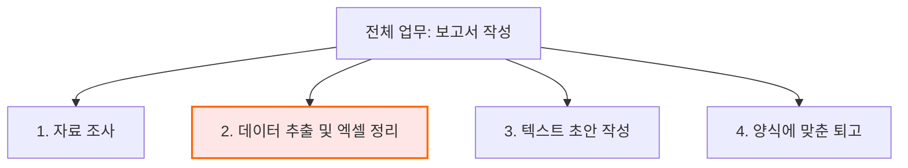

# 머메이드 테스트

```mermaid
graph TD
    A[전체 업무: 보고서 작성]

    A --> B[1. 자료 조사]
    A --> C[2. 데이터 추출 및 엑셀 정리]
    A --> D[3. 텍스트 초안 작성]
    A --> E[4. 양식에 맞춘 퇴고]

    style C fill:#ffe6e6,stroke:#ff6600,stroke-width:2px
```

