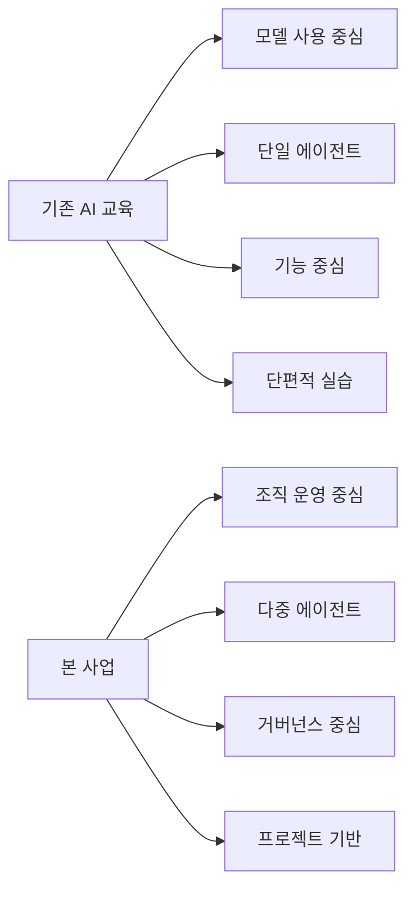

# 1. 사업계획서 (요약형)

## 1) 사업 개요

본 사업은 AI 에이전트를 단순 개발이 아닌 **조직 단위로 운영·관리하는 교육 플랫폼**인 *PaperclipAI 기반 교육 프로그램*을 구축하는 것을 목표로 한다.

기존 AI 교육이 모델 활용 또는 프롬프트 수준에 머무르는 반면, 본 과정은 **“AI 조직 운영(OS)” 개념**을 중심으로 목표–업무–조직–예산–승인 체계를 통합적으로 학습하도록 설계한다.

이를 통해 학습자는 단순 사용자 수준을 넘어, **AI를 실제 업무 조직처럼 설계·운영할 수 있는 실무 역량**을 확보하게 된다.

---

## 2) 사업 필요성

현 시점에서 AI 활용은 다음과 같은 한계를 가진다.

* 개별 AI 사용은 가능하나 **다수 에이전트 운영 시 통제 불가**
* 비용 증가 및 작업 중복 문제 발생
* 책임 추적 및 승인 체계 부재

PaperclipAI는 이러한 문제를 해결하기 위해 다음 구조를 제공한다.

* Company 기반 조직 관리
* Task 중심 작업 분할
* Heartbeat 기반 실행 통제
* Budget 및 Approval 기반 거버넌스

즉, 본 사업은 단순 기술 교육이 아니라
**“AI 운영 체계 설계 교육”이라는 새로운 영역을 개척**하는 것이다.

---

## 3) 사업 목표

### 정량 목표

* 연간 100명 이상 교육 운영
* 80% 이상 실습 완료율
* 70% 이상 캡스톤 프로젝트 완성

### 정성 목표

* AI 조직 설계 역량 확보
* 비용·통제 중심 AI 운영 능력 향상
* 산업 현장 적용 가능한 프로젝트 산출

---

## 4) 교육 서비스 구성

본 사업은 다음 3단 구조로 운영된다.

### (1) 이론 교육

* AI 에이전트 운영 개념
* 조직 구조 및 목표 설계
* 비용 및 승인 시스템

### (2) 실습 교육

* 로컬 환경 구축
* Task / Agent / Goal 구성
* Heartbeat 실행 및 모니터링

### (3) 프로젝트 (Capstone)

* AI 조직 설계
* 실제 업무 자동화 시나리오 구현
* 비용 및 승인 정책 포함

---

## 5) 차별성

기존 교육과의 차별점은 다음과 같다.

| 기존 AI 교육 | 본 사업     |
| -------- | -------- |
| 모델 사용 중심 | 조직 운영 중심 |
| 단일 에이전트  | 다중 에이전트  |
| 기능 중심    | 거버넌스 중심  |
| 실습 단편적   | 프로젝트 기반  |

특히 **Budget, Approval, Audit 구조까지 포함한 교육**은 기존 과정에서는 거의 다루지 않는 영역이다.

---

## 6) 기대 효과

* 기업: AI 자동화 조직 설계 가능
* 교육기관: 차별화된 커리큘럼 확보
* 학습자: 실무형 AI 운영 역량 확보

장기적으로는
**“AI 팀을 설계하고 운영할 수 있는 인력 양성”**이라는 새로운 직무 영역을 창출할 수 있다.

