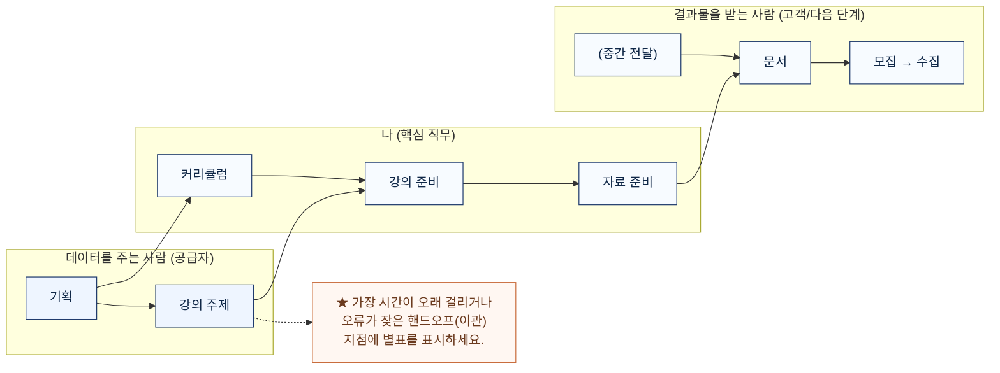

# 업무 흐름 (Mermaid)

```mermaid
flowchart LR
  %% =========================
  %% Swimlanes
  %% =========================
  subgraph L1["데이터를 주는 사람 (공급자)"]
    direction LR
    A1["기획"]
    A2["강의 주제"]
  end

  subgraph L2["나 (핵심 직무)"]
    direction LR
    B1["커리큘럼"]
    B2["강의 준비"]
    B3["자료 준비"]
  end

  subgraph L3["결과물을 받는 사람 (고객/다음 단계)"]
    direction LR
    C1["(중간 전달)"]
    C2["문서"]
    C3["모집 → 수집"]
  end

  %% =========================
  %% Main Flow
  %% =========================
  A1 --> A2
  A1 --> B1
  A2 --> B2
  B1 --> B2
  B2 --> B3
  B3 --> C2
  C1 --> C2
  C2 --> C3

  %% =========================
  %% Star annotation
  %% =========================
  S["★ 가장 시간이 오래 걸리거나<br/>오류가 잦은 핸드오프(이관)<br/>지점에 별표를 표시하세요."]
  A2 -.-> S

  %% =========================
  %% Optional styling
  %% =========================
  classDef supplier fill:#eef5ff,stroke:#1f3b6d,stroke-width:1px,color:#0f2747;
  classDef me fill:#f7fbff,stroke:#1f3b6d,stroke-width:1px,color:#0f2747;
  classDef receiver fill:#f7fbff,stroke:#1f3b6d,stroke-width:1px,color:#0f2747;
  classDef note fill:#fff7f2,stroke:#c96d3d,stroke-width:1px,color:#6b3a1e;

  class A1,A2 supplier;
  class B1,B2,B3 me;
  class C1,C2,C3 receiver;
  class S note;
```
