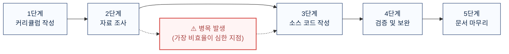

# AS-IS 프로세스 스케치

```mermaid
flowchart LR
  %% =========================
  %% Main Process
  %% =========================
  A["1단계<br/>커리큘럼 작성"]
  B["2단계<br/>자료 조사"]
  C["3단계<br/>소스 코드 작성"]
  D["4단계<br/>검증 및 보완"]
  E["5단계<br/>문서 마무리"]

  A --> B --> C --> D --> E

  %% =========================
  %% Bottleneck 표시
  %% =========================
  bottleneck["⚠️ 병목 발생<br/>(가장 비효율이 심한 지점)"]
  B -.-> bottleneck
  bottleneck -.-> C

  %% =========================
  %% 스타일
  %% =========================
  classDef normal fill:#f8fbff,stroke:#1f3b6d,stroke-width:1px,color:#0f2747;
  classDef danger fill:#fff4f4,stroke:#d9534f,stroke-width:2px,color:#a94442;

  class A,B,C,D,E normal;
  class bottleneck danger;
```
