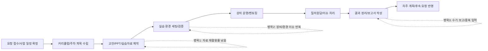
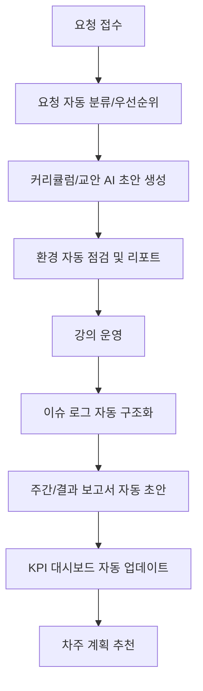
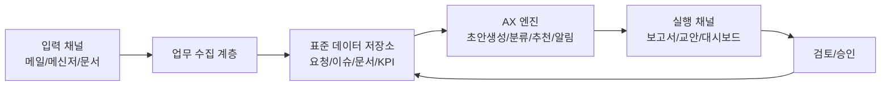

# 업무분석보고서

## 0. 문서 개요
- 작성 목적: `나의업무분석` 주간 업무일지(총 49주)를 기반으로, 2026년 4월 6일~4월 7일 수업에서 다룬 분석 방법(업무 흐름 구조화, 비효율 수치화, DX 개선 포인트 도출, AX 전환 판별)을 적용해 실제 업무를 진단하고 AX 전환 우선순위를 제시한다.
- 분석 기간: 업무일지 기준 2024년 12월 30일~2025년 12월 26일
- 분석 대상: 교육 운영, 교안/콘텐츠 제작, 기술 환경 구축, 행정/기획/보고, 운영비/계정 관리 업무
- 산출물 범위: AS-IS 프로세스, 병목 구간, 정량 추정, AX 전환 후보 선정, 3단계 실행 로드맵, KPI/리스크

---

## 1. 분석 방법론 (2026-04-06~2026-04-07 수업 적용)

### 1.1 적용한 수업 방법
2026년 4월 6일~4월 7일 수업에서 제시된 방법을 아래 순서로 적용했다.

1. 업무 흐름 구조화: 공급자-핵심직무-수요자 관점으로 프로세스를 단계화
2. 업무 흐름 가시화: Mermaid로 핸드오프 및 병목지점 표시
3. 비효율 식별: 반복성/대기/오류/중복입력/재작업 중심으로 비효율 지점 도출
4. 비효율 수치화: 월간 빈도, 평균 소요시간, 재작업률, 지연비용을 추정
5. DX 개선 포인트 정의: 표준화, 템플릿화, 데이터 연계, 대시보드화
6. AX 전환 판별: 자동화(Automation)와 지능화(Augmentation)로 구분해 우선순위 선정

### 1.2 판별 기준
AX 전환 대상 판별을 위해 항목별 5점 척도(높을수록 전환 우선)를 적용했다.

- 반복성: 동일 패턴 재발 빈도
- 규칙성: 규칙/템플릿으로 처리 가능한 정도
- 데이터 가용성: 기존 문서/로그/템플릿 존재 여부
- 영향도: 시간절감, 오류감소, 품질상승의 기대치
- 도입 난이도: 낮을수록 가점(5=쉽다, 1=어렵다)

`총점 = 반복성 + 규칙성 + 데이터가용성 + 영향도 + 도입난이도`

---

## 2. 데이터 범위 및 업무 분류 결과

### 2.1 데이터 신뢰성 점검
- 총 파일 수: 49개 주간 업무일지
- 기간 라인 존재율: 49/49 (100%)
- 핵심 섹션(`날짜별 주요 진행 업무`, `주요 이슈`, `차주 계획`) 존재: 127개(대부분 파일에 표준 구조 유지)
- 결론: 정성 분석 및 중간 수준 정량 추정에 충분한 구조적 일관성 확보

### 2.2 업무군 분류 결과 (업무일지 라인 기반)
업무일지 문장을 카테고리 키워드로 분류한 결과는 다음과 같다.

| 업무군 | 매칭 라인 수 | 관여 주차 수 | 해석 |
|---|---:|---:|---|
| 기술개발·환경 구축 | 508 | 49 | 전 기간 상시 발생. 세팅/설치/연동/디버깅이 지속적 병목 |
| 교육 운영 | 424 | 48 | 강의/교육/멘토링/출강 빈도가 매우 높음 |
| 행정·기획·보고 | 298 | 49 | 보고서/계획서/요청 대응/회의/일정이 상시 발생 |
| 교안·콘텐츠 제작 | 212 | 40 | 교안/자료/PPT/영상 작업이 주기적으로 반복 |
| 운영비·계정 관리 | 20 | 7 | 빈도는 낮지만 오류 발생 시 영향도가 큼 |

### 2.3 핵심 관찰
- 본 업무는 단순 강의 수행이 아니라 `교육 운영 + 기술지원 + 콘텐츠 제작 + 행정 대응`이 결합된 다중직무 구조다.
- 교육 자체보다, 교육 전후 준비/정리/보고/세팅 단계에서 재작업과 지연이 집중된다.
- AX 전환 효과는 “수업 시간”보다 “수업 전/후 반복 업무”에서 더 크게 발생한다.

---

## 3. AS-IS 업무 흐름 구조화

### 3.1 End-to-End 흐름

### 3.2 공급자-핵심직무-수요자 관점
- 공급자(입력): 발주처 요청, 사업 일정, 기존 교안/코드, 결제/계정 상태, 교육생 수준
- 핵심직무(처리): 기획, 자료 제작, 실습 환경 구축, 강의 운영, 이슈 대응, 결과 보고
- 수요자(출력): 교육생 학습성과, 기관 보고 문서, 차주 운영 계획, 비용/계정 처리 결과

### 3.3 핸드오프 리스크
- 요청사항이 메신저/문서/회의록에 분산되어 누락 가능성 존재
- 교안 버전과 실습 코드 버전이 분리되어 최신본 불일치 위험
- 보고서/계획서 작성 시 동일 내용의 재입력 반복

---

## 4. 비효율 식별 (정성)

### 4.1 반복적으로 나타난 비효율 유형
1. 자료 제작 중복
- 유사 주제의 교안을 기관별로 재작성
- 문체/포맷 차이로 버전 통합 난이도 증가

2. 환경 세팅 재작업
- OS/장비/드라이버 차이로 설치 오류 반복
- 실습 직전 긴급 트러블슈팅 발생

3. 이슈 대응 비표준
- 장애 이력은 있으나 재발 방지 지식베이스 부족
- 담당자 의존적 해결(개인 기억 기반)

4. 보고·계획 문서 수기화
- 주간 보고/결과 보고/사업 계획서에 중복 입력 다수
- 정량 근거 수집에 별도 수작업 소요

5. 운영/비용 관리 단절
- 계정 결제/해지/추가결제 이력이 분산
- 오류 시 일정 차질 및 운영 리스크 확대

### 4.2 이슈 키워드 기반 근거
업무일지 텍스트에서 `문제(50)`, `요청(47)`, `수정(27)`, `지연(10)`, `오류(10)`이 반복 확인되었고, 이는 단발성 이벤트가 아니라 상시 관리 대상임을 의미한다.

---

## 5. 비효율 수치화 (정량 추정)

### 5.1 산정 원칙
- 업무일지에 명시된 반복 패턴과 주차 빈도를 기준으로 월간 평균값을 추정
- 시간/비용은 보수적으로 계산
- 인건비 가정: 시간당 35,000원 (내부 분석용 가정)
- 월 기준: 4주

### 5.2 낭비 시간/비용 추정

| 비효율 업무 | 평균 소요(회) | 월 빈도 | 월간 낭비시간 | 연간 낭비시간 | 연간 환산비용 |
|---|---:|---:|---:|---:|---:|
| 교안/자료 중복 제작 | 3.0h | 6회 | 18h | 216h | 7,560,000원 |
| 환경 세팅 재작업(설치/오류 대응) | 2.5h | 8회 | 20h | 240h | 8,400,000원 |
| 보고서/계획서 수기 작성 및 재입력 | 2.0h | 6회 | 12h | 144h | 5,040,000원 |
| 일정/요청사항 정리 및 누락 보정 | 1.5h | 8회 | 12h | 144h | 5,040,000원 |
| 계정/결제/정산 수동 관리 | 1.0h | 3회 | 3h | 36h | 1,260,000원 |
| 교육 이슈 대응 기록 정리 미흡으로 인한 재진단 | 1.5h | 4회 | 6h | 72h | 2,520,000원 |
| **합계** |  |  | **71h/월** | **852h/년** | **29,820,000원/년** |

### 5.3 해석
- 월 71시간은 약 9~10인일(1인일 7.5h 기준)에 해당한다.
- 교육 수행 자체보다, 준비/정리/재작업 영역이 총 낭비시간의 대부분을 차지한다.
- AX 전환 시 1차 목표는 최소 30% 절감(월 21h)로 설정 가능하다.

---

## 6. DX 개선 포인트

### 6.1 표준화 대상
- 교안 템플릿: 과정 소개, 실습 목표, 체크리스트, 트러블슈팅 섹션 공통화
- 환경 세팅 체크리스트: OS별 사전점검 항목 및 실패 대응 가이드
- 보고 템플릿: 주간/결과 보고 공통 지표 자동 삽입 구조

### 6.2 데이터 연계 대상
- 일정/요청/결제/문서 버전을 단일 워크스페이스에서 추적
- 교육 진행 로그(출석, 과제, 이슈)를 구조화해 재사용

### 6.3 운영 체계 개선
- “요청 접수 -> 처리 상태 -> 결과 확인”의 티켓 흐름 도입
- 반복 이슈의 FAQ/Runbook 축적
- 버전관리 규칙(파일명, 날짜, 버전, 승인자) 일원화

---

## 7. AX 전환 후보 판별

### 7.1 자동화 vs 지능화 구분
- 자동화(Automation): 정형·반복·규칙 기반 업무를 시스템이 대체
- 지능화(Augmentation): 판단·요약·추천·생성 업무를 AI가 보조

### 7.2 후보 업무 평가표

| 후보 업무 | 유형 | 반복성 | 규칙성 | 데이터가용성 | 영향도 | 도입난이도 | 총점(25) |
|---|---|---:|---:|---:|---:|---:|---:|
| 주간 업무일지 -> 보고서 자동 초안 생성 | 지능화 | 5 | 4 | 5 | 5 | 4 | 23 |
| 교안/PPT 초안 생성 및 버전 비교 | 지능화 | 4 | 4 | 4 | 5 | 3 | 20 |
| 환경 세팅 체크리스트 자동 점검 스크립트 | 자동화 | 5 | 5 | 4 | 5 | 3 | 22 |
| 반복 장애 대응 Runbook 추천 | 지능화 | 4 | 3 | 4 | 4 | 3 | 18 |
| 일정/요청사항 자동 수집·우선순위화 | 자동화+지능화 | 4 | 4 | 4 | 4 | 3 | 19 |
| 결제/계정 상태 모니터링 및 알림 | 자동화 | 3 | 5 | 3 | 4 | 4 | 19 |
| 교육생 질문 분류/FAQ 자동 응답 초안 | 지능화 | 4 | 3 | 3 | 4 | 4 | 18 |
| 결과보고 KPI 자동 집계 대시보드 | 자동화 | 4 | 4 | 4 | 5 | 3 | 20 |
| 기관별 커리큘럼 커스터마이징 제안 | 지능화 | 3 | 3 | 4 | 4 | 3 | 17 |
| 과제 피드백 자동 코멘트 초안 | 지능화 | 3 | 3 | 3 | 3 | 4 | 16 |

### 7.3 AX 전환 대상 최종 선정
1차 우선 전환(즉시 효과)
- 환경 세팅 자동 점검
- 업무일지/보고서 자동 초안
- KPI 집계 자동화

2차 전환(품질 고도화)
- 교안/PPT 생성 및 버전 비교
- 요청/일정 우선순위화
- 결제/계정 모니터링

3차 전환(지식자산화)
- 장애 대응 추천
- FAQ/질의응답 지능화
- 커리큘럼 추천 시스템

---

## 8. TO-BE 프로세스 설계

### 8.1 목표 프로세스

### 8.2 기대 효과(목표치)
- 보고/문서 작성 시간 40% 절감
- 환경 이슈 대응 시간 35% 절감
- 요청 누락률 50% 감소
- 교안 재작성 시간 30% 절감
- 월간 총 낭비시간 71h -> 45h 이하로 감축(약 37% 개선)

---

## 9. 실행 로드맵 (3단계)

### 9.1 1단계: 0~2개월 (Quick Win)
- 업무일지/보고서 프롬프트 템플릿 표준화
- 환경 점검 체크리스트 스크립트화(설치 버전, 경로, 의존성 확인)
- 공통 보고서 템플릿(기관별 변형 파라미터 포함) 구축

산출물
- 표준 템플릿 3종(교안, 보고서, 차주계획)
- 환경 점검 자동 리포트
- 수작업 입력 항목 30% 축소

### 9.2 2단계: 3~5개월 (Integrated DX)
- 일정/요청/이슈를 단일 보드로 통합
- KPI 자동 집계 대시보드 운영
- 결제/계정 알림 자동화

산출물
- 통합 운영 보드
- 월간 성과 리포트 자동 생성
- 운영 리스크 알림 체계

### 9.3 3단계: 6~9개월 (AX 고도화)
- 축적된 이슈/해결 로그 기반 추천엔진
- 기관별 요구사항에 맞춘 커리큘럼 추천
- 질의응답/피드백 반자동화

산출물
- 지식베이스(문제-원인-해결) 체계
- AI 보조 의사결정 리포트
- 교육 품질 개선 루프 정착

---

## 10. KPI, 리스크, 거버넌스

### 10.1 KPI
- 운영 KPI: 월간 낭비시간, 이슈 해결 리드타임, 요청 누락률
- 품질 KPI: 교육생 만족도, 교안 재사용률, 실습 성공률
- 생산성 KPI: 보고서 작성시간, 커리큘럼 준비시간, 재작업률

### 10.2 주요 리스크 및 대응
- 리스크: 템플릿만 도입하고 데이터 입력 습관이 바뀌지 않을 가능성
  - 대응: 필수 입력 최소화, 자동 수집 우선 적용
- 리스크: AI 초안 품질 편차
  - 대응: 승인 워크플로우(사람 검토) 유지
- 리스크: 도구 분산으로 인한 데이터 단절 지속
  - 대응: 단일 운영 보드와 표준 파일 규칙 강제
- 리스크: 초기 도입 부담
  - 대응: Quick Win 중심으로 시작하여 효과를 수치로 공유

### 10.3 운영 원칙
- 사람 대체가 아닌 “반복업무 감축 + 판단업무 강화” 원칙
- 자동화 결과는 반드시 로그화하여 감사 가능성 확보
- 문서/코드/환경 정보를 하나의 기준 소스로 관리

---

## 11. 결론

본 분석에서 확인된 핵심은 다음과 같다.

1. 업무의 본질은 교육 실행보다 `준비-정리-보고-환경대응`의 반복 부담에 있다.
2. 연간 약 852시간(약 2,982만원 상당)의 비효율이 추정되며, AX 전환으로 즉시 절감 가능한 영역이 충분하다.
3. 1차 우선 대상은 `환경 점검 자동화`, `업무일지/보고서 자동 초안`, `KPI 자동 집계`이다.
4. 3단계 로드맵으로 진행하면 단기 생산성 개선과 중장기 품질 고도화를 동시에 달성할 수 있다.

따라서 본 조직의 AX 전환은 “대규모 시스템 도입”보다 “반복 업무의 표준화 + 자동화 + 지식화”를 순차적으로 실행하는 방식이 가장 실효성이 높다.

---

## 부록 A. 월별 업무 성격 변화 요약
- 1~3월: ROS2/임베디드/C 기반 실습 중심, 환경 구축 비중 높음
- 4~6월: 라즈베리파이/네트워크/파이썬/OpenCV/ML로 확장, 교안·실습 동시 부담 증가
- 7~9월: 프로젝트 멘토링 및 외부기관 교육 병행, 운영/요청 대응 증가
- 10~12월: 스마트시티/AI 리터러시/사업계획 및 보고 비중 확대, 행정·기획 업무 급증

## 부록 B. 즉시 적용 가능한 AX 액션 7개
1. 주간업무일지 입력 포맷 고정(한 줄 한 업무)
2. 보고서 자동 초안 프롬프트 템플릿 고정
3. 교안 버전명 규칙(`기관_과정_버전_날짜`) 통일
4. 환경 점검 스크립트로 사전검증 자동화
5. 이슈 로그를 원인/해결/재발방지로 구조화
6. 결제/계정 만료 알림 자동화
7. 월말 KPI 리포트 자동 생성

---

## 12. 핵심 업무 10종 상세 분석 (AS-IS -> AX)

### 12.1 업무별 상세 진단표

| No | 업무명 | AS-IS 수행 방식 | 주요 비효율 | AX 적용 방식 | 기대효과 | 선행조건 |
|---:|---|---|---|---|---|---|
| 1 | 교육 요청 접수/정리 | 메신저, 메일, 구두 요청을 수기로 취합 | 누락/중복/우선순위 혼선 | 요청 자동 수집 + 분류 + 우선순위 추천 | 요청 누락률 감소, 대응시간 단축 | 요청 채널 표준화 |
| 2 | 주차별 커리큘럼 설계 | 과거 문서 재검색 후 수동 편집 | 문서 탐색 시간 과다 | 기관/수준별 커리큘럼 생성 프롬프트 템플릿 | 설계 리드타임 단축 | 과거 커리큘럼 DB화 |
| 3 | 교안/PPT 제작 | 매번 신규 파일 생성 후 재작성 | 재사용률 낮음, 버전 충돌 | 모듈형 교안 블록 + AI 초안 생성 + 버전 비교 | 제작시간 절감, 품질 일관성 | 파일명/버전 규칙 고정 |
| 4 | 실습환경 세팅 | 장비별로 수동 설치/검증 | 설치 오류 반복, 당일 리스크 | 사전점검 스크립트 + 실패 원인 자동 리포트 | 장애 사전 차단, 준비시간 단축 | 표준 환경 명세서 |
| 5 | 강의 운영 중 질의 대응 | 강사 개인 경험 중심 대응 | 답변 편차, 재설명 반복 | FAQ 추천 + 유사 이슈 검색 | 대응 품질 균일화 | 질문/답변 로그 축적 |
| 6 | 장애/이슈 처리 | 실시간 대응 후 기록 누락 | 재발 시 처음부터 재진단 | 이슈 자동 분류 + Runbook 추천 | 재발 대응 속도 향상 | 이슈 템플릿 도입 |
| 7 | 주간 업무일지 작성 | 회상 기반 서술 작성 | 핵심지표 누락 가능 | 작업 로그 기반 자동 초안 | 작성시간 단축, 데이터 일관성 | 일일 로그 최소 입력 |
| 8 | 결과보고/사업보고 작성 | 기존 보고서 복사 후 수기 수정 | 중복입력, 수치 집계 수작업 | KPI 자동 삽입형 보고서 생성 | 문서작성 시간 절감 | KPI 정의/데이터 연계 |
| 9 | 계정/결제/정산 관리 | 수동 캘린더/메모 관리 | 만료/중복결제 위험 | 만료 알림 + 결제현황 대시보드 | 비용 통제력 향상 | 계정 목록 정규화 |
| 10 | 차주 계획 수립 | 주간 경험 기반 수기 계획 | 병목 재발, 우선순위 흔들림 | 이슈/성과 기반 계획 추천 엔진 | 실행가능성 높은 계획 수립 | 데이터 누적 필요 |

### 12.2 AX 적용 우선순위 사유
- 1순위(업무 4, 7, 8): 데이터와 규칙이 이미 존재하여 단기간 자동화 효과가 크다.
- 2순위(업무 2, 3, 9): 표준화가 선행되면 중간 난이도로 확장 가능하다.
- 3순위(업무 1, 5, 6, 10): 정착 단계에서 지식베이스가 쌓일수록 정밀도가 높아지는 영역이다.

### 12.3 예상 시간 절감 시나리오

| 구분 | 현재 월소요 | AX 적용 후 | 절감시간 | 절감률 |
|---|---:|---:|---:|---:|
| 문서/보고 작성 | 24h | 13h | 11h | 45.8% |
| 교안/자료 제작 | 30h | 21h | 9h | 30.0% |
| 환경 세팅/장애 대응 | 28h | 18h | 10h | 35.7% |
| 일정/요청/운영 관리 | 18h | 12h | 6h | 33.3% |
| **합계** | **100h** | **64h** | **36h** | **36.0%** |

---

## 13. 운영 아키텍처 및 역할 설계

### 13.1 AX 운영 아키텍처(개념)

### 13.2 역할 분담(RACI-lite)

| 활동 | 담당(Responsible) | 승인(Accountable) | 지원(Consulted) | 공유(Informed) |
|---|---|---|---|---|
| 템플릿 표준 정의 | 실무 담당자 | 운영 책임자 | 강사/기획자 | 전체 팀 |
| 자동화 규칙 설정 | 실무 담당자 | 운영 책임자 | 개발/IT 지원 | 전체 팀 |
| AI 초안 검수 | 강사/기획자 | 운영 책임자 | 기술지원 | 이해관계자 |
| KPI 대시보드 운영 | 운영 담당자 | 운영 책임자 | 재무/행정 | 전체 팀 |
| 월간 회고/개선 | 운영 책임자 | 의사결정권자 | 전 구성원 | 전체 팀 |

### 13.3 품질 게이트
- Gate 1: 자동 생성 결과는 배포 전 반드시 사람 검토
- Gate 2: 보고서/교안의 핵심 수치는 원천 데이터와 자동 대조
- Gate 3: 환경 점검 실패 시 강제 재검증 후 강의 진행

---

## 14. 90일 실행 계획 (주차 단위)

### 14.1 Week 1~4: 표준화 및 기반 구축
- W1: 업무일지 입력 포맷 통일, 기존 문서 분류 규칙 정의
- W2: 보고서/교안 템플릿 통합, 파일 버전 규칙 적용
- W3: 실습 환경 체크리스트 정의 및 자동 점검 항목 선정
- W4: 파일럿 운영(1개 과정 적용), 문제점 수집

### 14.2 Week 5~8: 자동화 적용
- W5: 업무일지 -> 보고서 자동 초안 파이프라인 적용
- W6: KPI 자동 집계(과정 수, 시간, 이슈, 완료율) 연동
- W7: 계정/결제 알림 규칙 적용 및 운영 테스트
- W8: 운영 회고, 규칙 튜닝, 불필요 단계 제거

### 14.3 Week 9~12: 지능화 고도화
- W9: 이슈 로그 분류 모델/프롬프트 튜닝
- W10: FAQ 추천 및 재발 이슈 경고 적용
- W11: 기관별 커리큘럼 추천 시범 적용
- W12: 성과평가(절감시간, 오류율, 만족도), 다음 분기 계획 수립

### 14.4 90일 성과 목표
- 보고서 작성시간 40% 이상 절감
- 실습환경 장애 사전탐지율 60% 이상
- 요청 누락 건수 월 0~1건 수준으로 축소
- 재작업률 25% 이상 감소

---

## 15. 투자 대비 효과(ROI) 관점 요약

### 15.1 연간 효과 추정
- 연간 절감 잠재시간: 852h
- 1차 도입 후 현실 절감목표(36%): 약 307h/년
- 시간당 35,000원 기준 절감가치: 약 10,745,000원/년

### 15.2 도입 우선순위의 경제성
- 높은 ROI: 보고서 자동초안, 환경 자동점검, KPI 자동집계
- 중간 ROI: 교안 생성/비교, 요청 우선순위화
- 전략 ROI: 이슈 추천, 커리큘럼 추천(초기 효과는 작지만 장기 품질 개선 큼)

### 15.3 의사결정 제언
- “효율이 큰데 구현이 쉬운 것”부터 시작한다.
- 초기 2개월은 기술 완성도보다 운영 정착률을 우선한다.
- 자동화 도입 후 반드시 절감시간을 재투자할 업무(고품질 피드백, 신규 과정 기획)를 사전에 지정한다.

---

## 16. 최종 제안

1. 즉시 실행(이번 달)
- 업무일지/보고서/교안 템플릿 통합
- 환경점검 자동 체크 시작
- KPI 최소 지표 대시보드 오픈

2. 단기 확장(다음 분기)
- 요청/일정/이슈 통합 운영 보드
- 계정/결제 알림 자동화
- 교안 생성/비교 반자동화

3. 중기 고도화(반기)
- 반복 이슈 추천 체계 구축
- 기관별 맞춤 커리큘럼 추천
- AX 운영 표준 절차(SOP) 문서화

본 보고서의 결론은 명확하다. 현재 업무는 이미 AX 전환의 데이터 기반과 반복 패턴을 충분히 갖추고 있으며, 대규모 시스템보다 “작은 자동화의 연쇄 적용”이 가장 빠르고 안전한 전환 경로다.
