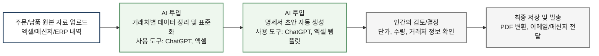

# 명세서 초안 자동 생성 AI 워크플로우

## 대상 업무
명세서 초안 자동 생성

---

## 1단계: 기존 프로세스 해체 (As-Is)

```mermaid
flowchart LR
    A[주문/납품 내역 확인] --> B[거래처별 데이터 수집]
    B --> C[품목/수량/단가 수기 정리]
    C --> D[명세서 양식에 직접 입력]
    D --> E[합계/부가세/누락 항목 검토]
    E --> F[PDF 저장 및 거래처 발송]

    style A fill:#f8f8f8,stroke:#999,stroke-width:1.5px,color:#222
    style B fill:#f8f8f8,stroke:#999,stroke-width:1.5px,color:#222
    style C fill:#f8f8f8,stroke:#999,stroke-width:1.5px,color:#222
    style D fill:#f8f8f8,stroke:#999,stroke-width:1.5px,color:#222
    style E fill:#f8f8f8,stroke:#999,stroke-width:1.5px,color:#222
    style F fill:#f8f8f8,stroke:#999,stroke-width:1.5px,color:#222
  ```

### As-Is 특징

* 주문/납품 자료가 여러 곳에 흩어져 있어 수집 시간이 듦
* 품목, 수량, 단가를 사람이 반복 입력함
* 양식 입력 과정에서 오타/누락 가능성이 큼
* 최종 검토에 시간이 많이 들어감

---

## 2단계: AI 개입 지점 탐색

```mermaid
flowchart LR
    A[주문/납품 내역 확인] --> B[거래처별 데이터 수집]
    B --> C[품목/수량/단가 수기 정리]
    C --> D[명세서 양식에 직접 입력]
    D --> E[합계/부가세/누락 항목 검토]
    E --> F[PDF 저장 및 거래처 발송]

  AI1[AI 개입 1<br/>데이터 정리/표준화] -.-> C
  AI2[AI 개입 2<br/>명세서 초안 생성] -.-> D

    style AI1 fill:#dff3e3,stroke:#3a7a4f,stroke-width:2px,color:#222
    style AI2 fill:#dff3e3,stroke:#3a7a4f,stroke-width:2px,color:#222
```

### AI 개입 포인트

* **AI 개입 1:** 주문/납품 자료를 읽고 거래처별로 정리
* **AI 개입 2:** 정리된 데이터를 바탕으로 명세서 초안 자동 생성

---

## 3단계: 새로운 프로세스 조립 (To-Be)



---

## 4단계: 이전 / 이후 비교

| 구분    | As-Is (기존)          | To-Be (AI 적용 후) |
| ----- | ------------------- | --------------- |
| 자료 정리 | 사람이 거래처별로 직접 정리     | AI가 거래처별로 자동 정리 |
| 초안 작성 | 명세서 양식에 직접 입력       | AI가 초안 자동 생성    |
| 사람 역할 | 처음부터 끝까지 직접 수행      | 최종 검토와 발송 중심    |
| 소요 시간 | 건당 3~5분             | 건당 1~2분         |
| 오류 위험 | 오타, 누락, 단가 입력 실수 가능 | 초안 표준화로 오류 감소   |
| 업무 성격 | 반복 입력 중심            | 검토/판단 중심        |

---

## 5단계: 핵심 기대 효과

* 반복 입력 작업 감소
* 명세서 초안 작성 속도 향상
* 거래처별 양식 작성 표준화
* 실무자는 검토와 예외 대응에 집중 가능
* 하루 누적 기준 20~40분 절감 가능

---

