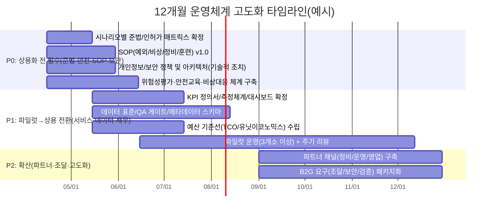

# 수중드론 사업화 운영안 초안 타당성 검증 및 객관적 피드백 보고서

**Executive summary**  
본 보고서는 사용자 제공 초안(업로드 파일 경로: `/mnt/data/붙여넣은 마크다운(1).md`)을 “운영 목적·범위·조직·업무절차(SOP)·인력·예산·리스크·성과지표(KPI)” 관점에서 검증한 결과를 정리한다. 초안은 **하드웨어 판매 중심에서 데이터/운영 서비스(DaaS) 중심으로 전환**하려는 방향성, **아키텍처(USV+수중모듈+플랫폼)**, **단계별 로드맵**, **기초 KPI/리스크 항목**을 갖추어 기획의 뼈대는 충분하다. 다만 “운영안”으로서의 완결성 측면에서 **규제·인허가/해상교통 안전/항만 보안/개인정보·보안/안전보건(중대재해 포함)** 요구사항을 **시나리오별로 구체화**하지 않았고, **서비스 운영(품질·장애·SLA·데이터 품질)** 체계와 **예산(총액·단가·TCO) 및 수익모델의 수치 검증**이 불가능한 상태(대부분 ‘미지정/불명시’)다. 이에 따라 본 보고서는 **법규·국제규범(IMO)·국제표준(ISO)·업계 모범사례(IMCA, DNV)** 대비 **누락/모순/실현가능성 리스크**를 우선순위로 도출하고, “즉시 보완해야 할 최소 운영요건(P0)”부터 “상용 확산을 위한 체계화(P1~P2)”까지 개선 권고를 제시한다. citeturn8search0turn8search1turn9search0turn0search1turn2search1

## 검증 범위와 방법, 미확인 가정

본 검증은 “운영안 타당성” 관점에서 (1) **규제/법령 적합성**, (2) **표준·모범사례 대비 운영체계 성숙도**, (3) **실현가능성(인력·절차·기술·시장·조달 리드타임)**, (4) **비용 추정의 검증가능성**, (5) **리스크 우선순위**를 기준으로 수행했다. 특히 해상/항만/양식장/공공(B2G) 운영은 안전·보안·법규의 비중이 크므로, 국내 법령(국가법령정보센터)과 공공기관 지침(KISA, 개인정보포털, 해수부·수과원), 국제 규범(IMO), 국제표준(ISO), 업계 가이드(IMCA, DNV)에서 운영상 “최소 요건”을 추출해 초안의 공백을 평가했다. citeturn2search1turn2search6turn3search0turn0search1turn10search2turn10search0turn8search0

미확인(가정) 사항은 아래와 같으며, 운영안 본문에 명시·검증이 필요하다.

첫째, 초안의 수상 플랫폼(USV)이 **법령상 ‘선박’ 또는 ‘동력수상레저기구’로 분류될 가능성**이 있으나, 기체 제원(톤수/출력/용도/항해구역/자율화 수준/승선 인원)과 운영수역(항만구역/교통안전특정해역/수상레저구역 등)이 불명시되어 **정확한 인허가·적용 법령 확정이 불가**하다(가정: 연안·항만 인근에서 항행 가능한 무인 수상기체). citeturn2search1turn7search4turn7search5turn15search2turn2search6

둘째, 영상+센서 데이터가 수집·저장·공유되는 운영 구조에서 **개인 식별이 가능한 ‘영상’이 포함될 수 있어 개인정보보호법 적용 가능성**이 있으나, 촬영 범위/마스킹/보관기간/접근권한/고지 방식이 불명시다(가정: 항만·양식장 작업자 또는 제3자가 영상에 포함될 수 있음). citeturn3search0turn4search4

셋째, B2G를 목표로 할 경우 공공기관이 사용하는 클라우드에 대해 **CSAP(클라우드 보안인증) 요구가 사실상 표준 관행**이 될 수 있으나(사업 제안/도입 맥락에 따라 상이), 초안은 클라우드·관제·데이터 저장의 인증/보안 요구수준을 불명시한다(가정: 공공 고객 도입을 위해 공공 조달·보안 요구 대응 필요). citeturn0search1turn0search5turn2search7

## 주요 항목별 타당성 검토

아래는 요청하신 8개 항목을 기준으로, 각 항목별 **적합성(법규·표준·모범사례 대비)**, **모순·누락**, **실현가능성/비용추정 타당성**, **핵심 위험요인**, **우선 개선 권고**를 제시한다.

**운영 목적(목표·비전)**
초안은 “탐색-정보전달-실행” 통합 운영 플랫폼과 “장비 판매가 아닌 데이터/운영 서비스 중심 전환”을 목적·비전으로 제시한다. 이 방향은 공공부문/양식 산업에서 데이터 표준·활용의 한계를 지적하고 빅데이터 인프라 구축 필요성을 강조해온 정책 흐름과 정합성이 있다(해수부는 양식 데이터가 부분 수집·표준 미비로 활용이 제한적이라고 언급). citeturn14search3  
다만 운영 목적이 “플랫폼 구축” 수준에 머물고, **운영의 1차 성과를 ‘데이터 자산(품질/표준/커버리지)’로 볼지, ‘현장 안전/비용절감’으로 볼지, ‘매출/재계약’으로 볼지**가 운영모델(조직·예산·SOP·KPI)을 결정하는데, 초안은 **우선순위(예: 12개월 내 손익분기점 접근 vs 안전·품질 우선)**를 충돌 없이 정렬하는 서술이 부족하다(불명시). citeturn8search2turn9search2  
개선 권고는 “목적-범위-성과지표-책임”의 연결을 강화하는 것이다. ISO 9001이 강조하는 프로세스 기반 운영(계획-실행-점검-개선) 관점에서, 운영목적을 “측정 가능한 서비스 결과(예: 미션 성공률·데이터 품질·경보 성능·SLA)”로 재정의해야 이후 절차·감사·개선이 가능해진다. citeturn8search2turn8search6turn8search14

**운영 범위(서비스 스코프·경계·대상)**
초안은 타깃 시장(양식장/항만·연안시설/B2G/레저)과 서비스 범주(탐색·정보전달·실행)를 제시하지만, 운영안 핵심인 “**어디서(수역/권역), 무엇을(점검 항목/데이터 항목), 어떤 조건에서(기상·해황·보안등급), 어떤 책임범위로(면책·보험·SLA)** 수행하는지”가 불명시다. 이는 해상교통량이 많은 해역/항만구역/보안구역에서 운영할수록 규제·안전·보안 요구가 급격히 증가하는 현실을 반영하지 못한다. 해사안전법은 선박 안전운항을 위한 안전관리체계 확립을 목적으로 하고, 해상교통안전법은 교통안전특정해역 설정 등 안전 확보 체계를 둔다. citeturn2search1turn15search2turn2search6  
항만을 대상으로 할 경우 항만법상 항만구역 개념이 있고, 국제항해선박·항만시설 보안(ISPS 체계) 영역과 접점이 생길 수 있다(적용 여부는 고객/시설/활동 범위에 따라 달라짐). citeturn2search6turn15search1turn15search3  
개선 권고는 “시나리오별 스코프 선언서”를 운영안에 포함하는 것이다. 예를 들어 (A) 양식장 정기 미션, (B) 항만시설 구조물 점검, (C) 이벤트성 긴급 점검, (D) 레저 안전정보 제공을 각각 별도 운영 시나리오로 분리하고, 각 시나리오별로 **적용 법령·필요 승인/협의·금지행위·데이터 처리·안전 기준·보험 요건**을 정의해야 한다(불명시 → 필수 보완). citeturn7search5turn2search6turn15search0

**조직도(거버넌스·RACI·통제)**
초안은 PM/사업개발, 해양운용 리드, 로보틱스(2), 데이터 엔지니어, AI/분석, 필드 오퍼레이터(2)의 8인 구성을 제시한다. “현장 운영 + 제품/데이터 개발”이 함께 필요한 초기 단계에 적합한 최소 구성으로는 타당하나, 운영안 관점에서 다음 기능이 누락되어 있다(불명시).  
첫째, **안전보건(작업 안전) 책임자/체계**. 산업안전보건법은 산업재해 예방과 작업환경 조성을 목적에 두며, 중대재해처벌법은 안전·보건 조치의무 위반으로 중대재해가 발생할 경우 처벌을 규정한다. 해양·전기·배터리·선박/수상 활동이 결합된 운영은 위험성평가, 교육·훈련, 비상대응 체계를 조직 차원에서 명시해야 한다. citeturn5search1turn5search0turn9search0  
둘째, **개인정보/보안(정보보호) 책임과 분리된 승인체계**. 개인정보보호법에서 개인정보 정의에 “영상 등”이 포함될 수 있으므로, 영상 수집·보관·제공에 대한 책임과 통제가 필요하다. citeturn3search0turn4search4  
셋째, **서비스 운영(고객지원·장애/변경관리·SLA 관리)** 기능. 플랫폼/알림/리포트가 포함된 서비스형 모델(DaaS/구독형)을 표방한다면 ISO/IEC 20000-1(서비스관리시스템)에서 말하는 서비스 기획·전환·제공·개선 체계를 최소한의 역할로라도 배치하는 것이 모범사례다. citeturn9search2  
개선 권고는 (1) “안전·준법(HSSE/Compliance) 기능”을 최소 1인(겸직 가능)으로 명시, (2) “데이터 거버넌스(품질/표준/접근권한)” 역할 확정, (3) “고객 성공/운영지원”을 KPI와 연결해 책임소재를 분명히 하는 것이다.

**업무절차(SOP·운영 프로세스)**
초안 SOP는 “사전 준비→임무 수행→정보 전달→실행(재탐색/설비연동/작업오더)→종료/학습”의 흐름을 제시해 큰 틀은 우수하다. 그러나 실제 해양/수중 무인시스템 운영에서는 “**금지조건(Go/No-Go), 비상중지, 통신두절, 회수 실패, 충돌위험, 항만 내부 보안/통제, 데이터 무결성/증거성**” 등 예외가 표준 절차의 대부분을 차지한다. 이 점에서 업계 가이드(IMCA R 004: ROV의 안전·효율적 운용 권고)는 **안전·운영·정비·역량**을 포함한 포괄적 운영 매뉴얼을 강조한다. citeturn10search2  
또한 수상 플랫폼(USV)이 자율/원격 항행을 수행한다면 충돌예방 규범(COLREG) 준수 개념이 운영 프로토콜에 내재되어야 한다(세부 적용은 선박성 인정 여부/운항구역에 따라 달라지나, 항행 안전 관점에서의 “동등 이상 안전” 논리는 필수). citeturn16search0turn2search1turn10search0  
개선 권고는 SOP를 “정상 흐름”이 아니라 “예외·사고 중심”으로 재작성하는 것이다. 최소 포함 항목은 다음과 같다(초안 불명시).  
- **출항 기준(기상·해황·시정·조류·항만 통제)** 및 위험등급별 운항 제한(운영 리스크에 대한 계량 기준). citeturn2search1turn15search2  
- **통신두절(Fail-safe)·자율 복귀·수동 회수** 절차, 책임/권한, 타임아웃, 현장 보고 체계(“이중 통신”만으로는 운영 통제요건이 충족되지 않음). citeturn10search0turn10search2  
- **정비/점검(배터리·프로펠러·센서 캘리브레이션·방수/내압)** 주기, 결함 격리, 예비품 기준. (해상 작업은 단순 IT 운영보다 물리적 고장이 빈번하며, 데이터 품질에도 직접 영향) citeturn10search2  
- **데이터 파이프라인 품질관리(QA)**: 수집률 98% KPI를 주장하려면 결측/오염/시간동기/위치오차 기준과 재수집 규칙이 필요. ISO 9001의 프로세스 접근 및 ISO 14001(환경), ISO 45001(안전)과 연계해 “운영-데이터-안전”을 통합 관리할 수 있다. citeturn8search2turn9search1turn9search0

**인력(수요 대비 산정·역량·교육)**
초안은 월 120회 미션(고객당 주 1~2회) 목표와 함께 필드 오퍼레이터 2인을 제시한다. 미션당 소요 시간(이동·셋업·운항·회수·정비·보고)이 불명시이므로 정확한 산정은 불가하나, “상시 알림/주간 리포트 자동 생성”을 제공하는 구독형 운영은 현장 운항 외에도 **관제·알림 튜닝·고객 커뮤니케이션·장애 대응**이 발생한다. 서비스관리 관점(ISO/IEC 20000-1)에서는 “서비스 제공·요구사항 충족·가치 전달”을 위해 운영 역할이 분명해야 한다. citeturn9search2  
또한 안전 관점에서 ISO 45001은 위험요인 식별과 통제, 역량(competence) 확보를 체계화한다. 해상·수중 운용자는 단순 장비 조작이 아니라, 위험 상황 판단과 비상조치 수행까지 포함한 역량 체계가 필요하므로 교육/자격/훈련 계획이 운영안에 포함되어야 한다(초안 불명시). citeturn9search0turn5search1  
개선 권고는 (1) “미션 단위 작업측정(표준시간) 기반 인력 산정”과 (2) “현장 안전·장비·데이터·고객” 4영역 교육체계(초기 OJT + 정기 재교육 + 사고사례 기반 훈련) 도입이다.

**예산(총액·구조·검증가능성)**
초안은 12개월 예산 비중(장비 40%, 인건비 35%, 클라우드/통신/운영 15%, 실증/인증/기타 10%)만 제시하고 **총액·단가·산정 가정이 미지정**이다. 따라서 “비용추정의 타당성”은 현재 상태에서 **검증 불가**가 결론이다(요청사항에 따라 미지정 표기).  
특히 B2G·항만·시설 점검까지 확장할 경우, (1) 인허가/협의 리드타임, (2) 보험/책임, (3) 보안/접근통제, (4) 데이터 보안 인증(CSAP 등)로 인해 비용구조가 달라질 수 있다. CSAP는 클라우드컴퓨팅법 제23조의2 근거 하에 운영되는 보안인증 체계이며, 공공기관 제공 목적의 클라우드 서비스가 인증대상이 될 수 있음을 제도 소개에서 밝힌다. citeturn2search7turn0search1turn0search5  
개선 권고는 3층 구조의 예산안을 운영안에 포함하는 것이다.  
- **ROM(개략) 추정**: ±50% 허용.  
- **예산 기준선(Baseline)**: 견적/인건비/운영단가 근거 포함.  
- **TCO/단위경제(Unit economics)**: 미션당 원가, 고객당 월 원가, 장비 감가/교체, 장애/회수 실패 비용, 보험료/법무비 포함.  
이는 ISO 31000(리스크 식별·분석·평가·처리·모니터링) 프레임과 결합해야 “리스크 비용”이 숫자로 관리된다. citeturn8search0turn8search4

**리스크(항목·대응·우선순위)**
초안은 기술/운영/사업/규제 리스크를 식별하고(통신단절·탁도·배터리, 기상급변·안전사고, 고객전환·단가저항, 인허가 이슈) 고수준 대응 방향(페일세이프 복귀, 출항 기준치, ROI 리포트 등)을 제시한다는 점에서 출발점은 양호하다. 그러나 ISO 31000 관점에서 운영 가능한 리스크 관리는 “리스크 항목”이 아니라 **리스크 등록부(등록번호·정의·원인·영향·가능성·영향도·통제·잔여리스크·오너·트리거·대응계획·검토주기)**로 구현되어야 한다(초안 불명시). citeturn8search0  
또한 항만·수역 운영은 해상교통안전(교통안전특정해역 등), 항만구역, 보안(ISPS/항만시설보안 관련 법) 등 외부 리스크가 커서 “규제 부담이 낮은 모델”이라는 문구가 사실이 되려면 **적용 수역과 활동 제한**을 운영안에 명시해야 한다. citeturn15search2turn2search6turn15search1turn15search3  
개선 권고는 리스크 우선순위를 “사람 안전·해상 안전·법규 위반·환경오염·보안사고”를 최상위로 두고, 그 다음 “서비스 중단·데이터 품질·재무”로 정렬하는 것이다. ISO 45001과 ISO 14001을 참조하면 안전/환경 리스크를 경영시스템에 내재화하기 용이하다. citeturn9search0turn9search1turn5search0

**성과지표(KPI)**
초안의 KPI(미션 성공률 95%, 유효 데이터 수집률 98%, 폐사/장애 예방 기여율 20% 개선, MRR, TRL 6~7)는 방향은 좋지만, 운영 KPI로서 다음이 불명시다.  
첫째, “미션 성공” 정의(출항/회수 포함? 데이터 업로드까지?), “유효 데이터” 정의(결측·노이즈·캘리브레이션·메타데이터 포함 여부), “예방 기여율”의 **기여도 산정/대조군 설계/외생변수 통제**가 없어 분쟁 시(고객 폐사 발생 등) KPI가 오히려 리스크가 될 수 있다. citeturn8search2turn8search0  
둘째, AI 기반 이상탐지/예측은 실제 환경(탁도·저조도·부유물·상태변화)이 성능을 크게 좌우한다는 점이 학술적으로 반복 보고된다. 예를 들어 양식장 그물망 검사에서 수중 영상 품질 저하(부유물·저조도)가 난제로 언급되며, ROV 기반 실시간 검사에서 이러한 환경적 제약이 명시된다. citeturn17search5turn17search2turn17search14  
셋째, TRL 6~7은 NASA가 정의한 기술 성숙도 척도이며, “관련 환경 시연/운용 환경 시연” 수준의 증빙이 필요하다. 초안은 TRL 목표만 제시하고, TRL 판정 기준(시험계획·증적·리뷰체계)이 불명시다. citeturn11search0  
개선 권고는 KPI를 “안전/준법-서비스 품질-데이터 품질-고객 가치-재무”로 계층화하고, 각 KPI에 **측정 정의(Definition), 측정 주기, 책임자, 목표치 근거(베이스라인/벤치마크), 허용오차**를 붙이는 것이다. 서비스형 운영 품질은 ISO/IEC 20000-1(서비스 전달·개선), 장애/중단 대응은 ISO 22301(회복력)과 결합하면 운영 KPI가 ‘관리 가능한 지표’가 된다. citeturn9search2turn8search3turn8search15

## 요약 표와 우선순위 개선 권고

아래 표는 “문제점-영향-권고-우선순위”를 운영안 핵심 리스크 중심으로 요약한 것이다. 우선순위는 **P0(즉시/상용화 전 필수), P1(파일럿~상용 전환 핵심), P2(확산/고도화)**로 제시한다.

| 문제점(핵심 공백) | 영향(실패 모드) | 권고(구체 조치) | 우선순위 |
|---|---|---|---|
| 운영 범위가 시나리오별로 법령·인허가와 연결되지 않음(불명시) | 항만/교통안전특정해역 등에서 **운항 중지·과태료·사고** 가능, B2G 신뢰 상실 | “시나리오별 준법 매트릭스(수역/활동/금지/승인/기관협의)”를 운영안 본문에 삽입 | P0 |
| SOP가 정상 흐름 중심이며 예외·사고 절차(통신두절/회수실패/충돌위험)가 상세화되지 않음(불명시) | 인명/재산 피해, 장비 손실, 서비스 중단 | IMCA ROV 가이드 수준을 참조해 **체크리스트·비상절차·정비절차·훈련** 포함한 SOP 개정 | P0 |
| 개인정보/영상 데이터 처리 고지·보관·접근통제 설계가 없음(불명시) | 개인정보보호법 위반, 민원/분쟁, 공공 도입 불가 | 영상 데이터 처리정책(목적·최소수집·마스킹·보관기간·권한·로그)과 기술적 보호조치 반영 | P0 |
| 클라우드/관제의 보안 인증·요구수준(특히 B2G)이 불명시 | 공공 제안 탈락, 보안사고 시 치명적 | 공공 타깃이면 CSAP/보안요구 충족 가능한 아키텍처·벤더 전략 수립 | P0 |
| 안전보건(위험성평가·교육·비상대응) 거버넌스가 조직/절차에 미반영 | 산업재해·중대재해 리스크, 운영 중단 | 안전보건관리체계(위험성평가·교육·작업허가·비상계획)와 책임자 지정 | P0 |
| KPI 정의(성공/유효데이터/정확도/예방기여)·측정 설계가 없음 | KPI가 분쟁 요소로 전락, 의사결정 왜곡 | KPI마다 정의/근거/측정주기/소유자/데이터 출처를 명시(측정가능성 확보) | P1 |
| “12개월 내 손익분기점 접근”의 수치 근거(가격·원가·CAC·리텐션)가 없음(미지정) | 재무 계획 붕괴, 추가 투자/조달 실패 | 예산 총액/단가/원가구조 기반의 TCO·유닛이코노믹스 모델 작성 | P1 |
| 인력 산정이 미션 수요(월 120회)와 표준시간/교대/관제 요구를 반영했는지 불명시 | 과로·품질 저하·사고 위험 증가 | 미션 표준시간 측정 후 인력/파트너 운영(지역 협력/외주) 설계 | P1 |
| 데이터 표준/메타데이터/품질관리 체계가 없음 | 데이터 상품화 실패, 모델 성능 저하 | 데이터 표준(측정항목·단위·타임스탬프·위치·품질플래그)과 QA 게이트 도입 | P1 |
| 항만/시설 점검(B2G 포함) 시 보안(ISPS 등)·촬영 제한 리스크가 불명시 | 현장 접근 실패, 계약 파기 | 시설/항만 유형별 보안요건 사전 협의 프로토콜·촬영/반출 통제 | P1 |
| 공급망(배터리/센서/부품)·정비 예비품·RMA 프로세스가 없음 | 다운타임 증가, 미션 실패율 상승 | 예비품 정책, 정비 KPI(MTBF/MTTR), 장애·변경관리 프로세스 수립 | P2 |
| 사업 확산(2차 연도)에서 B2G 조달 리드타임·계약 프로세스 고려가 약함 | 매출 지연·현금흐름 악화 | 조달 캘린더 반영한 파이프라인/제안서/실증 레퍼런스 전략 정교화 | P2 |

(표의 근거 법령·표준·사례: 해사안전법/해상교통안전법/항만법/국제항해선박 및 항만시설 보안 관련 법/개인정보보호법/클라우드컴퓨팅법/CSAP/ISO 31000·27001·20000-1·22301·45001/IMCA R 004/IMO COLREG 및 MASS 관련 문서 등) citeturn2search1turn15search2turn2search6turn15search1turn3search0turn2search7turn0search1turn8search0turn8search1turn9search2turn8search3turn9search0turn10search2turn16search0turn0search3

## mermaid 부록

아래 mermaid는 “필요 시 포함” 조건에 따라, 초안의 내용을 운영안 수준으로 구체화할 때 바로 가져다 쓸 수 있는 **프로세스 흐름도·조직도·타임라인** 예시다(세부 항목은 귀 조직의 실제 의사결정 구조/고객 계약 조건에 맞춰 조정 권장).

```mermaid
flowchart TD
  A[미션 요청/정기 스케줄] --> B[사전계획: 수역/목표/데이터항목/권한 확인]
  B --> C{Go/No-Go\n기상·해황·교통·보안·장비상태}
  C -- No-Go --> C1[연기/취소 기록\n고객 통지]
  C -- Go --> D[프리체크: 배터리/방수/센서캘리브레이션/통신 이중화]
  D --> E[출항/투입]
  E --> F[임무 수행: 순찰·점검·센서/영상 수집]
  F --> G{이상징후 탐지?}
  G -- No --> H[정상 종료/회수]
  G -- Yes --> I[집중탐색·재임무]
  I --> J{통신두절/위험상황?}
  J -- Yes --> J1[Fail-safe: 안전정지/자율복귀/회수 요청]
  J -- No --> K[경보 발행: 관제/현장 관리자]
  K --> L[대응: 작업오더 발행/현장조치/설비연동은 '요청' 원칙]
  H --> M[데이터 업로드/무결성·품질검사(QA)]
  L --> M
  M --> N[리포트/대시보드 업데이트]
  N --> O[사후 리뷰: KPI/리스크/개선사항\n(피드백 루프)]
```

```mermaid
flowchart TB
  CEO[총괄/대표(미지정)] --> PM[PM/사업개발]
  CEO --> OPS[해양운영/현장운영]
  CEO --> ENG[로보틱스/플랫폼 엔지니어링]
  CEO --> DATA[데이터/AI]
  CEO --> GRC[안전·준법·보안(겸직 가능)]

  OPS --> OPSL[해양운용 리드]
  OPS --> FO1[필드 오퍼레이터]
  OPS --> FO2[필드 오퍼레이터]

  ENG --> ROB1[로보틱스 엔지니어]
  ENG --> ROB2[로보틱스 엔지니어]
  ENG --> SRE[서비스 운영/관제(미지정)]

  DATA --> DE[데이터 엔지니어]
  DATA --> AI[AI/분석 엔지니어]

  GRC --> DPO[개인정보/데이터 거버넌스(미지정)]
  GRC --> HSE[안전보건 책임(미지정)]
```



## 참고 URL 목록

아래는 본 보고서에서 인용한 **공식/표준/학술/공공 통계** 중심의 URL이다. (사용자 제공 초안은 내부 업로드 문서로 URL이 없으며 파일 경로로만 식별 가능)

```text
https://law.go.kr/%EB%B2%95%EB%A0%B9/%ED%95%B4%EC%82%AC%EC%95%88%EC%A0%84%EB%B2%95/%2818702%2C20220104%29
https://law.go.kr/%EB%B2%95%EB%A0%B9/%ED%95%B4%EC%83%81%EA%B5%90%ED%86%B5%EC%95%88%EC%A0%84%EB%B2%95/%2819573%2C20230725%29
https://law.go.kr/%EB%B2%95%EB%A0%B9/%ED%95%AD%EB%A7%8C%EB%B2%95
https://law.go.kr/%EB%B2%95%EB%A0%B9/%EA%B5%AD%EC%A0%9C%ED%95%AD%ED%95%B4%EC%84%A0%EB%B0%95%EB%B0%8F%ED%95%AD%EB%A7%8C%EC%8B%9C%EC%84%A4%EC%9D%98%EB%B3%B4%EC%95%88%EC%97%90%EA%B4%80%ED%95%9C%EB%B2%95%EB%A5%A0
https://law.go.kr/%EB%B2%95%EB%A0%B9/%EA%B0%9C%EC%9D%B8%EC%A0%95%EB%B3%B4%EB%B3%B4%ED%98%B8%EB%B2%95
https://law.go.kr/%EB%B2%95%EB%A0%B9/%ED%81%B4%EB%9D%BC%EC%9A%B0%EB%93%9C%EC%BB%B4%ED%93%A8%ED%8C%85%20%EB%B0%9C%EC%A0%84%20%EB%B0%8F%20%EC%9D%B4%EC%9A%A9%EC%9E%90%20%EB%B3%B4%ED%98%B8%EC%97%90%20%EA%B4%80%ED%95%9C%20%EB%B2%95%EB%A5%A0
https://www.kisa.kr/1050603
https://isms-p.kisa.or.kr/main/csap/intro/index.jsp
https://www.privacy.go.kr/front/bbs/bbsView.do?bbsNo=BBSMSTR_000000000049&bbscttNo=14082
https://www.imo.org/en/MediaCentre/PressBriefings/Documents/MSC.1-Circ.1638%20-%20Outcome%20Of%20The%20Regulatory%20Scoping%20ExerciseFor%20The%20Use%20Of%20Maritime%20Autonomous%20Surface%20Ships...%20%28Secretariat%29.pdf
https://www.imo.org/en/about/conventions/pages/colreg.aspx
https://www.dnv.com/maritime/autonomous-remotely-operated-ships/regulatory/
https://www.imca-int.com/resources/technical-library/document/60d8d35a-c55b-ee11-8def-6045bdd2c0c0/
https://www.iso.org/standard/65694.html
https://www.iso.org/standard/27001
https://www.iso.org/standard/75106.html
https://www.iso.org/standard/63787.html
https://www.iso.org/standard/70636.html
https://www.nasa.gov/directorates/somd/space-communications-navigation-program/technology-readiness-levels/
https://www.mof.go.kr/doc/ko/selectDoc.do?=&bbsSeq=10&docSeq=51961&menuSeq=971
https://www.mof.go.kr/iframe/doc/ko/selectDoc.do?bbsSeq=10&docSeq=54046&menuSeq=971
https://www.mof.go.kr/doc/ko/selectDoc.do?bbsSeq=10&docSeq=61832&menuSeq=971
https://www.nifs.go.kr/nts/service_outline.do
https://www.fao.org/fishery/statistics-query/en/aquaculture
https://globalocean.noaa.gov/The-Ocean/
https://www.frontiersin.org/journals/marine-science/articles/10.3389/fmars.2024.1386267/full
https://www.sciencedirect.com/science/article/pii/S0168169924010007
https://www.nature.com/articles/s41598-025-21083-6
```

