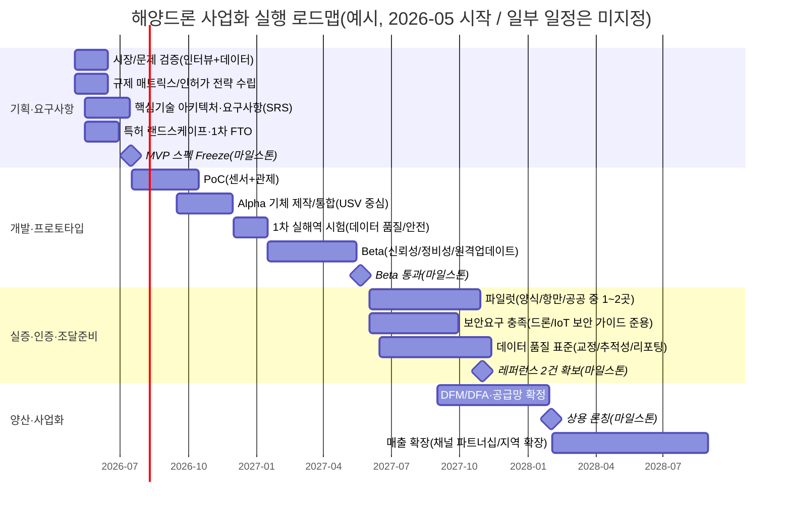

# 해양드론을 활용한 사업화 가능성 분석 보고서

## Executive summary

CREATE 적용: **C**(해양·수산/항만·안전/환경 현안이 ‘현장 데이터’ 수요로 연결), **R**(10년차 개발·기획자 관점: 기술-제품-시장-재무를 하나의 실행계획으로 정렬), **E**(동료 리뷰용 ‘설득형’ 요약: 결론·근거·결정포인트 우선 제시), **A**(개발/기획/사업/법무·보안 동료), **T**(핵심 가설→근거→권고안→다음 단계), **E**(정부 문서체·출처 명시·미지정 표기·시나리오 제시).

본 보고서는 **해양드론(해상·수중 무인 플랫폼 포함)을 활용한 사업화 가능성**을 정책·규제, 기술성숙도, 제품화, 시장/고객, 비즈니스 모델, 재무, 리스크 관점에서 종합 평가하고 **실행 가능한 로드맵과 권고안**을 제시한다. (일부 요구사항은 제공 정보가 없어 **‘미지정’**으로 표기하였다.)

**핵심 결론(요지)**  
1) **사업화 가능성: “조건부 高”**. 해양수산부 업무계획에서 **완전자율운항선박 기술 개발 착수**, **자율운항선박법 시행(’25.1)**, **AI 기반 해양교통 플랫폼 구축** 등 ‘해양 디지털 전환’이 정책과제로 명시되어 있고, 동시에 **고수온 양식 피해(’24년 1,430억원)** 등 기후·재난 리스크가 커져 **현장 데이터(관측·점검·경보) 수요가 구조적으로 증가**하는 환경이다. citeturn26view0turn26view2  
2) **전략적 초점(권고)**: 초기에는 “대형 완전자율선박”이 아니라, **소형/중형 해양드론 기반의 ‘데이터 생산·해석·알림’ 서비스**(Drone-as-a-Service/Monitoring-as-a-Service)로 진입하는 것이 비용·규제·검증 난이도를 줄이고 학습 속도를 높인다(기술·시장 양측에서 “실증”이 곧 신뢰 자산). 자율운항선박 생태계 확대(법·실증 특례) 흐름을 **하드웨어 판매보다 ‘데이터/운영 서비스’로 레버리지**하는 구도가 유리하다. citeturn26view2turn1search1  
3) **규제/컴플라이언스 전제**: (1) 해상 자율/원격운항은 **자율운항선박 개발·상용화 촉진 법체계**와 연계해 실증특례/검사기준 완화 등을 활용하는 설계가 필요하고, (2) 해상 상공(UAV) 운영이 포함되면 **드론법(드론 활용 촉진 및 기반조성)** 및 **항공안전법**을 함께 준수해야 한다. citeturn1search1turn28search0turn1search0  
4) **재무 관점(요약)**: 제공 정보가 없어 단가·채택률 등은 가정 기반으로 산정했다. 기본 시나리오(예시 가정)에서 **손익분기점 Y6**, 낙관 Y4, 비관은 분석기간(8년) 내 미도달로 산정되며, 민감도는 **연간 판매량(또는 서비스 계약수)과 매출총이익률(단가·COGS)**에 가장 크게 좌우된다(“볼륨×마진”이 전부).  
5) **즉시 실행 권고안(Top 3)**  
- **권고안 A(제품전략)**: “플랫폼 1종(USV 중심)+표준 페이로드 2종(수질/수온, 영상/열)”으로 MVP를 고정하고, ‘데이터 품질(교정/추적성)’을 제품의 핵심 스펙으로 정의한다(기술과 시장을 동시에 설득). citeturn10search8turn9search13turn8search4  
- **권고안 B(시장진입)**: 공공(관측·안전·환경)과 민간(양식·항만·해상 플랜트) 중 **‘실증-구매’ 전환이 빠른 세그먼트**를 1차 타깃으로 잡고, 1~2건의 레퍼런스를 만들기 위해 **정량 KPI(예: 탐지정확도, 운용시간, 단위면적당 비용, 데이터 납기)**를 계약서에 박는다. citeturn26view1turn26view0  
- **권고안 C(리스크/보안)**: 드론/무인이동체는 설계 단계부터 보안 요구를 내재화해야 하며, KISA는 **드론 사이버보안 가이드**를 공개 제공한다. 이를 **요구사항 베이스라인**으로 삼아(인증/조달 대응력 확보) 개발 프로세스에 반영한다. citeturn23search10turn22search3  

---

## 표지·목차·작성 프로세스

CREATE 적용: **C**(내부 결재·동료 리뷰를 전제로 문서 형식 표준화), **R**(개발·기획자: “요구사항-아키텍처-실증-사업성” 연결), **E**(정부 문서 형식: 문서번호/결재란/목차/부록 포함), **A**(동료 리뷰어 및 결재 라인), **T**(문서 관리정보→조사 프로세스→가정·범위 명시), **E**(출처 우선순위 준수, 미지정 표기).

**공식 표제(문서 정보)**  
- 문서명: 해양드론을 활용한 사업화 가능성 분석 보고서  
- 문서관리번호: **미지정**  
- 공개구분: **내부검토용(동료 리뷰)** / 대외배포: **미지정**  
- 작성일: 2026-04-13 (KST)  
- 작성부서: **미지정**  
- 작성자: 최수길(10년차 개발·기획)  
- 검토자: **미지정**  
- 승인자: **미지정**

**결재(서명란)**  
- 작성: __________________ (서명) / 일자: ____-__-__  
- 검토: __________________ (서명) / 일자: ____-__-__  
- 승인: __________________ (서명) / 일자: ____-__-__  

**목차(요약)**  
1. Executive summary  
2. 표지·목차·작성 프로세스  
3. 배경: 정책·규제·시장 동향  
4. 기술성 및 제품화  
5. 시장·고객 및 비즈니스 모델  
6. 재무 분석  
7. 리스크·법적·윤리·환경 영향  
8. 실행 로드맵·결론·권고안·체크리스트·출처  

**범위 및 전제(미지정 포함)**  
- 대상 해양드론 정의(본 보고서): 해양 환경에서 임무 수행을 위해 활용되는 **무인 수상(USV)**, **수중 무인(AUV/ROV)**, 필요 시 **해상 상공 무인비행체(UAV)**를 포괄한다. KIOST는 해양관측 무인화 플랫폼을 ROV/AUV/USV로 구분해 설명한다. citeturn10search8  
- 사업 지역: **대한민국 내수 중심(가정)** / 해외 진출: **미지정**  
- 1차 타깃 산업: **미지정** → 본문에서 세그먼트별로 비교 후 권고  
- 예산/팀 규모: **미지정** → 재무 파트에서 시나리오로 제시  

**단계별 조사·분석·작성 프로세스(CREATE 기반, 동료 리뷰 재현 가능하도록 명시)**  
아래는 “이번 보고서를 생산하기 위한” 표준 프로세스이며, 추후 업데이트 시 그대로 재사용한다.

| 단계 | 산출물 | 데이터 수집 방법 | 사용 키워드(예시) | 1차 데이터 소스(우선순위) |
|---|---|---|---|---|
| 문제정의·범위설정 | 문제정의서, 용어정의, 범위(미지정 포함) | 이해관계자 가설 수립(내부) + 공공정책/법령 확인 | “해양드론”, “무인수상정”, “AUV”, “ROV”, “해양관측” | 공공기관 연구자료(KIOST 등) citeturn10search8 |
| 정책·규제 조사 | 규제 매트릭스, 준수 체크리스트 | 법령 원문 확인 + 정책계획서 확인 | “자율운항선박법”, “드론법”, “항공안전법”, “선박안전법”, “전파법” | 국가법령정보센터(법령 원문) citeturn1search1turn28search0turn1search0turn1search4turn1search5 |
| 시장·수요 조사 | 세그먼트/수요 동인, 과제·예산 근거 | 부처 업무계획, 공공데이터 확인 | “스마트항만”, “고수온 피해”, “해양교통 플랫폼”, “스마트양식” | 해양수산부 업무계획(공식) citeturn26view0turn26view2 |
| 기술성·TRL 평가 | 핵심기술 목록, TRL 평가표 | 학술/공공 연구자료 + TRL 기준 정의 | “USV 연구 현황”, “자율항법”, “해양관측 무인화” | ScienceON 논문/공공기관 자료 citeturn9search13turn10search8 |
| 특허·IP 분석(랜드스케이프) | 키워드/분류코드, FTO(약식) | KIPRIS 검색, 출원동향/권리범위 확인 | “무인수상정”, “자율항해”, “해양관측”, “수중 로봇” | KIPRIS(특허청/특허정보원), KIPRIS 가이드 citeturn24search11turn24search2turn24search24 |
| 보안·개인정보·AI 윤리 | 보안 요구사항, 데이터 거버넌스 | 가이드라인/법령 원문 기반 체크 | “드론 사이버보안 가이드”, “개인정보보호법”, “AI 신뢰성 인증” | KISA 가이드, 개인정보보호법, TTA/NIA 가이드 citeturn23search10turn21search0turn23search15turn21search7 |
| 재무 모델링 | 3시나리오 손익/현금흐름/민감도 | 가정 기반(미지정 표시) + 벤치마크 예산 | “총사업비”, “실증”, “운영비” | 공공 예산/사업비는 정책문서로 벤치마크 citeturn26view2turn20view0 |

---

## 배경: 정책·규제·시장 동향

CREATE 적용: **C**(해양 디지털 전환·기후피해·안전 이슈가 해양드론 수요를 견인), **R**(규제-실증-조달을 ‘처음부터’ 설계하는 관점), **E**(정책·규제·시장 동향을 근거 중심으로 정리), **A**(기획/개발/사업/법무), **T**(정책근거→규제 매트릭스→시장 동인 도출), **E**(정부·공공 출처 우선 인용).

**정책 동향(국내, 수요 원천)**  
- 해양수산부 2025 업무계획은 해운·항만 분야에서 **국내 최초 완전 자동화 항만 개장**, “디지털·친환경, 미래형 물류산업 육성” 내에서 **AI 항만 조성**, **완전 자율운항선박 기술 개발 착수(’25 예타)**, **자율운항선박법 시행(’25.1) 기반의 민간실증 특례 지원**, **해양교통 플랫폼 구축** 등을 명시한다. 이는 해양드론(관측·점검·경계·데이터 수집)이 결합하기 좋은 정책 환경이다. citeturn26view0turn26view2  
- 같은 문서에서 기후변화 영향이 본격화되며 **’24년 고수온 양식 수산물 피해가 1,430억원(역대 최대)**으로 언급된다. 이는 “현장 관측-조기 경보-대응 자동화” 시장(양식/연안)의 경제적 필요를 뒷받침한다. citeturn26view0turn26view1  
- KIMST의 **제2차 해양수산과학기술 육성 기본계획(2023~2027)**은 해양수산 정책 최상위 계획으로서(법적근거: 해양수산과학기술 육성법 제5조) 10대 전략기술 플래그십에 **자율운항선박4.0, 디지털 해상교통물류, 스마트양식** 등을 포함한다. 즉, 중장기적으로 “무인·자율·데이터 기반” 투자가 지속될 가능성이 크다. citeturn12view0turn15view0  

**규제·제도 동향(핵심 포인트)**  
해양드론은 “무인이동체”라는 공통점에도 불구하고, **운용 영역(공중/수면/수중)**에 따라 적용 법 체계가 갈린다. 따라서 사업화 초기부터 “규제 매트릭스”를 제품 요구사항으로 전환해야 한다.

- **공중(UAV) 포함 시**: 드론법은 드론을 항공안전법상 무인비행장치/무인항공기 등으로 정의하며 드론산업 진흥의 법적 기반을 제공한다(시행 2025.10.1). citeturn28search0 또한 항공안전법은 무인항공기·무인비행장치 등 정의를 포함한다. citeturn1search0  
- **수면(USV)·연안 자율운항 적용 시**: 자율운항선박 개발·상용화 촉진 법률은 자율운항선박의 정의와 실증, 기술개발 및 상용화 촉진 체계를 규정한다(시행 2025.1.3). “해양드론을 ‘자율운항선박 체계’에 어떻게 매핑할 것인지”가 규제 리스크를 좌우한다. citeturn1search1  
- **선박 안전·정의 범위**: 선박안전법은 ‘선박’을 수상·수중·수상/수중 겸용 및 부유구조물까지 포함하는 형태로 정의한다. 수면/수중 무인체계가 “선박” 범주에 들어올 가능성을 검토해야 한다. citeturn1search4  
- **통신(원격제어/데이터링크)**: 전파법은 무선국 개설·사용 등 전파 관련 기본 틀을 제공하므로(원격제어, LTE/5G/위성/특정주파수 사용) 운용 설계와 병행 검토가 필요하다. citeturn1search5  
- **국제 규제 동향(참고)**: IMO는 Maritime Autonomous Surface Ships(MASS)에 대한 규제 스코핑 작업을 수행해 자율운항선박의 국제 규범 정비를 진행해 왔다. 해외 진출 또는 국제 항로/항만 연계 사업을 고려하면 조기 추적이 필요하다. citeturn0search2turn0search15  

**데이터/관측 인프라 동향(‘데이터 제품’ 관점의 기회)**  
해양드론은 결국 “데이터 생산 장치”이므로, 공공 데이터 생태계와 결합할수록 사업화가 쉬워진다.
- 국립해양조사원은 해양정보 오픈 플랫폼(개방海) 등을 운영하며, 해양정보·지형/지명·해상교통 등 데이터를 제공한다. citeturn8search0  
- 바다누리 해양정보 서비스는 **해양관측자료 다운로드** 및 사용자 분석 도구 등을 제공한다. citeturn8search6  
- 해양환경정보포털은 해양환경측정망, 해양생태, 해양폐기물, 해양보호구역 등 해양환경 데이터를 제공한다. citeturn8search4  
- 공공데이터포털에는 어업별 선박 운항 형태(위·경도, 속력/침로 등) 분석 데이터 등도 존재하여, 해양드론 수집 데이터와 결합한 분석 서비스(예: 이상행동 탐지, 혼잡도 기반 안전경보)로 확장 가능하다. citeturn29search21  

---

## 기술성 및 제품화

CREATE 적용: **C**(기술은 충분조건이 아니라 ‘현장 신뢰’가 필요), **R**(개발 관점: 핵심기술을 모듈화·검증가능한 단위로 분해), **E**(핵심기술·성숙도(TRL)·특허 + 프로토타입/생산/공급망까지 연결), **A**(개발자·PM·HW/SW/데이터 엔지니어), **T**(기술요소 분해→TRL 평가→제품화 게이트 정의), **E**(표/도표 포함, 출처 명시).

**핵심기술 분해(해양드론 상용화의 ‘필수 스택’)**  
KIOST는 해양관측 무인화 시스템을 ROV/AUV/USV로 구분하며, 영역 간 경계가 목적에 따라 모호해질 수 있음을 언급한다. citeturn10search8 이를 사업화 관점으로 재구성하면, 다음 6개 스택이 “성능·원가·리스크”를 결정한다.

1) **플랫폼(기체)·내환경성**: 해수(염분)·파랑·풍·강우·해무 환경에서 방수/방염/내식, 정비성(모듈 교환)을 확보해야 한다.  
2) **항법·자율운항**: GNSS/INS 기반 위치추정, 경로계획, 장애물 회피(해상 부유물), 정밀 저속 제어(정박·접안).  
3) **통신·관제**: 연안 LTE/5G, 위성(음영구역), 저전력 통신(부표 연계) 등 **임무별 링크 설계**가 필요하며 전파 규제와 연동된다. citeturn1search5  
4) **페이로드(센서/작업장치)**: 수질/수온/염분, 카메라(영상/열), 소나(수심·장애물), 샘플링 장치, ROV 결합 등.  
5) **데이터 파이프라인**: 수집→정제→교정(캘리브레이션)→품질메타데이터(추적성)→분석/AI→시각화/알림. 해양환경/해양정보 공공데이터와의 정합도 중요. citeturn8search4turn8search6  
6) **운용·정비(Ops)**: 배터리/연료, 임무 계획, 원격 점검, 예지정비, 운용자 안전, 보험.

**기술 비교표(플랫폼별 사업 적합성)**  
(목적: “어떤 해양드론을 먼저 팔 것인가/서비스화할 것인가” 결정)

| 구분 | UAV(해상 상공) | USV(수면) | ROV/AUV(수중) |
|---|---|---|---|
| 공공법/정의 출발점 | 드론법(드론=무인 비행체) 및 항공안전법 체계 citeturn28search0turn1search0 | 자율운항선박/선박안전법 체계로 매핑 가능성 citeturn1search1turn1search4 | 선박안전법 정의(수중 포함) 연계 가능성 citeturn1search4 |
| 강점 | 접근성, 넓은 면적 영상/열 탐지, 신속 배치 | 장시간 관측, 수질/수온 센서 탑재 용이, 항만·연안 반복 운용 | 해저/수중 구조물 점검, 생태/시설 직접 관측 |
| 한계/리스크 | 비행 허가·비행금지구역, 기상(풍) 민감, 배터리 제약 | 파랑/조류 영향, 충돌/표류 리스크, 접안/회수 설계 필요 | 통신 제한(수중), 운용 난이도↑, 장비 단가↑ |
| 초기 사업화 적합도(권고) | 항만/연안 시설 점검에 “보조”로 유용 | **1차 MVP 후보(권고)**: 모니터링/관측 서비스화 용이 | 2차 확장(고부가): 시설/해저 자산 점검에 유리 |
| 대표 활용처(국내 데이터 연계) | 항만/연안 영상 + 공공데이터 결합 | 해양환경측정망 보완, 양식장 수질/수온, 해상교통 보조 | 해양플랜트/항만 수중시설, 양식장 저층 생물/시설 |

**기술성숙도(TRL) 평가 프레임(핵심기술별)**  
TRL은 1~9 단계로 기술 성숙도를 표현하는 대표적 체계이며 NASA는 9단계 TRL 개념을 설명한다. citeturn31search0 국내에서도 TRL 단계 정의(별표 형태)가 제공된다. citeturn31search12

다음은 “해양드론 사업화”를 위해 권고하는 **핵심기술별 목표 TRL**이다(현 상태는 ‘미지정’).  
- 항법/자율운항(연안): 목표 TRL **6~7**(관련 환경에서 프로토타입 실증)  
- 내환경 하드웨어(방수/내식/정비): 목표 TRL **7**(반복 실해역 운용)  
- 데이터 품질관리(교정/메타데이터/추적성): 목표 TRL **8**(운영 프로세스 표준화)  
- 관제/원격 업데이트(보안 포함): 목표 TRL **7~8**(운영환경에서 보안 요구 충족) citeturn23search10turn22search3  

**특허(특허·FTO) 전략(실행형)**  
- KIPRIS는 특허청이 제공하는 국내·외 지식재산 검색 플랫폼으로 개편 및 통합 제공 사실을 특허청 보도자료가 설명한다. citeturn24search11 또한 한국특허정보원은 KIPRIS 운영을 통해 대국민 검색 서비스를 제공한다고 안내한다. citeturn24search2  
- 실무 가이드(공식 문서)로 KIPRIS 안내 PDF가 존재한다. citeturn24search24  

권고하는 특허 조사 방식(보고서 재현성 목적):  
1) **키워드 세트**(예: “무인수상정”, “자율항해”, “해양관측”, “수질 센서”, “부표 연계”, “원격제어”, “군집”) + 영문(USV, AUV, ROV, autonomous navigation).  
2) **출원인/경쟁사 기반**(국내 방산/조선/센서기업 및 해외 주요사) 동향 확인.  
3) **FTO(자유실시) 1차 스크리닝**: (a) 통신/관제, (b) 장애물 회피/접안, (c) 센서 융합/데이터 품질관리 영역을 분리해 리스크를 조기 식별.  
4) **우회설계 포인트**: 알고리즘 자체보다 “운용방법(데이터 교정+품질메타데이터+서비스 SLA)”로 차별화하여 특허와 영업비밀을 혼합.

**제품화(프로토타입→양산→공급망) 관점의 핵심 의사결정**  
- **MVP 정의(권고)**: “USV 1종 + 표준 페이로드 2종 + 관제/데이터 플랫폼”  
- **생산전략(권고)**: 초기에 전부 내재화하지 말고, 선체/구동/배터리팩/방수 하우징 등은 외주/파트너로 분담하고 **데이터 품질·관제 소프트웨어·운용 프로세스**를 핵심 자산으로 내재화(학습 축적).  
- **공급망 리스크**: 해양용 부품은 납기·부식·방수 인증 이슈로 BOM 변경 비용이 크므로, “대체 가능 부품(멀티 벤더)”을 설계 규칙으로 둔다.  
- **실증 게이트(권고 KPI 예시)**: 연속운용시간, 파고 조건별 임무 성공률, 데이터 결측률, 단위 면적 커버리지/시간, 회수 성공률, 장애물 회피 성공률.

---

## 시장·고객 및 비즈니스 모델

CREATE 적용: **C**(정책·현장 피해·디지털 전환이 ‘지불의사’로 전환되는 구간을 탐색), **R**(PM 관점: 세그먼트별 JTBD/구매 프로세스/성공 KPI 정의), **E**(세그먼트·수요·경쟁 + 수익원·가격·유통을 한 프레임으로), **A**(사업/영업/PM/개발), **T**(세그먼트 선택→가치제안→BM 설계), **E**(불명확은 미지정, 시나리오 제시).

**시장 세그먼트(후보) 및 ‘돈이 되는 문제’ 정의(JTBD)**  
1) **양식장(스마트양식/기후리스크 대응)**: 고수온·적조·질병·산소 부족 등 이벤트는 “조기 감지→즉시 대응”이 손실을 좌우한다. 정부 문서에 고수온 피해가 1,430억원으로 제시된 점은 “피해의 크기”를 보여주는 근거다. citeturn26view0  
2) **항만/연안 안전·시설 점검**: 자동화항만, AI 항만 조성 등으로 항만 인프라가 고도화되는 만큼, “시설 점검/보안/안전”의 자동화 수요가 늘어난다. citeturn26view0turn26view2  
3) **해양환경/해양관측(공공)**: 해양환경측정망 등 공공 데이터 체계가 이미 존재하며, 해양드론은 이를 보완(공백 지역/고빈도 관측)하는 형태로 조달/실증이 가능하다. citeturn8search4turn8search6  
4) **해상교통/해양물류 데이터**: 해양수산부 계획에는 선박위치정보 등 공공 빅데이터·AI 기반 플랫폼 구축이 포함되어, 데이터 결합형 서비스 기회가 존재한다. citeturn26view2turn29search21  

**경쟁 환경(국내 중심, 카테고리 기반)**  
- **방산/대형 프로젝트 기반 경쟁**: 국내 방산 분야에서 12m급 정찰용 무인수상정 체계 설계 사업(총사업비 약 420억원) 등 대형 R&D/조달이 진행되는 정황이 있다. 이는 기술이 빠르게 고도화되는 신호지만, 동시에 민수 시장과는 구매 요건(보안/성능/체계 통합)이 다르다. citeturn20view0  
- **민수 경쟁(예상)**: 소형 USV/수중로봇은 ‘장비 판매’ 경쟁이 빠르게 가격경쟁으로 변할 가능성이 있어, 차별화 포인트를 **데이터 품질·분석·운용(SLA)**로 이동시키는 전략이 필요하다.

**권고하는 비즈니스 모델(복수 트랙, 단계별 전환)**  
- **BM-1(초기 권고): Monitoring-as-a-Service**  
  - 고객은 장비를 사기보다 “결과(데이터/보고서/알림)”를 산다.  
  - 과금: 월/연 구독(관측 횟수, 커버리지, SLA) + 초기 셋업비.  
  - 장점: 초기 고객의 CAPEX 부담을 줄이고 도입 장벽 낮춤.  
- **BM-2(확장): 장비 판매 + 유지보수(AMC) + 데이터 구독**  
  - 반복 구매(추가 대수)와 업셀(페이로드 추가)로 LTV 극대화.  
- **유통/채널(권고)**  
  - 공공: 실증→조달(규격/인증/데이터 표준)  
  - 민간: SI/시설점검 업체, 양식장 솔루션 사업자와 파트너 채널  
  - 데이터: 공공데이터 연계 및 리포팅 자동화로 “납품물 표준화”

---

## 재무 분석

CREATE 적용: **C**(미지정 정보가 많아 ‘가정 기반’ 재무를 표준화), **R**(개발·기획자: 비용 구조를 제품 게이트/조직 규모와 연결), **E**(초기투자·운영비·수익·BEP·민감도 제공), **A**(경영/기획/개발 리더), **T**(가정 명시→3시나리오→민감도), **E**(불명확=미지정, 수치=예시임을 명확히).

### 분석 가정(명시: 미지정/예시 구분)
- 사업 기간: 7년(기본), 6~8년(시나리오)  
- 매출 모델: **장비 판매 + 연간 구독(관제/데이터/유지보수)**  
- 단가/원가/판매량/인건비 등은 사용자 제공이 없어 **예시 가정**으로 산정(실제는 ‘미지정’).  
- 공공/대형 사업비 벤치마크(참고):  
  - 스마트 항만장비 핵심부품 기술개발(’25~’28) 총사업비 310억원(정책 문서 표기). citeturn26view2  
  - 12m급 정찰용 무인수상정 체계 설계 사업 총사업비 약 420억원(보도). citeturn20view0  
  위 수치는 본 사업의 직접 비용이 아니라 “해양 무인체계 개발/실증이 대체로 큰 예산을 동반”한다는 **규모감 참고**다.

### 시나리오(낙관·기본·비관) 요약
(단위: 백만원/대 또는 십억원. **모두 예시 가정**)

| 시나리오 | 판매단가(백만원/대) | COGS(백만원/대) | 연간구독료(백만원/대·년) | 구독COGS(백만원/대·년) | 연간판매량(예: Y1→Y3) | 초기투자(십억원) | 연 OPEX(십억원, Y1→Y3) | 손익분기점(누적현금+) |
|---|---:|---:|---:|---:|---|---:|---|---|
| 낙관 | 170 | 95 | 30 | 7.5 | 4→18 | 1.1 | 0.85→1.10 | Y4 |
| 기본 | 150 | 90 | 24 | 7.2 | 3→10 | 1.2 | 0.80→1.00 | Y6 |
| 비관 | 130 | 90 | 20 | 8.0 | 2→7 | 1.5 | 0.85→0.95 | 미도달(분석기간) |

### 기본 시나리오 연도별 손익·현금흐름(요약)
(단위: **십억원**, 예: 0.52 = 5.2억)

| 연도 | 판매대수 | 누적설치대수 | 매출(십억원) | 매출총이익(십억원) | 영업비(십억원) | 영업이익(십억원) | 누적현금흐름(십억원) |
|---|---:|---:|---:|---:|---:|---:|---:|
| Y1 | 3 | 3 | 0.52 | 0.23 | 0.80 | -0.57 | -1.77 |
| Y2 | 6 | 9 | 1.12 | 0.51 | 0.90 | -0.39 | -2.16 |
| Y3 | 10 | 19 | 1.96 | 0.92 | 1.00 | -0.08 | -2.24 |
| Y4 | 15 | 34 | 3.07 | 1.47 | 1.10 | 0.37 | -1.87 |
| Y5 | 20 | 54 | 4.30 | 2.11 | 1.20 | 0.91 | -0.96 |
| Y6 | 25 | 79 | 5.65 | 2.83 | 1.30 | 1.53 | 0.57 |
| Y7 | 30 | 109 | 7.12 | 3.63 | 1.40 | 2.23 | 2.80 |

**해석(기본 시나리오)**  
- Y1~Y3은 제품/실증/영업 학습구간으로 적자가 정상이며, Y4부터 설치대수가 누적되며 구독 매출이 기저를 형성해 손익이 개선된다.  
- 손익분기점이 Y6로 늦어지는 핵심 원인은 “초기 OPEX 대비 판매량/설치대수 상승 시간”이다. 즉, **실증을 빠르게 ‘다수 고객’으로 전환하는 영업/채널 역량**이 기술만큼 중요하다.

### 민감도 분석(무엇이 BEP를 좌우하는가)
(기본 시나리오의 핵심 변수 ± 변화에 따른 영향, 예시)

| 민감도 항목 | 손익분기(누적현금 +) 시점 | 7년 누적현금흐름 |
|---|---|---|
| 기본 | Y6 | 2.80 (십억원) |
| 판매단가 +10% | Y6 | 4.43 (십억원) |
| 판매단가 -10% | Y7 | 1.16 (십억원) |
| COGS +10% | Y7 | 1.82 (십억원) |
| COGS -10% | Y6 | 3.78 (십억원) |
| **연간판매량 +20%** | **Y5** | **5.18 (십억원)** |
| **연간판매량 -20%** | Y7 | 0.42 (십억원) |
| 구독료 +10% | Y6 | 3.53 (십억원) |
| OPEX +10% | Y7 | 2.03 (십억원) |

**결론**: 민감도 상 가장 강한 레버는 **연간 판매량(또는 서비스 계약 수)**이며, 그 다음이 **단가/COGS(마진)**이다. 따라서 “기술 완성도”는 매출로 전환되는 순간까지는 비용일 뿐이며, **초기 레퍼런스 1~2건을 ‘반복 가능한 판매 프로세스’로 바꾸는 체계(채널·표준 패키지화·운용 자동화)**가 BEP를 결정한다.

---

## 리스크·법적·윤리·환경 영향

CREATE 적용: **C**(무인이동체는 안전·보안·환경 리스크가 사업 지속성을 좌우), **R**(개발 관점: 리스크를 요구사항·테스트·운영절차로 치환), **E**(리스크/법/윤리/환경을 실행 체크리스트로 제시), **A**(리더/보안/법무/현장운영), **T**(리스크 식별→완화책→준수 근거), **E**(공식 근거 우선 인용).

**리스크 분류(Top Risks) 및 완화 전략**  
1) **안전(운항/충돌/회수)**: 파고·조류·부유물로 인한 충돌/표류, 회수 실패.  
- 완화: 지오펜싱, 충돌회피, Fail-safe(정지/귀항), 이중 위치추정, 회수장치 표준화.  
2) **통신/전파**: 음영구역에서 제어 상실. 전파법 준수 및 통신 설계 필요. citeturn1search5  
- 완화: 멀티링크(셀룰러+저대역+위성 옵션), 로컬 자율모드(링크 손실 시 안전 상태).  
3) **사이버보안**: 탈취, 데이터 위조, 서비스거부 등. KISA는 **드론 사이버보안 가이드(PDF)**를 공개 제공하며 이를 요구사항 기준으로 삼을 수 있다. citeturn23search10 또한 KISA는 IoT 보안인증 체계(인증영역, 수수료/기간 등)를 운영한다. citeturn22search3turn22search0  
- 완화: 암호화(링크/저장), 인증/권한관리, 안전한 업데이트, 로그/감사, 취약점 관리 프로세스.  
4) **개인정보/영상정보**: 항만/연안 촬영 시 얼굴/차량 등 개인 식별 가능 정보가 포함될 수 있다. 개인정보보호법은 영상 등을 통해 개인을 알아볼 수 있는 정보를 개인정보로 정의한다. citeturn21search0  
- 완화: 촬영 최소화, 비식별 처리(블러/마스킹), 보관기간 최소화, 접근통제, 목적외 이용 금지.  
5) **환경영향(운용/배출/서식지 교란)**: 프로펠러/소음, 해양 쓰레기(장비 유실), 배터리 누출.  
- 관련 법제: 해양환경관리법 및 해양환경 보전·활용 관련 법 체계가 존재한다. citeturn21search1turn21search9  
- 완화: 회수 계획(유실 최소화), 친환경 재료/누출방지, 운용구역 사전평가, 환경 데이터 공개(투명성).  
6) **환경영향평가/인허가 리스크(프로젝트성)**: 항만/연안 시설과 결합된 사업은 환경영향평가 체계가 영향을 줄 수 있다. 환경영향평가법은 기본원칙과 절차적 틀을 규정한다. citeturn21search2turn21search10  

**AI 윤리/책임성(특히 탐지·경보 자동화 시)**  
- NIA는 생성형AI 윤리 가이드북을 발간(기획: 방송통신위원회+NIA)하여 저작권, 책임성, 개인정보·인격권, 오남용 등 체크리스트를 제공한다. 해양드론의 분석/리포팅에 생성형AI를 사용할 경우 이 기준을 준용하는 것이 합리적이다. citeturn21search7  
- TTA는 국제표준 기반의 **인공지능 신뢰성 인증(CAT) 가이드**를 제공하여 AI 위험관리/완화 조치를 설명한다. 안전·환경 분야 경보 모델은 향후 인증/조달에서 “신뢰성 증빙”이 중요해질 수 있어, 초기부터 CAT 관점의 문서화(데이터, 성능, 한계, 모니터링)를 권고한다. citeturn23search15  

---

## 실행 로드맵·결론·권고안·체크리스트·출처

CREATE 적용: **C**(정책·기술·시장 조사 결과를 ‘실행 일정’으로 변환), **R**(개발/기획자: 마일스톤·자원·검증기준을 명확화), **E**(로드맵+결론+권고안+리뷰 체크리스트+출처 목록 제공), **A**(동료 리뷰·결재자), **T**(단계별 일정/마일스톤/자원 계획 제시), **E**(mermaid 타임라인, 표 포함, 출처 정리).

### 실행 로드맵(mermaid 타임라인)


### 이해관계자 매핑(Stakeholder Map)
| 이해관계자 | 관심사(무엇을 원하나) | 영향력 | 핵심 요구/우려 | 권고 커뮤니케이션·협업 방식 |
|---|---|---:|---|---|
| 해양수산부/산하기관(정책·R&D·안전/환경) | 정책 KPI 달성, 실증/성과, 안전·환경 데이터 | 높음 | 법·실증특례/표준, 성과지표 | 실증 제안서(성과 KPI), 데이터 공개/표준 준수 citeturn26view2turn12view0 |
| 국립해양조사원/해양정보 기관 | 해양정보 품질, 관측 공백 해소 | 중~높음 | 데이터 품질·추적성 | 공공데이터 연계 PoC, 품질 메타데이터 설계 citeturn8search0turn8search6 |
| 해양환경 데이터 운영(측정망/포털) | 환경 모니터링 확대 | 중 | 측정 정확도, 표준, 환경영향 | 센서 교정/QA 프로토콜, 환경영향 최소화 citeturn8search4turn21search1 |
| 양식업 운영자 | 피해 감소, 노동 절감, 경보 | 중 | 비용 대비 효과, 설치/운용 난이도 | 구독형 요금, KPI(감지시간/정확도) 계약화 citeturn26view0 |
| 항만 운영/시설관리 | 점검 자동화, 안전 강화 | 중 | 운영 중단 최소화, 보안 | 야간/비가동 시간 운용, 보안 요구사항 준수 citeturn26view2turn23search10 |
| 규제기관(항공/선박/전파) | 안전, 준수, 사고 예방 | 높음 | 인허가·검사·주파수 | 규제 매트릭스 기반 설계, 문서화/시험 citeturn1search0turn1search4turn1search5 |
| KISA/보안 인증 생태계 | 안전한 제품 확산 | 중 | 보안요구 충족 | 드론 사이버보안 가이드 준수, IoT 보안인증 검토 citeturn23search10turn22search3 |
| 지역사회/이용자 | 소음·사생활·환경 영향 최소 | 중 | 영상/개인정보, 소음, 쓰레기 | 비식별·최소수집, 운용 공지, 회수체계 citeturn21search0turn21search9 |

### 결론(정식 문장)
해양수산부의 디지털·친환경 전환 기조와 자율운항선박 기술/법제 추진, 그리고 기후변화로 인한 수산·연안 피해 증가(고수온 피해 1,430억원)라는 현장 문제는 **해양드론 기반 “관측·점검·경보 데이터 서비스”의 사업화 여건을 강화**한다. citeturn26view2turn26view0turn1search1 다만 사업 성패는 ‘기체 성능’만이 아니라, 규제 준수(드론/선박/전파), 보안(드론 사이버보안 가이드 준용), 데이터 품질, 그리고 레퍼런스의 반복 가능한 판매/운영 체계로의 전환에 달려 있다. citeturn28search0turn1search4turn1search5turn23search10

### 권고안(결재용)
1) **MVP 및 세그먼트 선택을 즉시 고정하라**: USV 중심의 표준 플랫폼 1종 + 페이로드 2종(수질/수온, 영상/열) + 관제/리포팅을 “패키지”로 정의하고, 1차 타깃은 **양식/항만/공공 중 ‘실증→구매’ 전환이 가장 빠른 1~2개**로 제한한다. citeturn26view0turn26view2  
2) **규제·보안·데이터 품질을 PRD의 ‘필수 요구사항’으로 승격하라**: 전파(링크), 개인정보(영상), 보안(KISA 가이드), 환경(유실/배출)을 개발 후반이 아니라 **설계 요구사항 단계에서 테스트 항목으로 내재화**한다. citeturn1search5turn21search0turn23search10turn21search1  
3) **특허(FTO)와 표준 문서화로 조달/확장성을 확보하라**: KIPRIS 기반 동향/권리범위 분석과, TRL 기반의 단계별 성과 정의(문서·시험성적)를 함께 준비해 “신뢰”를 선제 구축한다. citeturn24search11turn31search0turn31search12  
4) **재무적으로는 ‘볼륨×마진’의 레버를 정면으로 설계하라**: 민감도 상 판매량과 마진이 BEP를 좌우하므로, 채널 파트너십과 운용 자동화(서비스 인당 운영비 절감)를 로드맵 KPI에 포함한다.  
5) **(미지정 사항) 확정 요청**: 타깃 해역/기관, 목표 페이로드, 초기 예산, 팀 구성, 출시 목표 시점을 확정하지 않으면 최적화가 불가능하다(현 시점 “미지정”).

### 동료 리뷰용 체크리스트(검토 포인트)
- 정책/규제: 드론법·항공안전법·자율운항선박법·선박안전법·전파법 적용 범위가 운용 시나리오와 일치하는가? citeturn28search0turn1search0turn1search1turn1search4turn1search5  
- 시장/세그먼트: “누가, 언제, 어떤 예산 항목으로” 구매하는지(구매 프로세스)가 구체적인가? citeturn26view2turn26view0  
- 기술: MVP가 플랫폼/페이로드/데이터 품질까지 포함해 명확히 정의됐는가? KIOST/학술 근거와 정합적인가? citeturn10search8turn9search13  
- TRL/실증: TRL 목표와 시험 계획이 연결되어 있는가? citeturn31search0turn31search12  
- 보안/개인정보: KISA 드론 보안 가이드를 요구사항에 반영했고, 개인정보보호법 관점(영상 포함)을 충족하는가? citeturn23search10turn21search0  
- 데이터 거버넌스: 해양환경/해양정보 공공데이터 체계와 결합 가능한 메타데이터/포맷을 정의했는가? citeturn8search4turn8search6turn8search0  
- 재무: 가정(단가/판매량/채택률/OPEX)이 명확히 분리(사실 vs 가정)되어 있는가? 민감도에서 핵심 레버가 드러나는가?  
- 리스크: 환경영향(유실/배출), 안전사고 대응 매뉴얼, 보험/책임 범위가 포함되었는가? citeturn21search2turn21search1turn21search9  
- 문서 품질: 각 섹션에 근거 출처가 있으며(정부·공식 우선), 미지정 항목이 명확히 표기되어 있는가?

### 출처 목록(우선순위: 정부·공공기관/법령 → 학술 → 산업/기타)
- 해양수산부, 「2025년 주요업무 추진계획(2025.1.14)」(PDF) 중 자동화항만, 고수온 피해(1,430억원), AI 항만/완전자율운항선박/실증특례 등. citeturn26view0turn26view1turn26view2  
- 해양수산과학기술진흥원(KIMST), 「제2차 해양수산과학기술 육성 기본계획(2023~2027)」 요약 페이지(자율운항선박4.0, 디지털 해상교통물류, 스마트양식 포함). citeturn12view0turn15view0  
- 국가법령정보센터(법제처): 자율운항선박 개발 및 상용화 촉진에 관한 법률. citeturn1search1  
- 국가법령정보센터(법제처): 드론 활용의 촉진 및 기반조성에 관한 법률(약칭 드론법). citeturn28search0  
- 국가법령정보센터(법제처): 항공안전법(무인비행장치/무인항공기 정의 포함). citeturn1search0  
- 국가법령정보센터(법제처): 선박안전법(선박 정의에 수상/수중 포함). citeturn1search4  
- 국가법령정보센터(법제처): 전파법(무선국/전파 사용 관련 기본 틀). citeturn1search5  
- 국가법령정보센터(법제처): 개인정보 보호법(영상 등 개인정보 정의 포함). citeturn21search0  
- 국가법령정보센터(법제처): 환경영향평가법. citeturn21search2turn21search10  
- 국가법령정보센터(법제처): 해양환경관리법 / 해양환경보전및활용에관한법률. citeturn21search1turn21search9  
- 한국해양과학기술원(KIOST), “해양관측분야 무인화 시스템 개발 및 활용”(ROV/AUV/USV 구분). citeturn10search8  
- ScienceON(KISTI), 「무인 수상정(USV) 국내외 연구 현황」(USV 정의/현황). citeturn9search13  
- NASA, Technology Readiness Levels(TRL 1~9 정의). citeturn31search0  
- 국가법령정보센터 첨부(별표): 기술성숙도(TRL) 수준별 정의(국내 TRL 정의 자료). citeturn31search12  
- 특허청 보도자료: KIPRIS 개편 및 서비스 개요(무료, 통합 제공 등). citeturn24search11  
- 한국특허정보원(KIPI): KIPRIS 운영 소개. citeturn24search2  
- 특허청/정부 문서: KIPRIS 가이드(PDF). citeturn24search24  
- KISA: 드론 사이버보안 가이드(PDF 제공). citeturn23search10  
- KISA/정보보호산업진흥포털: IoT 보안인증 제도 개요(인증영역/기간/수수료 등). citeturn22search3turn22search0  
- NIA(한국지능정보사회진흥원) 관련: 생성형AI 윤리 가이드북(기획: 방통위+NIA). citeturn21search7  
- TTA: 인공지능 신뢰성 인증(CAT) 가이드(ISO/IEC 기반 위험관리). citeturn23search15  
- IMO: Maritime Autonomous Surface Ships(MASS) 규제 스코핑 관련 자료. citeturn0search2turn0search15  
- (국내 동향 참고) 정찰용 무인수상정 설계 사업(총사업비 약 420억원) 등 보도. citeturn20view0  

**원문/이미지 링크(요청에 따라 URL을 코드로 제공)**  
```text
MOF 2025 업무계획 PDF: https://www.mof.go.kr/2025briefing/main/2025_briefing.pdf
KIMST 제2차 기본계획 요약 페이지: https://www.kimst.re.kr/u/data/rnd/content.do
KISA 드론 사이버보안 가이드(PDF): https://www.kisa.or.kr/2060205/form?lang_type=KO&postSeq=9
국가법령정보센터(드론법): https://law.go.kr/lsInfoP.do?ancYnChk=0&lsId=013479
국가법령정보센터(자율운항선박법): https://www.law.go.kr/%EB%B2%95%EB%A0%B9/%EC%9E%90%EC%9C%A8%EC%9A%B4%ED%95%AD%EC%84%A0%EB%B0%95%EA%B0%9C%EB%B0%9C%EB%B0%8F%EC%83%81%EC%9A%A9%ED%99%94%EC%B4%89%EC%A7%84%EC%97%90%EA%B4%80%ED%95%9C%EB%B2%95%EB%A5%A0
해양환경정보포털: https://www.meis.go.kr/portal/main.do
국립해양조사원 개방海: https://www.khoa.go.kr/oceanmap/main.do
```