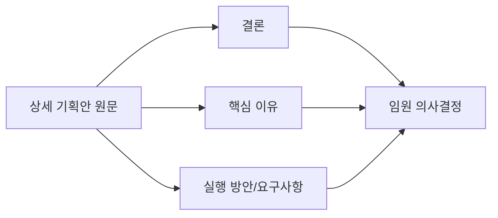

# 수중드론 사업화 1페이지 요약안 (BLUF)

- 보고 대상: CEO/임원 의사결정
- 기준 문서: `C:\Users\Administrator\dxAx\실습결과물\14\수중드론_사업화_상세기획안.md`

## [결론]
- 본 사업은 "드론 판매"가 아니라 "수중 데이터 서비스(DaaS)" 사업으로 추진하며, 12개월 내 유료 파일럿 5개소를 확보한다.
- 초기 시장은 B2B/B2G(양식장·항만/연안시설)를 우선 공략하고, 규제 대응이 유리한 USV(수상)+ROV(수중) 하이브리드 운영 모델로 빠르게 상용 검증한다.
- 목표 성과는 미션 성공률 95% 이상, 유효 데이터 수집률 98% 이상, 점검 리드타임 30% 단축, 위험 작업 40% 절감이다.

## [핵심 이유]
1. 고객 문제의 강도가 높고 지불 주체가 명확하다.
: 양식장 고수온/저산소, 항만·시설 점검 수요는 선택이 아닌 운영 필수 과제다.

2. 경쟁우위는 하드웨어보다 데이터 자산에서 나온다.
: 공공 매크로 데이터 + 민간 마이크로 데이터를 결합한 데이터 레이어링으로 복제 어려운 정보 상품을 만든다.

3. 기술·운영·규제 리스크를 통제 가능한 구조다.
: 테더 기반 수중 운용, Fail-safe, SOP, 준법 매트릭스(수역별 허용/금지/협의)로 현장 실행 안정성을 확보한다.

## [실행 방안/요구사항]
### 1) 90일 실행계획(착수)
| 기간 | 핵심 실행 | 주요 산출물 |
|---|---|---|
| 1~30일 | 요구사항 동결, 수역 선정, 준법/안전 기준 확정 | 요구사항 명세서, Go/No-Go 기준, 부품 선정안 |
| 31~60일 | EVT 시제품 조립 및 수조 시험, SOP v0.9 작성 | 기체 1호기, 기능시험 리포트, 오퍼레이터 훈련 |
| 61~90일 | 해역 실증(20회+), 장애 시나리오 검증, 파일럿 제안 | 실증 데이터, 리스크 개선안, 고객 제안서 |

### 2) 기체 개발 핵심 범위(상용 1차)
- 운용 사양: 정격 30m(최대 50m), 임무 90~120분, 6-DOF 안정화, 수질 5종(수온/DO/염분/탁도/수심).
- 설계 포인트: 수평4+수직2 추진, 이중 실링 내압구조, USV 전원 + 비상 배터리, 통신두절 시 자동 복귀.
- 검증 게이트: P0(개념) → P1(EVT) → P2(DVT) → P3(PVT) 단계로 12개월 내 TRL 6~7 달성.

### 3) 의사결정 요청(이번 분기)
- 파일럿 고객 5개소 확보를 위한 영업·실증 동시 착수 승인.
- 핵심 조직 구성 승인(사업/운영/로보틱스/데이터/안전·준법).
- 초기 예산 구조 승인(장비 40%, 인건비 35%, 운영 15%, 실증·인증 10%) 및 월간 KPI 리뷰 체계 승인.

### 4) 임원 모니터링 KPI(월간)
| 영역 | KPI | 목표 |
|---|---|---|
| 운영 | 미션 성공률 | 95% 이상 |
| 데이터 | 유효 데이터 수집률 | 98% 이상 |
| 고객 가치 | 점검 리드타임 | 30% 단축 |
| 안전 | 위험 작업 노출 | 40% 절감 |
| 기술 | TRL | 6~7 달성 |

---

## BLUF 구조 도식

