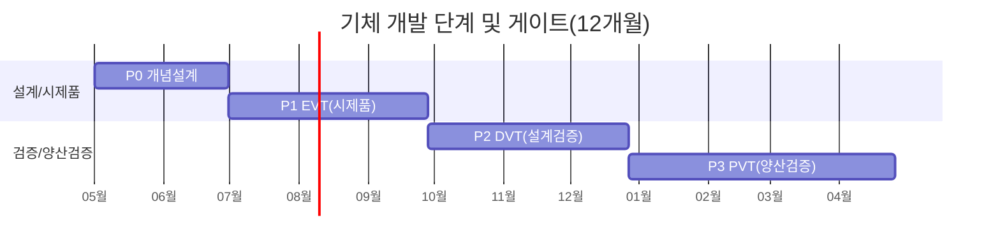
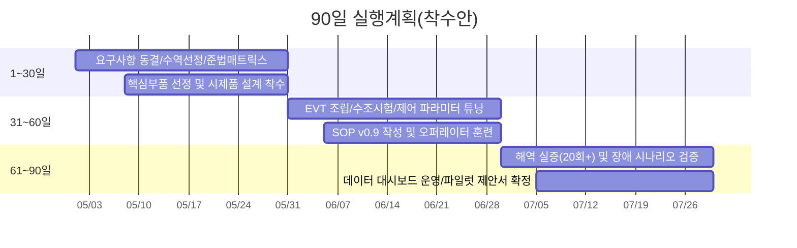

# 수중드론 사업화 상세 기획안

- 문서명: 수중드론 사업화 상세 기획안(타당성 검토 반영본)
- 작성 기준: `C:\Users\Administrator\dxAx\실습결과물\14\수중드론_사업화_타당성.md`
- 핵심 초점: 수중에서 작동하는 드론을 "탐색-정보전달-실행"의 현장 실행자로 운영하기 위한 사업화·기체개발 구체화
- 개념도 미리보기 링크: [Gemini_Generated_Image_95m9e195m9e195m9.png](C:/Users/Administrator/dxAx/실습결과물/14/assets/Gemini_Generated_Image_95m9e195m9e195m9.png)

---

## 1. 배경과 필요성

### 1.1 해양 현장 문제 정의
| 문제점 항목 | 시각자료 |
|---|---|
| 해양 현장 점검의 인력 의존, 데이터 즉시성 부족, 환경 급변 리스크 | [Gemini_Generated_Image_1zn82o1zn82o1zn8.png](C:/Users/Administrator/dxAx/실습결과물/14/assets/Gemini_Generated_Image_1zn82o1zn82o1zn8.png)  |

- 양식장/항만/연안 시설은 실시간 점검 수요가 높지만 인력 잠수 중심 점검은 안전·비용·주기 측면에서 한계가 크다.
- 공공 데이터는 거시(Macro) 정보 중심이므로, 현장 의사결정에는 포인트 단위의 즉시(Micro) 데이터가 필요하다.
- 고수온·저산소·부유물 급증 등 환경 변화가 빨라져 기존 정기 점검만으로는 사전 대응이 어렵다.

### 1.2 사업화 필요성
- 하드웨어 판매 단독 모델은 마진과 차별화가 제한적이다.
- "기체 + 운영 + 데이터 상품" 결합형 DaaS 모델은 반복 매출과 진입장벽(누적 데이터셋)을 동시에 만든다.
- 타당성 검토 결과 기준으로 상용화 핵심은 기술 화려함보다 준법/안전/운영 표준화다.

### 1.3 시장 진입 전략의 기본 원칙
- 초기 타겟은 B2B/B2G(양식장, 항만/시설)로 설정한다.
- 규제 부담 최소화를 위해 "USV(수상) + ROV(수중)" 하이브리드 구조를 1차 상용 플랫폼으로 채택한다.
- 1차 연도 목표는 "기체 완성"이 아니라 "운영 가능한 서비스 품질 확보"다.

---

## 2. 프로젝트 목적

### 2.1 프로젝트 비전
- 수중 드론을 현장 실행자로 배치하여, 탐색-상황판단-실행조치를 하나의 운영 체계로 통합한다.

### 2.2 12개월 사업 목표
| 구분 | 목표 |
|---|---|
| 고객 확보 | 유료 파일럿 5개소(양식장 3, 항만/시설 2) |
| 운영 성과 | 월 120회 미션, 미션 성공률 95% 이상 |
| 데이터 성과 | 유효 데이터 수집률 98% 이상 |
| 고객 가치 | 점검 리드타임 30% 단축, 위험 작업 40% 절감 |
| 기술 성숙도 | TRL 6~7 수준 현장 실증 완료 |

### 2.3 서비스 범위(탐색-정보전달-실행)
- 탐색: 지정 경로 순찰, 구조물/환경 점검, 이상 징후 탐지.
- 정보전달: 실시간 경보, 위험지수, 주간 운영리포트 제공.
- 실행: 재탐색 임무 자동 생성, 현장 조치 오더 발행, 설비 연동 신호 제공.

---

## 3. 핵심 실행방안

### 3.1 운영 아키텍처
- 수상부(USV): 항행, 통신 중계, 전원 허브, 임무 스케줄링.
- 수중부(ROV): 근접 탐색, 영상/센서 수집, 정밀 점검 실행.
- 관제부(클라우드/엣지): 미션 관리, 데이터 파이프라인, 알림/리포트, 이력 관리.

### 3.2 기체 개발 상세안

#### 3.2.1 미션 요구사항(Mission Requirement)
| 항목 | 목표 사양(1차 상용) | 비고 |
|---|---|---|
| 운용 수심 | 정격 30m, 최대 50m | 연안/양식장/항만 근접 운영 기준 |
| 임무 시간 | 90분(연속), 120분(표준) | 현장 점검 1회 기준 |
| 이동 속도 | 순항 1.0~1.5kn, 최대 2.0kn | 정밀 점검 안정성 우선 |
| 자세 제어 | 6-DOF 안정화(수평/수직/요/피치/롤) | 구조물 근접 점검 대응 |
| 영상 성능 | 저조도 대응 FHD/4K 선택 | 탁도 환경 고려 |
| 센서 패키지 | 수온, DO, 염분, 탁도, 수심 | 1차 필수 센서 |

#### 3.2.2 기체 구조 설계
- 기체 형식: 중형 작업형 ROV(테더 기반) + USV 전개/회수 구조.
- 프레임: 내식성 알루미늄 합금(아노다이징) + 고강도 폴리머 커버.
- 내압 하우징: 이중 O-ring 씰, 표준 방수 커넥터, 모듈별 독립 실링.
- 부력/트림: 중성부력 기준 설계, 현장별 교체형 밸러스트 키트 적용.
- 유지보수성: 추진기/센서/카메라 모듈을 현장 20분 이내 교체 가능하도록 설계.

#### 3.2.3 추진·전원 설계
- 추진 구성: 수평 4기 + 수직 2기(총 6기) 벡터 배치.
- 제어 목표: 정지 호버링 안정화, 저속 정밀 접근, 자동 자세 복원.
- 전원 구조:
  - 주전원: USV 공급 전원(테더)을 기본으로 운용.
  - 백업전원: ROV 내장 배터리(비상 복귀용 15~20분).
  - 배터리 안전: BMS(과충전/과전류/온도 차단), 충전 이력 관리.
- 안전 기능: 저전압 임계 도달 시 자동 상승/복귀 모드 진입.

#### 3.2.4 센서·항법·통신 설계
- 항법 센서: IMU, 수심계, 자기센서, 속도추정 로직(환경별 튜닝).
- 임무 센서: 수질 4종(DO/수온/염분/탁도), 전방 관측(소나 옵션).
- 통신:
  - 수중: 테더 기반 유선 통신(영상+제어 일체).
  - 수상-육상: LTE/5G + 장거리 무선 백업.
- 위치 기준: USV GPS 좌표와 ROV 상대위치를 결합한 작업 좌표계 운용.

#### 3.2.5 제어 SW/데이터 SW 상세
- SW 스택: 임무제어(로봇), 관제(운영), 데이터(분석) 3계층 분리.
- 운용 모드:
  - 수동 보조 모드(현장 오퍼레이터 우선).
  - 반자율 경로 모드(정기 순찰).
  - 이상점 재탐색 모드(자동 재임무).
- 필수 기능:
  - 지오펜스/운용금지구역 설정.
  - 통신 끊김 타임아웃 및 Fail-safe 복귀.
  - 센서 결측/오류 플래그 자동 부여.
  - 미션 로그 자동 저장(사후 감사/품질 추적).

#### 3.2.6 신뢰성·안전 설계
- Fail-safe 우선순위: 인명·충돌·환경오염 방지 > 장비 보호 > 데이터 보존.
- 최소 안전 규칙:
  - 통신두절 10초 초과 시 정지/부상 절차 자동 실행.
  - 전원 이상 시 비상 복귀 경로 강제 진입.
  - 임계 탁도/조류 초과 시 임무 자동 중단.
- 정비 기준:
  - 임무 전후 체크리스트 30항목 운영.
  - 주요 소모품(씰, 추진기, 커넥터) 예방교체 주기 관리.
  - MTBF/MTTR 지표를 월 단위로 추적.

#### 3.2.7 개발 단계 및 게이트

- P0 게이트: 요구사항 동결, 핵심 부품 선정 완료.
- P1 게이트: 내압/방수/기동 기본 성능 통과.
- P2 게이트: 연속 임무 50회 무중대 결함.
- P3 게이트: 미션 성공률 95% 이상, 양산 SOP 기준 충족.

#### 3.2.8 시험·검증 계획
- 환경 시험: 방수, 염수 분무, 온도 사이클, 진동/충격.
- 기능 시험: 추진/자세제어, 센서 정확도, 통신 지연/손실.
- 현장 시험: 양식장/항만 실해역 반복 운용(주간·야간).
- 운영 시험: 장애 시나리오(통신두절, 전원저하, 회수지연) 모의훈련.
- 데이터 시험: 타임스탬프 동기화, 위치 정합성, 결측률/이상치율 검증.

#### 3.2.9 원가·제조(가정값)
| 항목 | 1세트 기준 예상비(만원) |
|---|---:|
| ROV 기체(프레임/내압/추진) | 1,100 |
| 센서 패키지(수질+영상) | 900 |
| 제어/통신/전원 모듈 | 600 |
| USV 플랫폼 및 탑재부 | 2,000 |
| 예비품/정비키트/안전장비 | 400 |
| 합계(초도 1세트) | 5,000 |

- 상기 수치는 견적 전 단계의 계획 가정값이며, EVT 이후 실견적 기준으로 재산정한다.
- 1차 양산(3~5세트)부터 부품 표준화/공용화로 세트당 15~20% 원가 절감을 목표로 한다.

### 3.3 운영 SOP 고도화
- 사전: 수역 허가/협의, 기상·해황 Go/No-Go, 장비/배터리/센서 캘리브레이션.
- 수행: 미션 실행, 이상 탐지 시 재탐색, 위험 알림 전파.
- 사후: 회수/세척/정비, 로그 검토, 리포트 배포, 개선사항 반영.
- 예외: 통신두절, 회수 실패, 충돌 위험, 데이터 손상에 대한 비상 절차 별도 문서화.

### 3.4 데이터 제품화 및 수익화
- 데이터 레이어링: 공공 매크로 데이터 + 민간 마이크로 데이터 결합.
- 정보 상품:
  - 운영형 대시보드(실시간)
  - 경보형 알림 서비스(이벤트)
  - 의사결정 리포트(주간/월간)
  - API 피드(고객 시스템 연동)
- 요금제: 기본 구독 + 미션 초과 과금 + 프리미엄 분석 옵션.

### 3.5 규제·보안·안전 대응
- 준법 매트릭스: 수역별 법령/협의기관/허용행위/금지행위 정의.
- 정보보호: 영상 최소수집, 보관기간 정책, 권한기반 접근통제, 접근로그 감사.
- 안전보건: 위험성 평가, 작업허가제, 비상훈련, 사고보고 체계.

---

## 4. 기대효과 및 리소스

### 4.1 기대효과
- 고객 관점: 사고·폐사 예방, 점검 자동화, 대응 속도 향상.
- 사업 관점: 반복 매출 구조 정착, 데이터 자산 누적, 고객 락인 강화.
- 산업 관점: 해양 현장 디지털 전환 기반 확보, 데이터 표준화 촉진.

### 4.2 필요 인력(초기 12개월)
| 역할 | 인원 | 핵심 업무 |
|---|---:|---|
| PM/사업개발 | 1 | 고객개발, 계약, KPI/손익 관리 |
| 해양운용 리드 | 1 | 현장 운영 기준, 안전/품질 총괄 |
| 로보틱스 기구/제어 | 2 | 기체 설계, 추진/제어 튜닝 |
| 전장/펌웨어 | 1 | 전원/BMS/통신/임베디드 제어 |
| 데이터/플랫폼 | 2 | 파이프라인, 대시보드, 알림 |
| 필드 오퍼레이터 | 2 | 미션 수행, 회수/정비, 현장 대응 |
| 준법/안전(겸직 가능) | 1 | 인허가, 보안, 안전보건 체계 |

### 4.3 인프라 및 장비
- 개발: 수조 시험 환경, 압력 테스트 장비, 부품 검증 장비.
- 운영: USV 2대, ROV 3세트(운영 2 + 예비 1), 이동형 관제 세트.
- 데이터: 클라우드 저장/분석 인프라, 백업 및 장애복구 체계.

### 4.4 재무/성과 관리 체계
- 재무: 월별 MRR, 고객당 공헌이익, 미션당 원가, 장비 가동률 관리.
- 품질: 미션 성공률, 센서 유효율, 장애 건수, 복구시간(MTTR) 관리.
- 고객: 경보 적중률, 리포트 활용도, 재계약률, 추천지수(NPS) 관리.

---

## 5. 90일 실행계획(착수안)

---

## 결론
본 기획안은 수중드론을 단순 촬영장비가 아니라 현장 실행자(탐색-정보전달-실행)로 정의하고, 기체 개발을 사업화 운영요건과 연결해 구체화했다. 핵심은 "기체 성능" 자체보다 "안전하게 반복 운용되는 시스템"을 만드는 것이며, 이를 통해 12개월 내 유료 파일럿 기반의 데이터 서비스 사업으로 전환한다.
