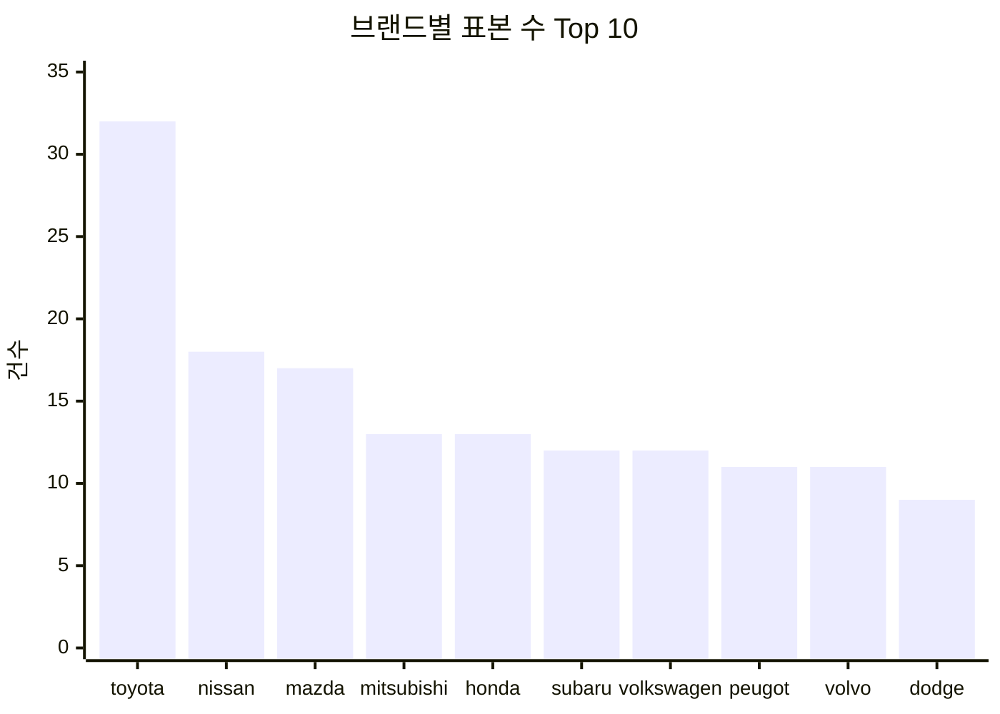
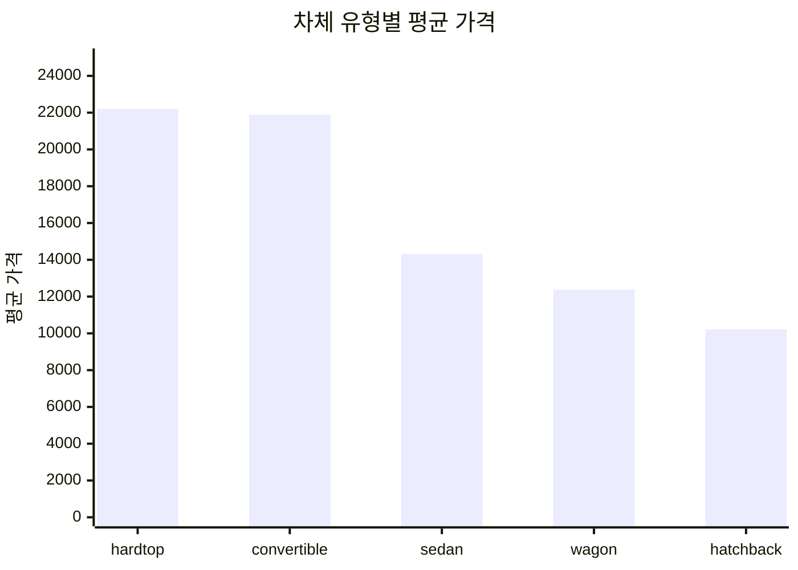
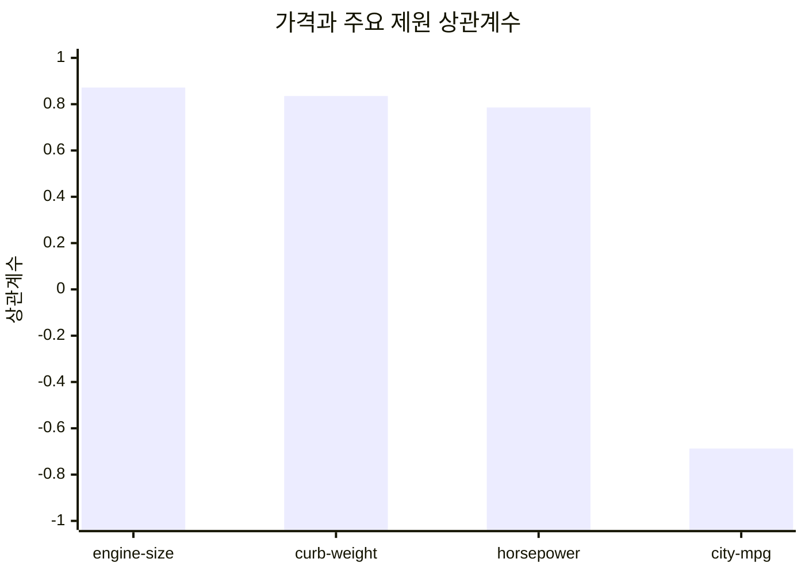

# imports-85 실제데이터 기반 요약보고서

## 보고 범위
- 본 보고서는 [imports-85_cleaned.csv](C:/Users/Administrator/dxAx/실습결과물/16/imports-85_cleaned.csv) 의 실제 컬럼만 사용했다.
- 실제 존재 컬럼: `make`, `body-style`, `fuel-type`, `drive-wheels`, `engine-size`, `horsepower`, `curb-weight`, `city-mpg`, `highway-mpg`, `price` 등.
- 데이터에 없는 항목: `국가`, `수출량`, `수출금액`, `연도`, `월`.
- 따라서 원요청의 `국가별 수출량/수출금액/연월 상관분석`은 이 파일만으로는 수행할 수 없다.

## 핵심 요약
1. 현재 데이터는 수출 실적 데이터가 아니라 차량 제원 및 가격 데이터다. 따라서 신제품 런칭 이후 국가별 수출 부진 원인을 직접 설명하는 근거로 쓰기에는 한계가 있다.
2. 실제 데이터 안에서는 `price`가 `engine-size`와 가장 강한 양의 상관관계(`r=0.8719`)를 보였고, `curb-weight`(`r=0.8351`), `horsepower`(`r=0.7857`)도 높게 연결됐다. 반대로 `city-mpg`와는 음의 상관관계(`r=-0.6874`)가 나타났다.
3. 표본 구성은 `sedan` 96건, `hatchback` 70건으로 집중되어 있고, 브랜드 기준으로는 `toyota` 32건, `nissan` 18건, `mazda` 17건 순으로 많다. 즉 현재 데이터는 판매 성과보다 상품 포트폴리오 특성을 읽는 데 더 적합하다.

## 실제 데이터 추출 결과
| 구분 | 실제 추출 가능 여부 | 사용 컬럼 |
|---|---|---|
| 차종(브랜드/모델 대용) | 가능 | `make`, `body-style` |
| 가격 | 가능 | `price` |
| 성능/제원 | 가능 | `engine-size`, `horsepower`, `curb-weight`, `city-mpg`, `highway-mpg` |
| 국가 | 불가 | 없음 |
| 수출량 | 불가 | 없음 |
| 수출금액 | 불가 | 없음 |
| 연도/월 | 불가 | 없음 |

## 상관관계 요약
`price` 기준 상관계수:

| 변수 | 상관계수 |
|---|---:|
| `engine-size` | 0.8719 |
| `curb-weight` | 0.8351 |
| `horsepower` | 0.7857 |
| `city-mpg` | -0.6874 |

해석:
- 가격이 높을수록 대체로 엔진 크기, 출력, 차량 중량이 함께 증가했다.
- 연비(`city-mpg`)가 높을수록 가격은 낮아지는 경향이 있었다.
- 이 결과는 현재 데이터에서 상품 포지셔닝이 `고성능/대배기량/고중량 = 고가격` 구조임을 보여준다.

## 시각화 1. 브랜드별 표본 수 Top 10

## 시각화 2. 차체 유형별 평균 가격

## 시각화 3. 가격과 주요 제원 상관계수

## 경영진 보고용 결론
- 이 파일만으로는 국가별 수출 부진의 원인을 직접 분석할 수 없다. 수출국, 수출량, 수출금액, 연월 데이터가 없기 때문이다.
- 다만 실제 데이터 기준으로 보면, 제품 포지셔닝은 가격이 성능·배기량·차량 중량과 강하게 연결된 전형적인 상위 트림 구조다.
- 수출 부진 원인 가설을 세우려면 다음 데이터 결합이 필요하다: `국가`, `연월`, `모델`, `수출대수`, `수출금액`, `할인/프로모션`, `재고/리드타임`.
