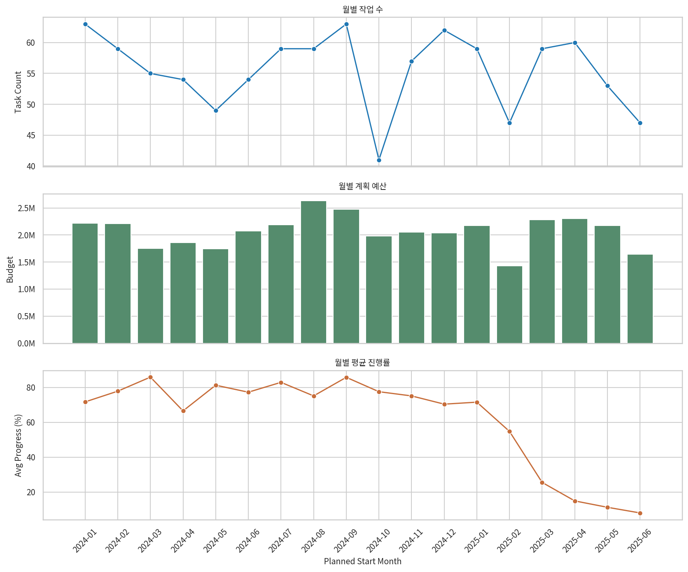
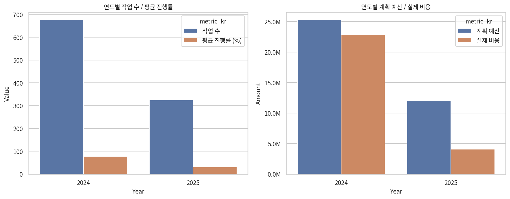
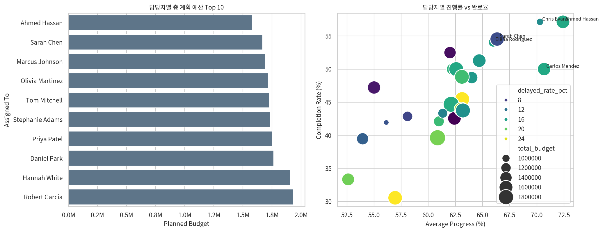

# Project Management 데이터 1페이지 요약 보고서

## 개요
- 분석 대상: `02 Project Management_ml_imputed.xlsx` 1,000건
- 기간: 2024-01-02 ~ 2025-08-23
- 기준: 월별/연도별 비교는 `Planned Start Date`, 담당자 비교는 `Assigned To`를 프로젝트 매니저 대리 지표로 사용
- 전처리 참고: `Actual End Date` 결측 426건은 상태 기반 규칙으로 대체되었으며, 원본 여부는 `Actual End Date Was Imputed`로 추적 가능

## 핵심 요약
- 2024년 시작 작업은 675건, 계획 예산은 25.22M, 평균 진행률은 77.3%입니다.
- 2025년 시작 작업은 325건, 계획 예산은 12.01M, 평균 진행률은 31.3%입니다.
- 2025년은 `Not Started` 146건, `In Progress` 94건으로 초기 단계 작업 비중이 큽니다.
- 월별로는 `2024-08`에 예산이 가장 크고 (2.63M), `2024-03`에 평균 진행률이 가장 높습니다 (85.9%).
- 담당자 기준 상위 성과는 `Ahmed Hassan`으로, 평균 진행률 72.4%, 완료율 57.1%입니다.

## 월별 프로젝트 비교
- 작업 수는 월별 41~63건 수준으로 비교적 균등하지만, 예산과 진행률은 시기별 편차가 있습니다.
- 예산 상위 월: `2024-08` (2.63M), `2024-09` (2.47M), `2025-04` (2.30M)
- 진행률 상위 월: `2024-03` (85.9%), `2024-09` (85.8%), `2024-07` (82.9%)
- 진행률 하위 월: `2025-06` (8.0%)

## 연도별 비교
- 2024년: 작업 675건, 계획 예산 25.22M, 실제 비용 22.89M, 평균 진행률 77.3%
- 2025년: 작업 325건, 계획 예산 12.01M, 실제 비용 4.09M, 평균 진행률 31.3%
- 비용 집행률은 2024년 90.8%, 2025년 34.0%입니다. 2025년은 아직 시작 전/진행 중 프로젝트가 많아 예산 집행이 덜 된 상태로 해석하는 것이 타당합니다.

## 담당자별 비교
- 예산 기준 상위 담당자: `Robert Garcia` (1.94M), `Hannah White` (1.91M), `Daniel Park` (1.77M)
- 성과 기준 상위 담당자(20건 이상): `Ahmed Hassan` (평균 진행률 72.4%, 완료율 57.1%), `Carlos Mendez` (70.7%, 50.0%), `Chris Evans` (70.3%, 57.1%)
- 지연 관리 우선 담당자(20건 이상): `Daniel Park` (25.0%), `Marcus Johnson` (25.0%), `Olivia Martinez` (22.0%)
- 해석 시 유의점: 이 비교는 인력별 성과 평가라기보다 담당 포트폴리오 구성 차이까지 포함한 운영 지표입니다.

## 결론
- 이 데이터에서 가장 분명한 패턴은 연도 효과입니다. 2024년은 대부분 종료 단계, 2025년은 초기 단계라 단순 평균 비교보다 상태 구성을 함께 봐야 합니다.
- 운영 관점에서는 고예산 월(`2024-08`, `2024-09`, `2025-04`)과 지연율 높은 담당자를 함께 추적하는 방식이 유효합니다.
- 다음 분석 단계로는 상태별 예산 소진율, 예산 초과 여부, 완료/지연 예측 모델을 연결하기 좋습니다.
