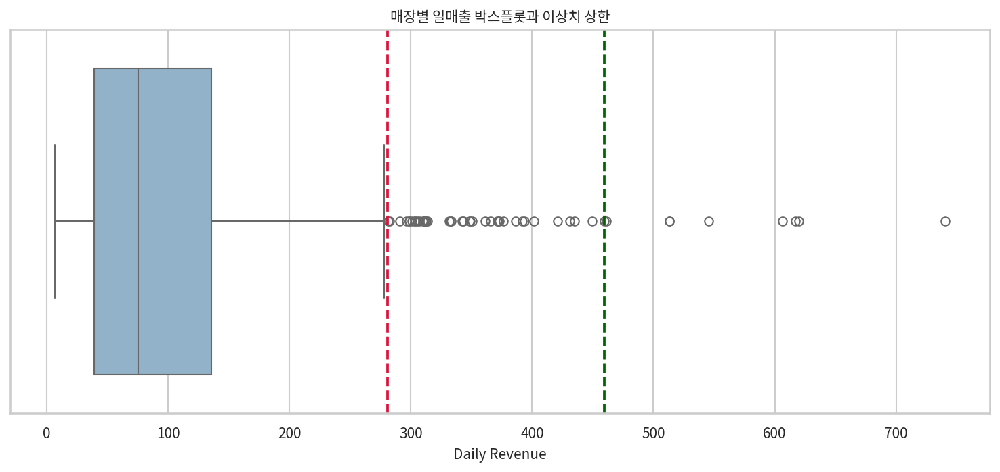
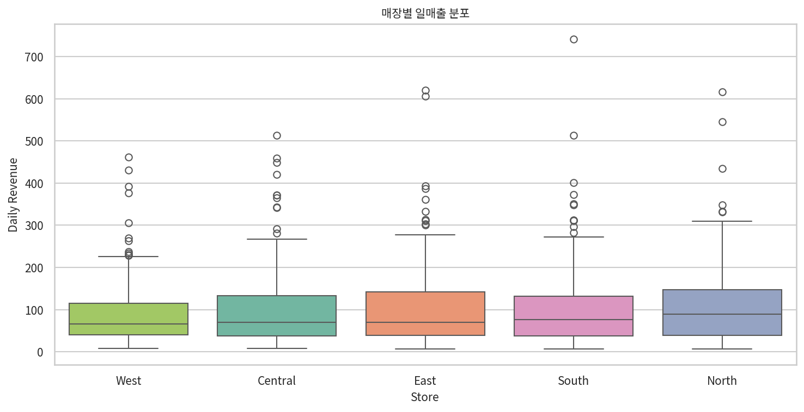

# E-Commerce Orders 매장별 일매출 이상치 분석 보고서

## 전처리
- 원본 파일: `08 E-Commerce Orders.xlsx`
- 매장 정의: 별도 `Store` 컬럼이 없어 `Region`을 매장으로 간주
- 집계 방식: `Store × Order Date` 기준으로 `Total Revenue` 합계를 계산하여 일매출 생성
- 생성 CSV: `08 E-Commerce Orders_daily_sales_by_store.csv`
- 생성 레코드 수: `871건`

## 기본 IQR 1.5배 결과
- Q1: `39.14`
- Q3: `135.83`
- IQR: `96.68`
- 하한: `-105.88`
- 상한: `280.86`
- 이상치 수: `48건 / 871건`
- 이상치 비율: `5.51%`

판정: 기본 `1.5 × IQR` 기준 이상치 비율이 `5.51%`로 `5%`를 초과하므로, 요청 규칙에 따라 배수 조정이 필요하다.

## 조정된 IQR 배수
- 조정 배수: `3.35 × IQR`
- 조정 하한: `-284.75`
- 조정 상한: `459.72`
- 조정 후 이상치 수: `8건 / 871건`
- 조정 후 이상치 비율: `0.92%`

## 이상치 의미 분석
- 일매출 기준 이상치는 주로 상단 꼬리에서 발생하며, 매출 급감일보다 `고매출 집중일`을 더 잘 설명한다.
- 기본 1.5배 기준에서는 48건이 이상치로 잡혔고, 조정 후에는 8건만 남는다.
- 이는 일매출 분포가 오른쪽으로 긴 꼬리를 갖는다는 뜻이며, 몇몇 날짜에 주문 수가 몰리거나 고가 상품 조합이 집중된 것으로 해석할 수 있다.
- 따라서 일매출 이상치는 입력 오류보다는 `프로모션`, `캠페인`, `특정 상품 믹스`, `주문 집중일`의 신호일 가능성이 높다.

기본 1.5배 기준 이상치가 많이 나온 매장:
- `Central`: 11ê±´
- `North`: 11ê±´
- `South`: 11ê±´
- `East`: 10ê±´
- `West`: 5ê±´

기본 1.5배 기준 상위 이상치 일자:

| Store   | Order Date          |   order_count |   total_quantity |   daily_revenue |   daily_profit |
|:--------|:--------------------|--------------:|-----------------:|----------------:|---------------:|
| South   | 2024-05-02 00:00:00 |             2 |                6 |          740.58 |          93.98 |
| East    | 2024-11-06 00:00:00 |             1 |                5 |          619.75 |          90.31 |
| North   | 2025-01-01 00:00:00 |             3 |                6 |          616.74 |         145.49 |
| East    | 2025-10-27 00:00:00 |             2 |                6 |          606.2  |          95.3  |
| North   | 2025-10-26 00:00:00 |             1 |                4 |          545.6  |         115.45 |
| Central | 2024-06-16 00:00:00 |             1 |                4 |          513.27 |         108.92 |
| South   | 2024-08-06 00:00:00 |             1 |                4 |          513.08 |         117.74 |
| West    | 2025-07-16 00:00:00 |             1 |                5 |          461.44 |          62.12 |
| Central | 2025-11-03 00:00:00 |             2 |                5 |          459.3  |          97.31 |
| Central | 2025-12-17 00:00:00 |             1 |                3 |          449.34 |          95.69 |
| North   | 2024-12-02 00:00:00 |             3 |                7 |          434.79 |         139.92 |
| West    | 2025-12-21 00:00:00 |             2 |                7 |          430.81 |         109.13 |
| Central | 2025-04-24 00:00:00 |             1 |                5 |          420.95 |          73.68 |
| South   | 2025-12-24 00:00:00 |             2 |                5 |          401.32 |          67.03 |
| East    | 2024-12-14 00:00:00 |             1 |                3 |          393.78 |          57.16 |

조정 배수 기준 이상치 일자:

| Store   | Order Date          |   order_count |   total_quantity |   daily_revenue |   daily_profit |
|:--------|:--------------------|--------------:|-----------------:|----------------:|---------------:|
| South   | 2024-05-02 00:00:00 |             2 |                6 |          740.58 |          93.98 |
| East    | 2024-11-06 00:00:00 |             1 |                5 |          619.75 |          90.31 |
| North   | 2025-01-01 00:00:00 |             3 |                6 |          616.74 |         145.49 |
| East    | 2025-10-27 00:00:00 |             2 |                6 |          606.2  |          95.3  |
| North   | 2025-10-26 00:00:00 |             1 |                4 |          545.6  |         115.45 |
| Central | 2024-06-16 00:00:00 |             1 |                4 |          513.27 |         108.92 |
| South   | 2024-08-06 00:00:00 |             1 |                4 |          513.08 |         117.74 |
| West    | 2025-07-16 00:00:00 |             1 |                5 |          461.44 |          62.12 |

## 매장별 분포 비교
| Store   |   Days |    Q1 |     Q3 |    IQR |   Outlier Count |   Outlier Ratio % |   Mean Daily Revenue |   Max Daily Revenue |
|:--------|-------:|------:|-------:|-------:|----------------:|------------------:|---------------------:|--------------------:|
| Central |    184 | 38.16 | 132.7  |  94.54 |              11 |              5.98 |               102.34 |              513.27 |
| East    |    165 | 39.49 | 141.87 | 102.38 |              10 |              6.06 |               106.94 |              619.75 |
| North   |    178 | 38.77 | 147.78 | 109.02 |               6 |              3.37 |               111.22 |              616.74 |
| South   |    179 | 38.14 | 132    |  93.86 |              11 |              6.15 |               104.72 |              740.58 |
| West    |    165 | 40.95 | 115.02 |  74.07 |              11 |              6.67 |                92.03 |              461.44 |

해석:
- 매장별 박스플롯을 보면 평균 일매출 수준과 상단 피크가 매장마다 다르다.
- 특정 매장의 이상치 비율이 높다면, 그 매장은 안정적 반복 수요보다 이벤트성 매출에 더 많이 의존할 수 있다.
- 반대로 이상치 비율이 낮고 평균 일매출이 높다면, 상대적으로 안정적인 매출 구조로 볼 수 있다.
- 실무적으로는 전\ccb4 기준 하나만 쓰기보다 `전\ccb4 일매출 이상치 + 매장별 일매출 이상치`를 함께 보는 것이 더 타당하다.

## 결론
- `Region`을 매장으로 간주해 일매출 CSV를 생성했다.
- 일매출 기준 기본 `1.5 × IQR` 이상치 비율은 `5.51%`로 5%를 초과했다.
- 따라서 배수를 `3.35 × IQR`로 조정했고, 조정 후 이상치 비율은 `0.92%`로 1% 이하가 되었다.
- 이 이상치들은 대체로 오류보다 고매출 피크일로 해석하는 것이 적절하다.
- 운영적으로는 이상치 제거보다, 해당 날짜의 프로모션/상품구성/주문량을 역추적해 매출 증폭 요인을 찾는 데 활용하는 편이 가치가 높다.

