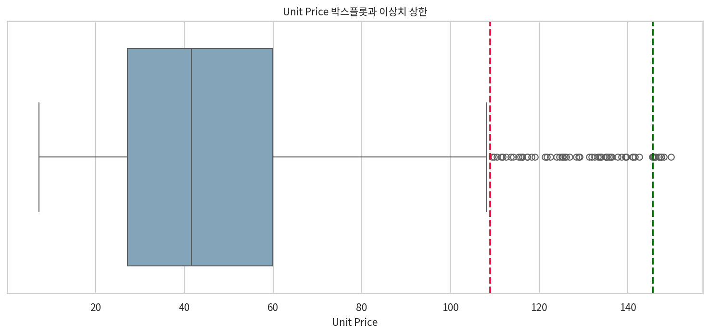
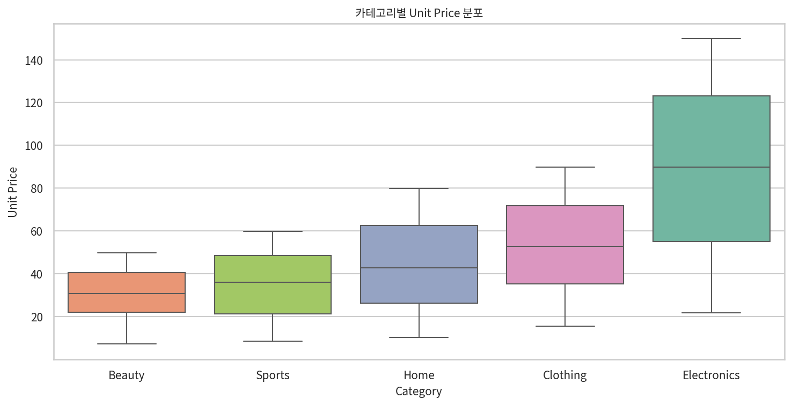

# E-Commerce Orders 가격 이상치 분석 보고서

## 분석 기준
- 대상 파일: `08 E-Commerce Orders.xlsx`
- 가격 변수: `Unit Price`
- 기본 규칙: 박스플롯 기준 `IQR 1.5배`
- 조정 규칙: 이상치 비율이 `5%`를 넘으면, 이상치 비율이 `1% 이하`가 되는 최소 배수로 상향 조정

## 1. 기본 IQR 1.5배 결과
- Q1: `27.13`
- Q3: `59.88`
- IQR: `32.75`
- 하한: `-21.99`
- 상한: `109.00`
- 이상치 수: `61건 / 1000건`
- 이상치 비율: `6.1%`

판정: 기본 1.5배 규칙에서는 이상치 비율이 `6.1%`로 5%를 초과하므로, 규칙에 따라 배수 조정이 필요하다.

## 2. 조정된 IQR 배수
- 조정 배수: `2.62 × IQR`
- 조정 하한: `-58.67`
- 조정 상한: `145.67`
- 조정 후 이상치 수: `10건 / 1000건`
- 조정 후 이상치 비율: `1.0%`

해석: 이 데이터는 기본 1.5배 규칙에 비해 상단 가격대가 두꺼운 분포를 가진다. 그래서 표준 박스플롯 기준만 쓰면 정상적인 고가 상품까지 과도하게 이상치로 분류된다.

## 3. 이상치의 의미
- 기본 1.5배 기준 이상치 61건은 전부 `Electronics` 카테고리에서 발생했다.
- 즉 이 이상치는 전사 가격 분포 전체에서 볼 때는 높지만, 전자제품 내부에서는 자연스러운 고가 가격대일 가능성이 높다.
- 실제로 카테고리별로 다시 1.5배 IQR을 적용하면 모든 카테고리의 이상치 비율이 `0%`였다.
- 따라서 이 데이터의 가격 이상치는 입력 오류나 단순 오기보다는 `카테고리 혼합으로 생긴 구조적 이상치`에 가깝다.

자주 등장한 기본 이상치 상품:
- `Webcam HD` (Electronics): 12ê±´
- `Keyboard Mechanical` (Electronics): 8ê±´
- `Portable Charger` (Electronics): 7ê±´
- `Wireless Headphones` (Electronics): 7ê±´
- `Tablet Case` (Electronics): 6ê±´
- `Laptop Stand` (Electronics): 5ê±´
- `Smart Watch` (Electronics): 5ê±´
- `Bluetooth Speaker` (Electronics): 4ê±´
- `Mouse Wireless` (Electronics): 4ê±´
- `USB-C Hub` (Electronics): 3ê±´

조정 후 남는 상위 이상치 10건:

| Order ID   | Order Date          | Category    | Product Name        |   Unit Price |   Quantity |   Discount % |   Total Revenue |   Profit |
|:-----------|:--------------------|:------------|:--------------------|-------------:|-----------:|-------------:|----------------:|---------:|
| ORD-10269  | 2025-12-17 00:00:00 | Electronics | Bluetooth Speaker   |       149.78 |          3 |            0 |          449.34 |    95.69 |
| ORD-10897  | 2024-01-05 00:00:00 | Electronics | Portable Charger    |       148.13 |          1 |            0 |          148.13 |    27.32 |
| ORD-10736  | 2024-04-20 00:00:00 | Electronics | USB-C Hub           |       147.55 |          1 |            0 |          147.55 |    18.77 |
| ORD-10130  | 2025-09-25 00:00:00 | Electronics | Wireless Headphones |       147.49 |          3 |           15 |          376.1  |    93.84 |
| ORD-10620  | 2025-10-07 00:00:00 | Electronics | Keyboard Mechanical |       147.05 |          1 |            5 |          139.7  |    32.77 |
| ORD-10862  | 2024-11-23 00:00:00 | Electronics | Wireless Headphones |       147.01 |          1 |           15 |          124.96 |    20.96 |
| ORD-10948  | 2024-09-11 00:00:00 | Electronics | Wireless Headphones |       146.24 |          1 |           15 |          124.3  |    15.45 |
| ORD-10898  | 2024-05-15 00:00:00 | Electronics | Portable Charger    |       146.01 |          1 |            0 |          146.01 |    20.14 |
| ORD-10020  | 2025-03-17 00:00:00 | Electronics | Bluetooth Speaker   |       145.8  |          3 |           15 |          371.79 |    37.26 |
| ORD-10838  | 2025-12-17 00:00:00 | Electronics | Webcam HD           |       145.76 |          2 |           10 |          262.37 |    43.52 |

## 4. 카테고리별 확인
| Category    |   Count |    Q1 |     Q3 |   IQR |   Outlier Count |   Outlier Ratio % |
|:------------|--------:|------:|-------:|------:|----------------:|------------------:|
| Beauty      |     232 | 21.94 |  40.52 | 18.58 |               0 |                 0 |
| Clothing    |     192 | 35.21 |  71.79 | 36.58 |               0 |                 0 |
| Electronics |     167 | 55    | 123.22 | 68.22 |               0 |                 0 |
| Home        |     196 | 26.2  |  62.56 | 36.35 |               0 |                 0 |
| Sports      |     213 | 21.28 |  48.63 | 27.35 |               0 |                 0 |

의미 해석:
- `Beauty`, `Sports`, `Home`은 상대적으로 저가 중심 분포다.
- `Electronics`는 가격 상단이 매우 높고 분산이 크다.
- 전\ccb4 데이터에서 전자제품 가격을 다른 카테고리와 섞어서 보면 고가 전자제품이 이상치처럼 보인다.
- 그러나 카테고리 내부에서는 이런 가격이 정상 범위여서, 이상치 탐지는 `전\ccb4 기준`보다 `카테고리별 기준`이 더 적절하다.

## 결론
- 규칙대로 보면 기본 `1.5 × IQR`은 과도하게 민감했고, 이상치 비율 `6.1%`를 만들었다.
- 이를 `2.62 × IQR`로 조정하면 이상치 비율이 `1.0%`로 내려간다.
- 남은 이상치는 모두 전자제품 고가 구간에 몰려 있으며, 데이터 오류라기보다 고가 상품군을 반영한 것으로 해석하는 편이 타당하다.
- 실무적으로는 `전\ccb4 Unit Price 기준 이상치`보다 `Category별 Unit Price 이상치 탐지`를 우선 사용하는 것이 더 정확하다.

